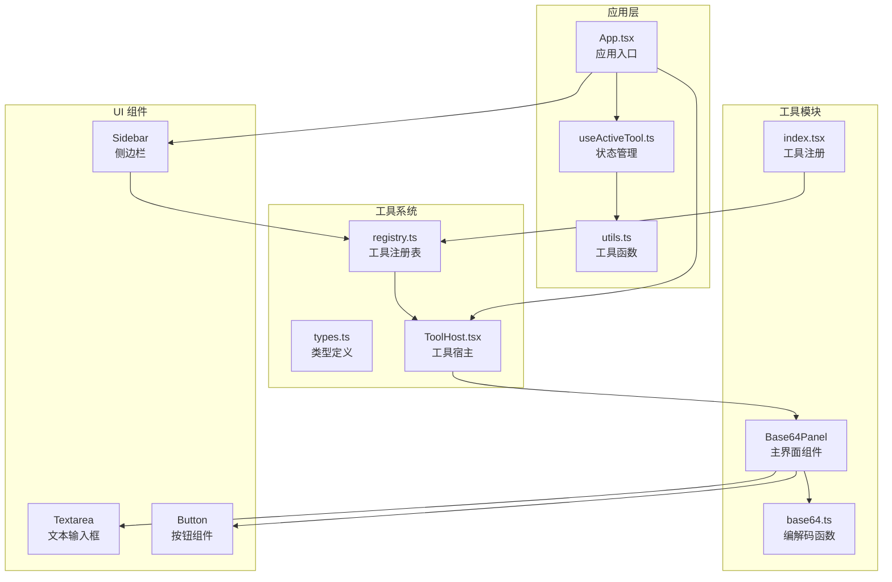
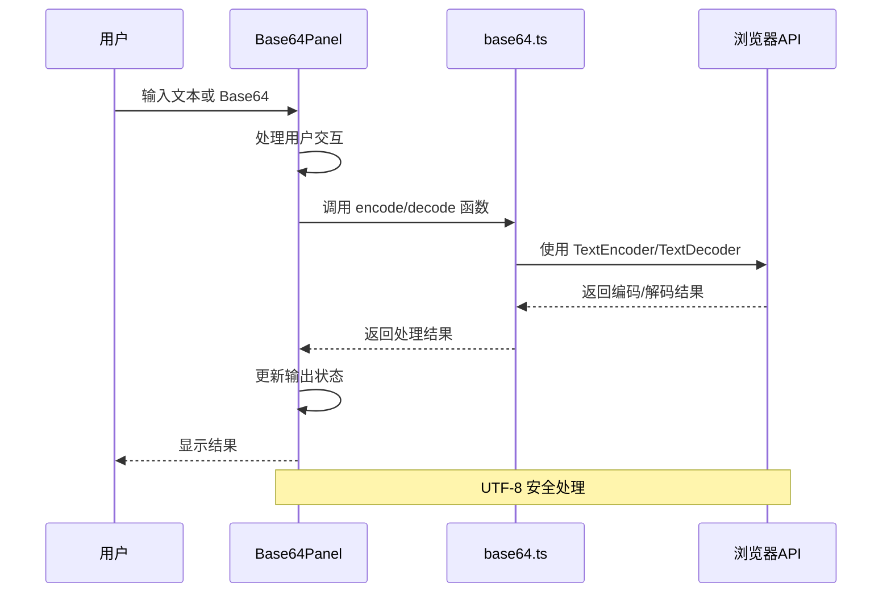
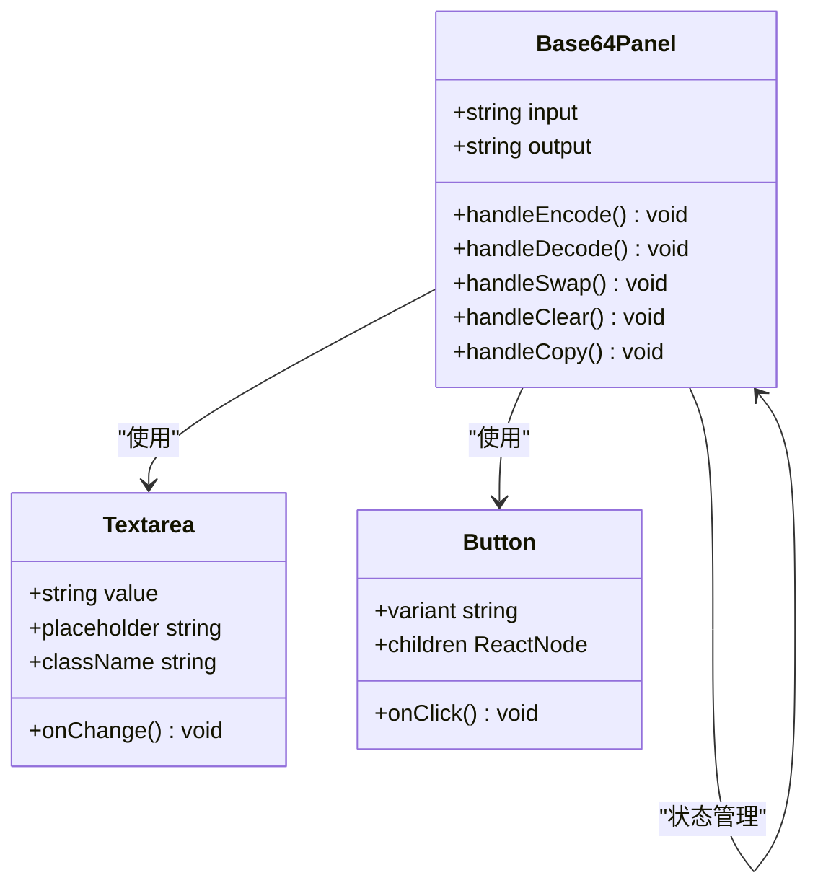
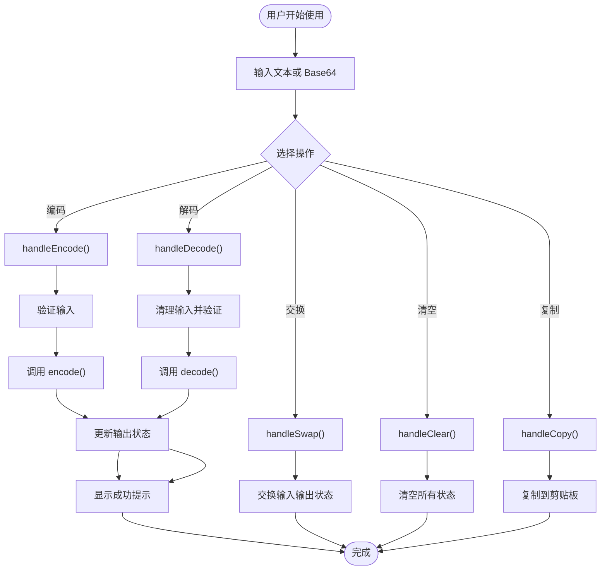
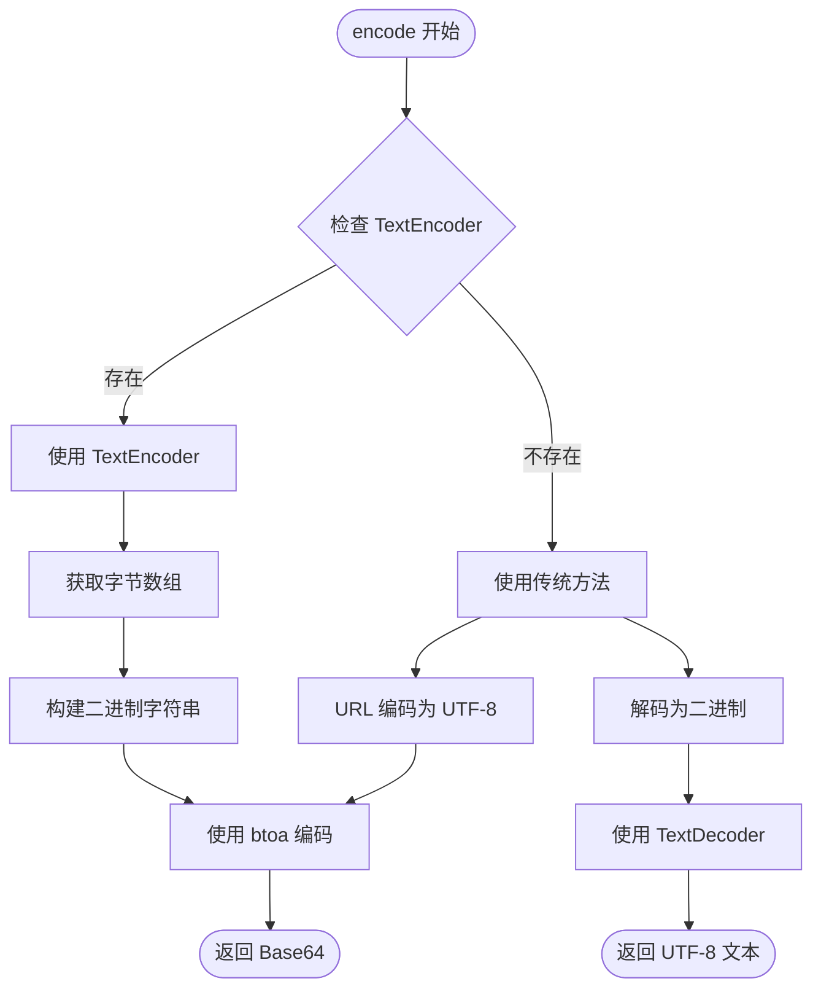
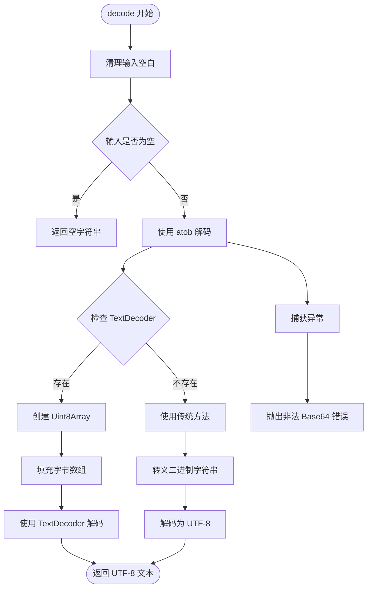
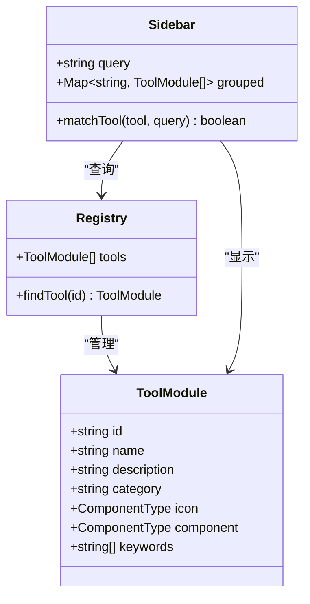
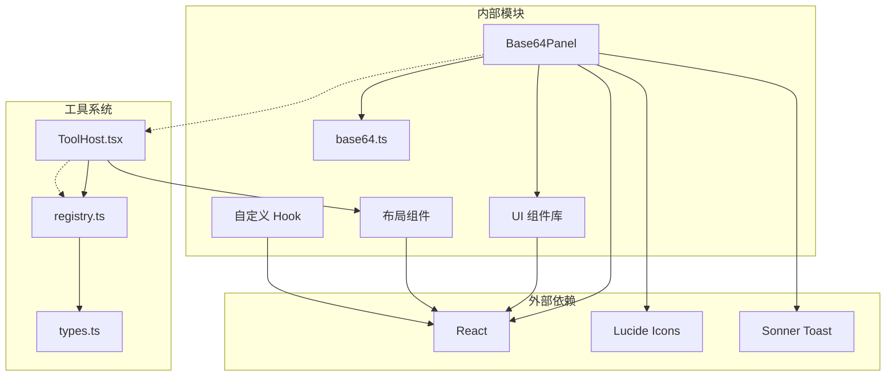
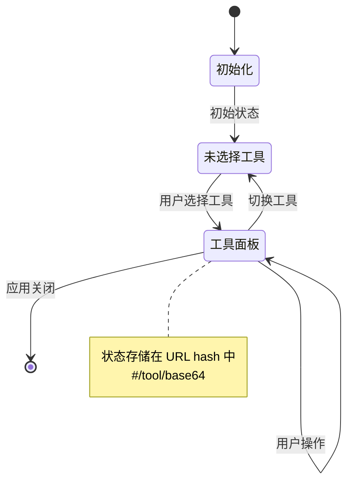

# Base64 工具实现

<cite>
**本文档引用的文件**
- [Base64Panel.tsx](file://src/tools/base64/Base64Panel.tsx)
- [base64.ts](file://src/tools/base64/base64.ts)
- [index.tsx](file://src/tools/base64/index.tsx)
- [registry.ts](file://src/tools/registry.ts)
- [types.ts](file://src/tools/types.ts)
- [textarea.tsx](file://src/components/ui/textarea.tsx)
- [button.tsx](file://src/components/ui/button.tsx)
- [ToolHost.tsx](file://src/layout/ToolHost.tsx)
- [App.tsx](file://src/App.tsx)
- [useActiveTool.ts](file://src/hooks/useActiveTool.ts)
- [utils.ts](file://src/lib/utils.ts)
- [Sidebar.tsx](file://src/layout/Sidebar.tsx)
</cite>

## 目录
1. [简介](#简介)
2. [项目结构](#项目结构)
3. [核心组件](#核心组件)
4. [架构概览](#架构概览)
5. [详细组件分析](#详细组件分析)
6. [依赖关系分析](#依赖关系分析)
7. [性能考量](#性能考量)
8. [故障排除指南](#故障排除指南)
9. [结论](#结论)
10. [附录](#附录)

## 简介
Base64 工具是一个轻量级的字符串与 Base64 编解码工具，支持 UTF-8 字符集处理，提供直观的用户界面和完善的错误处理机制。该工具采用纯前端实现，无需服务器端处理，确保数据隐私和安全性。

## 项目结构
Base64 工具位于工具箱项目的工具模块目录中，采用模块化设计，便于扩展和维护。

**图表来源**
- [Base64Panel.tsx:1-125](file://src/tools/base64/Base64Panel.tsx#L1-L125)
- [base64.ts:1-35](file://src/tools/base64/base64.ts#L1-L35)
- [index.tsx:1-16](file://src/tools/base64/index.tsx#L1-L16)
- [registry.ts:1-13](file://src/tools/registry.ts#L1-L13)

**章节来源**
- [Base64Panel.tsx:1-125](file://src/tools/base64/Base64Panel.tsx#L1-L125)
- [index.tsx:1-16](file://src/tools/base64/index.tsx#L1-L16)
- [registry.ts:1-13](file://src/tools/registry.ts#L1-L13)

## 核心组件
Base64 工具由多个精心设计的组件构成，每个组件都有明确的职责和边界。

### 主要组件职责
- **Base64Panel**: 提供用户界面和交互逻辑
- **base64.ts**: 实现核心编解码算法
- **工具注册**: 管理工具模块的注册和发现
- **UI 组件**: 提供一致的用户体验

### 状态管理模式
工具采用 React 的本地状态管理，通过 useState Hook 管理输入输出状态，确保组件间的通信简洁高效。

**章节来源**
- [Base64Panel.tsx:23-125](file://src/tools/base64/Base64Panel.tsx#L23-L125)
- [base64.ts:5-35](file://src/tools/base64/base64.ts#L5-L35)

## 架构概览
Base64 工具采用分层架构设计，从底层的编解码算法到顶层的用户界面，层次清晰，职责分离。

**图表来源**
- [Base64Panel.tsx:27-41](file://src/tools/base64/Base64Panel.tsx#L27-L41)
- [base64.ts:5-35](file://src/tools/base64/base64.ts#L5-L35)

## 详细组件分析

### Base64Panel 组件分析
Base64Panel 是工具的主要界面组件，负责处理用户交互和状态管理。

#### 组件结构

**图表来源**
- [Base64Panel.tsx:23-125](file://src/tools/base64/Base64Panel.tsx#L23-L125)
- [textarea.tsx:5-19](file://src/components/ui/textarea.tsx#L5-L19)
- [button.tsx:38-60](file://src/components/ui/button.tsx#L38-L60)

#### 用户界面设计
界面采用卡片式布局，包含以下关键元素：
- **输入区域**: 支持多行文本输入，字体等宽显示
- **操作按钮区**: 包含编码、解码、交换、清空、复制功能
- **输出区域**: 只读文本框，展示处理结果

#### 交互流程

**图表来源**
- [Base64Panel.tsx:27-64](file://src/tools/base64/Base64Panel.tsx#L27-L64)

**章节来源**
- [Base64Panel.tsx:23-125](file://src/tools/base64/Base64Panel.tsx#L23-L125)

### 编解码算法实现
base64.ts 模块实现了核心的编解码功能，重点关注 UTF-8 字符集的安全处理。

#### 编码算法流程

**图表来源**
- [base64.ts:5-16](file://src/tools/base64/base64.ts#L5-L16)

#### 解码算法流程

**图表来源**
- [base64.ts:18-35](file://src/tools/base64/base64.ts#L18-L35)

#### UTF-8 处理策略
工具实现了双重兼容性策略：
- **现代浏览器**: 使用 TextEncoder/TextDecoder API
- **传统浏览器**: 使用 encodeURIComponent/decodeURIComponent 兼容方案

这种设计确保了在不同环境下的稳定运行。

**章节来源**
- [base64.ts:1-35](file://src/tools/base64/base64.ts#L1-L35)

### 工具注册系统
工具注册系统提供了统一的工具管理机制，支持动态加载和搜索功能。

#### 注册表结构

**图表来源**
- [types.ts:7-22](file://src/tools/types.ts#L7-L22)
- [registry.ts:4-12](file://src/tools/registry.ts#L4-L12)
- [Sidebar.tsx:13-21](file://src/layout/Sidebar.tsx#L13-L21)

**章节来源**
- [types.ts:1-23](file://src/tools/types.ts#L1-L23)
- [registry.ts:1-13](file://src/tools/registry.ts#L1-L13)
- [Sidebar.tsx:23-100](file://src/layout/Sidebar.tsx#L23-L100)

## 依赖关系分析

### 组件依赖图

**图表来源**
- [Base64Panel.tsx:1-21](file://src/tools/base64/Base64Panel.tsx#L1-L21)
- [index.tsx:1-16](file://src/tools/base64/index.tsx#L1-L16)
- [registry.ts:4-7](file://src/tools/registry.ts#L4-L7)

### 状态管理依赖
工具采用基于 URL hash 的状态管理，避免了复杂的路由配置。

**图表来源**
- [useActiveTool.ts:5-30](file://src/hooks/useActiveTool.ts#L5-L30)

**章节来源**
- [useActiveTool.ts:1-34](file://src/hooks/useActiveTool.ts#L1-L34)
- [App.tsx:1-21](file://src/App.tsx#L1-L21)

## 性能考量

### 内存使用优化
- **流式处理**: 编解码过程使用原生 JavaScript 字符串，避免额外的内存分配
- **状态最小化**: 仅保存必要的输入输出状态，减少内存占用
- **事件监听**: 合理管理事件监听器，在组件卸载时清理

### 运行时性能
- **算法复杂度**: 编解码时间复杂度为 O(n)，其中 n 为输入长度
- **内存复杂度**: 空间复杂度为 O(n)，主要用于存储中间结果
- **浏览器兼容**: 自动检测 API 支持，选择最优实现路径

### 用户体验优化
- **即时反馈**: 操作完成后立即显示结果，提供良好的响应体验
- **错误处理**: 优雅的错误处理机制，避免应用崩溃
- **无障碍设计**: 支持键盘导航和屏幕阅读器

## 故障排除指南

### 常见问题及解决方案

#### 编码失败
**症状**: 调用 encode() 时抛出异常
**原因**: 输入包含无法识别的字符
**解决**: 
1. 检查输入字符集是否为有效的 UTF-8
2. 确保没有包含不支持的 Unicode 字符
3. 尝试清理输入中的特殊字符

#### 解码失败
**症状**: 调用 decode() 时抛出 "非法的 Base64 字符串" 错误
**原因**: 
1. 输入不是有效的 Base64 字符串
2. 字符串包含空格或特殊字符
3. 字符串长度不符合 Base64 规范

**解决**:
1. 使用清理后的输入字符串
2. 确保 Base64 字符串只包含允许的字符
3. 验证字符串长度是否为 4 的倍数

#### 复制失败
**症状**: 点击复制按钮后显示复制失败
**原因**: 
1. 浏览器不支持 Clipboard API
2. 权限不足
3. 安全上下文限制

**解决**:
1. 在 HTTPS 环境下使用
2. 检查浏览器权限设置
3. 手动选择复制文本

### 调试技巧
- 使用浏览器开发者工具监控状态变化
- 检查控制台是否有错误信息
- 验证输入输出的字符编码
- 测试边界情况（空字符串、特殊字符等）

**章节来源**
- [base64.ts:31-33](file://src/tools/base64/base64.ts#L31-L33)
- [Base64Panel.tsx:30-40](file://src/tools/base64/Base64Panel.tsx#L30-L40)

## 结论
Base64 工具是一个设计精良的前端工具，具有以下特点：

### 技术优势
- **纯前端实现**: 无需服务器端处理，确保数据隐私
- **UTF-8 安全**: 支持完整的 Unicode 字符集
- **跨浏览器兼容**: 自动适配现代和传统浏览器
- **用户友好**: 直观的界面设计和即时反馈

### 架构优点
- **模块化设计**: 组件职责清晰，易于维护
- **状态管理**: 基于 URL hash 的简单状态管理
- **可扩展性**: 易于添加新功能和新工具
- **性能优化**: 高效的算法实现和内存管理

### 应用价值
该工具适用于多种实际场景，包括文件转换、数据传输、安全编码等，为开发者和用户提供了一个可靠、易用的 Base64 处理解决方案。

## 附录

### 使用场景示例

#### 文件转换
- **图片 Base64**: 将图片文件转换为 Base64 字符串，便于嵌入到 HTML/CSS 中
- **文档转换**: 将小文件转换为 Base64，便于在网络上传输

#### 数据传输
- **API 请求**: 将二进制数据编码为 Base64，通过 JSON 传输
- **缓存存储**: 将对象序列化为 Base64 存储在 localStorage 中

#### 安全编码
- **敏感数据**: 对密码等敏感信息进行 Base64 编码
- **令牌生成**: 生成 Base64 编码的临时令牌

### 最佳实践
- **输入验证**: 始终验证输入的有效性
- **错误处理**: 实现完善的错误处理机制
- **性能监控**: 关注大数据量时的性能表现
- **安全考虑**: 避免对敏感信息进行不必要的 Base64 编码