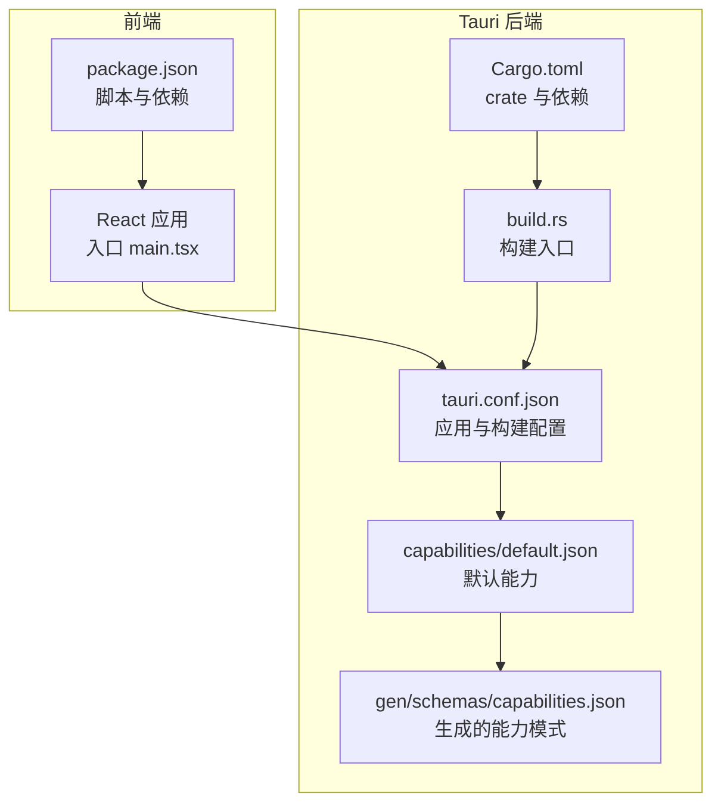
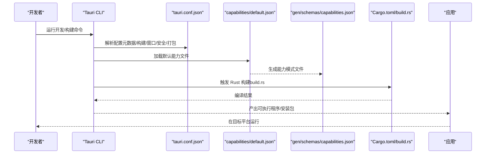
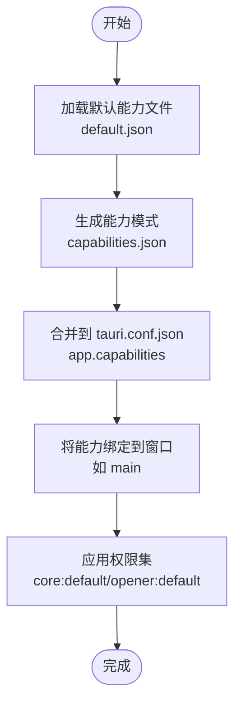
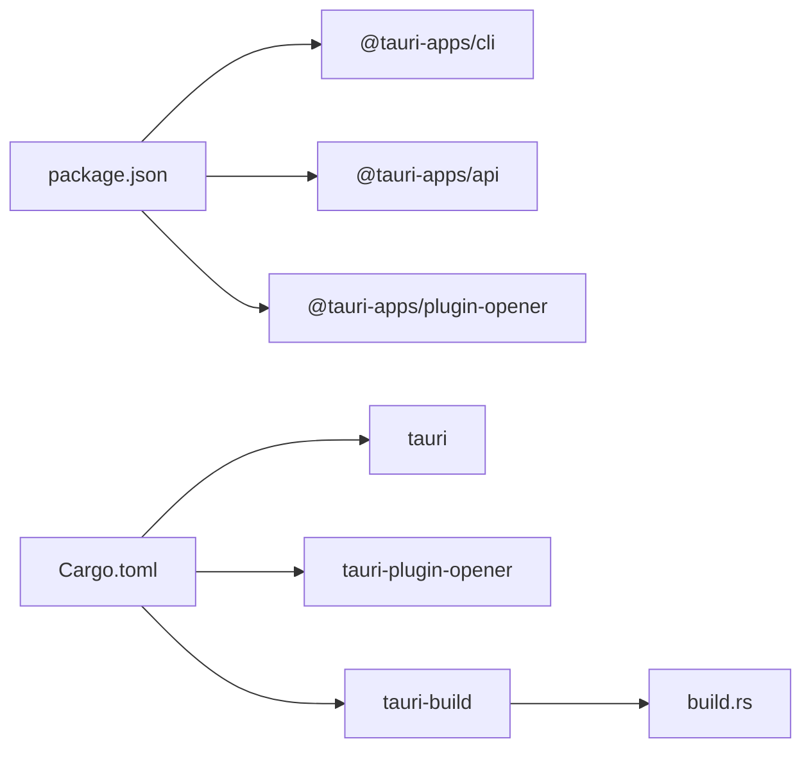

# Tauri 配置管理

<cite>
**本文档引用的文件**
- [tauri.conf.json](file://src-tauri/tauri.conf.json)
- [default.json](file://src-tauri/capabilities/default.json)
- [Cargo.toml](file://src-tauri/Cargo.toml)
- [package.json](file://package.json)
- [config.schema.json](file://node_modules/@tauri-apps/cli/config.schema.json)
- [capabilities.json](file://src-tauri/gen/schemas/capabilities.json)
- [build.rs](file://src-tauri/build.rs)
- [README.md](file://README.md)
</cite>

## 目录
1. [简介](#简介)
2. [项目结构](#项目结构)
3. [核心组件](#核心组件)
4. [架构总览](#架构总览)
5. [详细组件分析](#详细组件分析)
6. [依赖分析](#依赖分析)
7. [性能考虑](#性能考虑)
8. [故障排除指南](#故障排除指南)
9. [结论](#结论)
10. [附录](#附录)

## 简介
本文件面向 Tauri 应用的配置管理，围绕 tauri.conf.json 的关键配置项进行深入解析，涵盖应用元数据、构建流程、窗口与安全策略、能力系统（capabilities）以及配置层级与继承关系。同时提供跨平台差异、最佳实践与常见问题解决方案，帮助开发者在保证安全性与可维护性的前提下高效完成配置。

## 项目结构
该仓库采用前端（Vite + React + TypeScript）与 Tauri 后端（Rust）的典型分层组织方式，配置集中在 src-tauri 目录下的 tauri.conf.json 及其配套能力文件中；前端通过 package.json 管理脚本与依赖；Rust 侧通过 Cargo.toml 定义 crate 与依赖；构建时通过 build.rs 触发 tauri_build。

**图表来源**
- [tauri.conf.json:1-39](file://src-tauri/tauri.conf.json#L1-L39)
- [default.json:1-11](file://src-tauri/capabilities/default.json#L1-L11)
- [Cargo.toml:1-26](file://src-tauri/Cargo.toml#L1-L26)
- [package.json:1-37](file://package.json#L1-L37)
- [build.rs:1-4](file://src-tauri/build.rs#L1-L4)

**章节来源**
- [tauri.conf.json:1-39](file://src-tauri/tauri.conf.json#L1-L39)
- [default.json:1-11](file://src-tauri/capabilities/default.json#L1-L11)
- [Cargo.toml:1-26](file://src-tauri/Cargo.toml#L1-L26)
- [package.json:1-37](file://package.json#L1-L37)
- [build.rs:1-4](file://src-tauri/build.rs#L1-L4)

## 核心组件
本节聚焦 tauri.conf.json 中的关键配置域及其作用：

- 应用元数据（顶层）
  - productName：应用产品名称
  - version：版本号
  - identifier：应用标识符（通常为反向域名）
  - $schema：指向配置模式，确保编辑器与 CLI 的校验与提示

- 构建配置（build）
  - beforeDevCommand：开发模式启动前执行的命令
  - devUrl：开发服务器地址
  - beforeBuildCommand：打包前执行的命令
  - frontendDist：前端构建产物目录（相对于 src-tauri）

- 应用配置（app）
  - windows：窗口列表，支持多窗口；每个窗口可配置标题、宽高、最小宽高、是否可调整等
  - security：安全策略，包含 CSP 与响应头等

- 打包配置（bundle）
  - active：是否启用打包
  - targets：目标平台集合
  - icon：图标清单（按尺寸与格式）

- 能力系统（capabilities）
  - 在 app 或顶层通过 capabilities 指定启用的能力文件或内联能力
  - 默认能力文件位于 capabilities/default.json，标识符为 default，描述为“主窗口能力”，关联窗口 main，并声明核心权限与 opener 权限

- 平台特定配置
  - 支持按平台命名的配置文件（如 tauri.macos.conf.json），会与主配置合并

**章节来源**
- [tauri.conf.json:1-39](file://src-tauri/tauri.conf.json#L1-L39)
- [default.json:1-11](file://src-tauri/capabilities/default.json#L1-L11)
- [config.schema.json:4:53](file://node_modules/@tauri-apps/cli/config.schema.json#L4-L53)
- [config.schema.json:1233:1234](file://node_modules/@tauri-apps/cli/config.schema.json#L1233-L1234)

## 架构总览
下图展示从配置到运行时的关键路径：前端脚本触发 Tauri CLI，读取 tauri.conf.json，结合能力系统与 Rust 依赖，最终生成可执行程序并在目标平台运行。

**图表来源**
- [tauri.conf.json:1-39](file://src-tauri/tauri.conf.json#L1-L39)
- [default.json:1-11](file://src-tauri/capabilities/default.json#L1-L11)
- [capabilities.json:1-1](file://src-tauri/gen/schemas/capabilities.json#L1-L1)
- [Cargo.toml:1-26](file://src-tauri/Cargo.toml#L1-L26)
- [build.rs:1-4](file://src-tauri/build.rs#L1-L4)

## 详细组件分析

### 应用元数据与构建配置
- 元数据域
  - productName、version、identifier 用于标识应用与版本，影响打包产物与系统集成
  - $schema 提供配置校验与编辑器智能提示
- 构建域
  - beforeDevCommand 与 devUrl 配合前端开发服务器，实现热重载与调试体验
  - beforeBuildCommand 与 frontendDist 指定前端构建输出位置，便于打包时复制静态资源

最佳实践
- 将前端构建脚本与 devUrl 保持一致，避免开发与生产环境差异
- 使用相对路径指定 frontendDist，确保跨平台一致性

**章节来源**
- [tauri.conf.json:1-11](file://src-tauri/tauri.conf.json#L1-L11)
- [package.json:6-11](file://package.json#L6-L11)

### 窗口配置
- 单窗口示例包含标题、初始宽高、最小宽高与可调整属性
- 多窗口场景可通过数组扩展，每项独立配置

设计要点
- 最小尺寸与可调整性有助于提升用户体验与可访问性
- 标题应简洁明确，符合平台习惯

**章节来源**
- [tauri.conf.json:12-26](file://src-tauri/tauri.conf.json#L12-L26)

### 安全配置（CSP 与响应头）
- security.csp：内容安全策略，建议在生产环境设置以降低 XSS 风险
- security.headers：可配置跨源隔离相关头部（如 COOP/COEP），配合 SharedArrayBuffer 等特性

注意
- 开发阶段可使用 dev_csp 或允许临时禁用 CSP，但生产必须明确策略
- 响应头与 CSP 是互补的安全措施

**章节来源**
- [tauri.conf.json:23-25](file://src-tauri/tauri.conf.json#L23-L25)
- [config.schema.json:1174:1175](file://node_modules/@tauri-apps/cli/config.schema.json#L1174-L1175)
- [config.schema.json:1661:1661](file://node_modules/@tauri-apps/cli/config.schema.json#L1661-L1661)

### 能力系统（Capabilities）
- 默认能力文件 default.json
  - identifier：default
  - description：主窗口能力
  - windows：["main"]
  - permissions：["core:default", "opener:default"]
- 生成模式 capabilities.json 展示了已启用能力的结构化定义
- CLI 文档对 capabilities 的说明包括：
  - 可引用 capabilities 目录中的能力文件标识符
  - 支持内联能力对象，细粒度控制权限范围
  - 能力与窗口绑定，未匹配任何能力的窗口将无 IPC 访问

创建自定义能力的步骤
- 在 capabilities 目录新增 JSON 文件，定义 identifier、description、windows、permissions 等字段
- 在 tauri.conf.json 的 app.capabilities 或顶层 capabilities 中引用该能力标识符
- 如需限制权限范围，可在 permissions 中使用带 allow/restrict 的对象形式

**图表来源**
- [default.json:1-11](file://src-tauri/capabilities/default.json#L1-L11)
- [capabilities.json:1-1](file://src-tauri/gen/schemas/capabilities.json#L1-L1)
- [config.schema.json:1233:1234](file://node_modules/@tauri-apps/cli/config.schema.json#L1233-L1234)
- [config.schema.json:1431:1443](file://node_modules/@tauri-apps/cli/config.schema.json#L1431-L1443)

**章节来源**
- [default.json:1-11](file://src-tauri/capabilities/default.json#L1-L11)
- [capabilities.json:1-1](file://src-tauri/gen/schemas/capabilities.json#L1-L1)
- [config.schema.json:1233:1234](file://node_modules/@tauri-apps/cli/config.schema.json#L1233-L1234)
- [config.schema.json:1431:1443](file://node_modules/@tauri-apps/cli/config.schema.json#L1431-L1443)

### 配置层级与继承关系
- 主配置文件：tauri.conf.json
- 平台特定配置：可按平台命名（如 tauri.macos.conf.json），与主配置合并
- 能力文件：capabilities/*.json，通过 app.capabilities 引用或默认自动包含

合并规则
- 平台特定配置与主配置键值冲突时，平台配置优先
- 能力文件通过标识符引用，未显式配置时默认包含所有文件

**章节来源**
- [config.schema.json:4:53](file://node_modules/@tauri-apps/cli/config.schema.json#L4-L53)

### 打包与图标配置
- bundle.active：控制是否启用打包
- bundle.targets：目标平台集合
- bundle.icon：图标清单，包含多尺寸与格式，便于各平台适配

最佳实践
- 为所有目标平台提供对应尺寸的图标
- 使用矢量或高分辨率位图作为源，确保缩放清晰

**章节来源**
- [tauri.conf.json:27-37](file://src-tauri/tauri.conf.json#L27-L37)

## 依赖分析
- 前端依赖与脚本
  - package.json 定义了开发、构建与预览脚本，以及 @tauri-apps/api 与 @tauri-apps/plugin-opener 等依赖
- Rust 依赖与构建
  - Cargo.toml 指定 tauri 与 tauri-plugin-opener 等依赖，build.rs 调用 tauri_build::build 触发 Rust 端构建

**图表来源**
- [package.json:12-24](file://package.json#L12-L24)
- [Cargo.toml:20-25](file://src-tauri/Cargo.toml#L20-L25)
- [build.rs:1-4](file://src-tauri/build.rs#L1-L4)

**章节来源**
- [package.json:1-37](file://package.json#L1-L37)
- [Cargo.toml:1-26](file://src-tauri/Cargo.toml#L1-L26)
- [build.rs:1-4](file://src-tauri/build.rs#L1-L4)

## 性能考虑
- 构建优化
  - 将前端构建命令与 devUrl 对齐，减少重复编译与资源拷贝
  - 使用合适的 frontendDist，避免不必要的文件扫描
- 运行时优化
  - 合理设置窗口最小尺寸与 resizable，减少布局抖动
  - 在生产环境启用 CSP 与必要的响应头，降低安全检查开销
- 能力权限最小化
  - 仅授予所需权限，避免过度授权导致的运行时检查与潜在风险

## 故障排除指南
- 开发服务器无法访问
  - 检查 devUrl 与前端 dev 脚本是否一致
  - 确认 beforeDevCommand 正常启动本地服务
- 打包失败或图标缺失
  - 核对 bundle.icon 是否包含目标平台所需尺寸
  - 确保 frontendDist 指向实际存在的构建输出目录
- 能力未生效
  - 确认 capabilities/default.json 存在且 identifier 正确
  - 在 tauri.conf.json 的 app.capabilities 中正确引用
- 安全策略导致页面异常
  - 生产环境务必设置合理的 CSP；开发阶段可临时放宽但需尽快修复
  - 如需跨源隔离，正确配置 COOP/COEP 响应头

**章节来源**
- [tauri.conf.json:6-11](file://src-tauri/tauri.conf.json#L6-L11)
- [tauri.conf.json:27-37](file://src-tauri/tauri.conf.json#L27-L37)
- [default.json:1-11](file://src-tauri/capabilities/default.json#L1-L11)

## 结论
通过合理配置 tauri.conf.json 的元数据、构建、窗口与安全策略，并结合能力系统的精细化权限控制，可以构建出既安全又易维护的桌面应用。建议在开发阶段保持配置与脚本的一致性，在生产阶段严格启用 CSP 与响应头，并遵循“最小权限”原则管理能力与权限范围。

## 附录
- 推荐 IDE 插件与环境
  - VS Code + Tauri 插件 + rust-analyzer，提升开发体验与错误定位效率

**章节来源**
- [README.md:1-8](file://README.md#L1-L8)