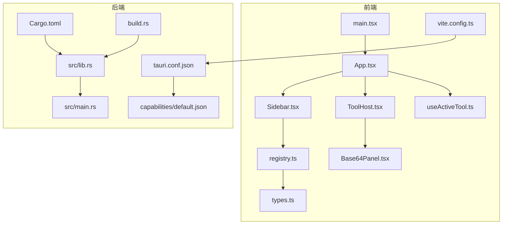
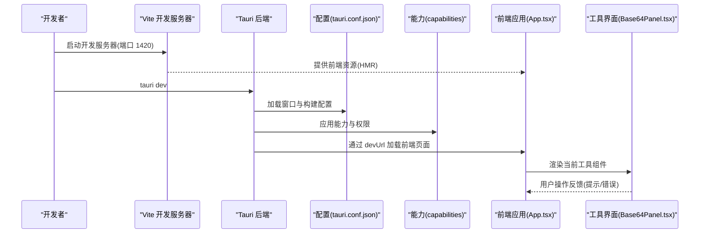
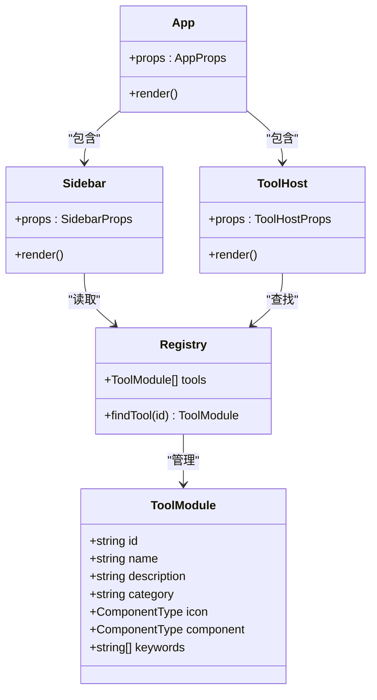
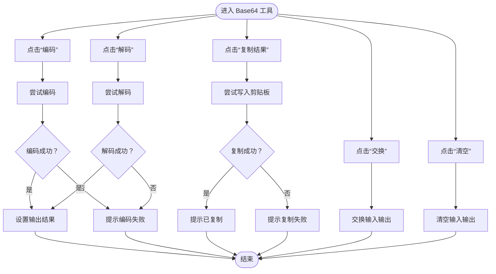
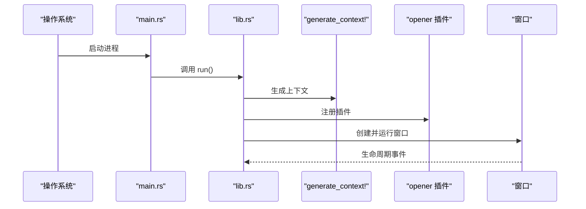
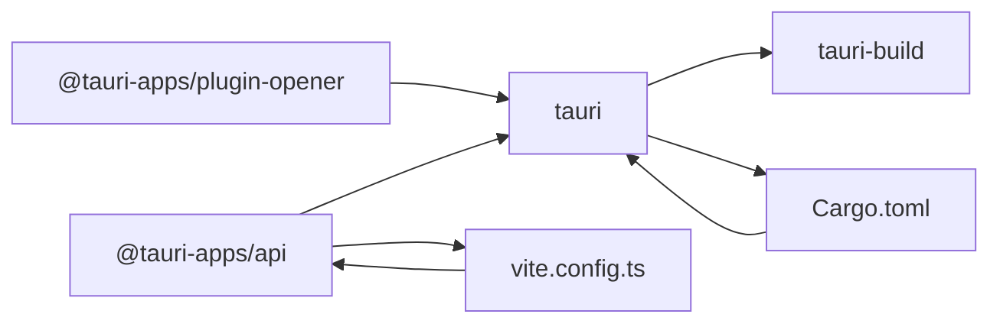

# Tauri 集成

<cite>
**本文引用的文件**
- [Cargo.toml](file://src-tauri/Cargo.toml)
- [tauri.conf.json](file://src-tauri/tauri.conf.json)
- [lib.rs](file://src-tauri/src/lib.rs)
- [main.rs](file://src-tauri/src/main.rs)
- [build.rs](file://src-tauri/build.rs)
- [default.json](file://src-tauri/capabilities/default.json)
- [package.json](file://package.json)
- [vite.config.ts](file://vite.config.ts)
- [App.tsx](file://src/App.tsx)
- [main.tsx](file://src/main.tsx)
- [Base64Panel.tsx](file://src/tools/base64/Base64Panel.tsx)
- [registry.ts](file://src/tools/registry.ts)
- [types.ts](file://src/tools/types.ts)
- [Sidebar.tsx](file://src/layout/Sidebar.tsx)
- [ToolHost.tsx](file://src/layout/ToolHost.tsx)
- [useActiveTool.ts](file://src/hooks/useActiveTool.ts)
- [README.md](file://README.md)
</cite>

## 目录
1. [简介](#简介)
2. [项目结构](#项目结构)
3. [核心组件](#核心组件)
4. [架构总览](#架构总览)
5. [详细组件分析](#详细组件分析)
6. [依赖分析](#依赖分析)
7. [性能考虑](#性能考虑)
8. [故障排除指南](#故障排除指南)
9. [结论](#结论)
10. [附录](#附录)

## 简介
本项目是一个基于 Tauri v2 的桌面应用，采用 React + TypeScript 前端与 Rust 后端结合的方式构建。前端通过 Vite 开发服务器提供热重载体验，Tauri 负责窗口管理、系统 API 访问与打包分发。项目提供了工具箱式的模块化工具集合，当前包含 Base64 编解码工具，并通过路由与能力系统进行扩展。

## 项目结构
项目采用前后端分离但紧密集成的结构：
- 前端位于 src/ 目录，使用 React + Vite 构建，开发时通过固定端口 1420 提供 HMR。
- 后端位于 src-tauri/ 目录，使用 Rust + Tauri v2，通过 tauri.conf.json 进行配置，build.rs 触发 tauri-build。
- 工具系统通过 registry.ts 注册，types.ts 定义工具接口，Sidebar 与 ToolHost 负责 UI 展示与路由。

图表来源
- [vite.config.ts:1-39](file://vite.config.ts#L1-L39)
- [tauri.conf.json:1-39](file://src-tauri/tauri.conf.json#L1-L39)
- [Cargo.toml:1-26](file://src-tauri/Cargo.toml#L1-L26)
- [lib.rs:1-11](file://src-tauri/src/lib.rs#L1-L11)
- [main.rs:1-7](file://src-tauri/src/main.rs#L1-L7)
- [build.rs:1-4](file://src-tauri/build.rs#L1-L4)
- [default.json:1-11](file://src-tauri/capabilities/default.json#L1-L11)
- [App.tsx:1-21](file://src/App.tsx#L1-L21)
- [main.tsx:1-11](file://src/main.tsx#L1-L11)
- [Sidebar.tsx:1-100](file://src/layout/Sidebar.tsx#L1-L100)
- [ToolHost.tsx:1-50](file://src/layout/ToolHost.tsx#L1-L50)
- [Base64Panel.tsx:1-125](file://src/tools/base64/Base64Panel.tsx#L1-L125)
- [registry.ts:1-13](file://src/tools/registry.ts#L1-L13)
- [types.ts:1-23](file://src/tools/types.ts#L1-L23)
- [useActiveTool.ts:1-34](file://src/hooks/useActiveTool.ts#L1-L34)

章节来源
- [README.md:1-8](file://README.md#L1-L8)
- [vite.config.ts:1-39](file://vite.config.ts#L1-L39)
- [tauri.conf.json:1-39](file://src-tauri/tauri.conf.json#L1-L39)
- [Cargo.toml:1-26](file://src-tauri/Cargo.toml#L1-L26)
- [lib.rs:1-11](file://src-tauri/src/lib.rs#L1-L11)
- [main.rs:1-7](file://src-tauri/src/main.rs#L1-L7)
- [build.rs:1-4](file://src-tauri/build.rs#L1-L4)
- [default.json:1-11](file://src-tauri/capabilities/default.json#L1-L11)
- [App.tsx:1-21](file://src/App.tsx#L1-L21)
- [main.tsx:1-11](file://src/main.tsx#L1-L11)
- [Sidebar.tsx:1-100](file://src/layout/Sidebar.tsx#L1-L100)
- [ToolHost.tsx:1-50](file://src/layout/ToolHost.tsx#L1-L50)
- [Base64Panel.tsx:1-125](file://src/tools/base64/Base64Panel.tsx#L1-L125)
- [registry.ts:1-13](file://src/tools/registry.ts#L1-L13)
- [types.ts:1-23](file://src/tools/types.ts#L1-L23)
- [useActiveTool.ts:1-34](file://src/hooks/useActiveTool.ts#L1-L34)

## 核心组件
- 前端应用入口与布局
  - 应用根组件负责组织侧边栏与工具主机区域，并统一展示通知组件。
  - 入口文件负责挂载 React 根节点。
- 工具系统
  - 工具注册表集中管理可用工具，类型定义约束工具模块的结构。
  - 侧边栏支持按名称、描述、关键词搜索与分类展示。
  - 工具主机根据当前激活 ID 动态渲染对应工具组件。
- 路由与状态
  - 使用 URL hash 管理当前激活工具，避免引入额外路由依赖。
- 后端与系统集成
  - Tauri 后端通过 Builder 初始化插件与上下文，当前默认启用 opener 插件。
  - 配置文件定义窗口尺寸、CSP、打包目标与图标集等。

章节来源
- [App.tsx:1-21](file://src/App.tsx#L1-L21)
- [main.tsx:1-11](file://src/main.tsx#L1-L11)
- [Sidebar.tsx:1-100](file://src/layout/Sidebar.tsx#L1-L100)
- [ToolHost.tsx:1-50](file://src/layout/ToolHost.tsx#L1-L50)
- [registry.ts:1-13](file://src/tools/registry.ts#L1-L13)
- [types.ts:1-23](file://src/tools/types.ts#L1-L23)
- [useActiveTool.ts:1-34](file://src/hooks/useActiveTool.ts#L1-L34)
- [lib.rs:1-11](file://src-tauri/src/lib.rs#L1-L11)
- [tauri.conf.json:1-39](file://src-tauri/tauri.conf.json#L1-L39)

## 架构总览
下图展示了 Tauri 应用从启动到前端交互的整体流程，包括开发服务器、窗口配置、能力与插件加载、以及工具渲染路径。

图表来源
- [vite.config.ts:17-38](file://vite.config.ts#L17-L38)
- [tauri.conf.json:6-11](file://src-tauri/tauri.conf.json#L6-L11)
- [lib.rs:4-10](file://src-tauri/src/lib.rs#L4-L10)
- [default.json:1-11](file://src-tauri/capabilities/default.json#L1-L11)
- [App.tsx:1-21](file://src/App.tsx#L1-L21)
- [Base64Panel.tsx:1-125](file://src/tools/base64/Base64Panel.tsx#L1-L125)

## 详细组件分析

### 前端应用与工具系统
- 应用入口与布局
  - main.tsx 负责挂载 React 根节点，App.tsx 组织侧边栏与工具主机区域。
- 工具注册与类型
  - registry.ts 集中注册工具模块，types.ts 定义 ToolModule 接口，确保工具具备唯一 id、名称、描述、分类、图标、组件与关键词等字段。
- 侧边栏与工具主机
  - Sidebar.tsx 支持搜索过滤与分组展示，ToolHost.tsx 根据当前激活 ID 渲染对应工具组件。
- 路由与状态管理
  - useActiveTool.ts 基于 URL hash 管理当前激活工具，避免引入额外路由依赖，提供读取与设置方法。

图表来源
- [types.ts:7-22](file://src/tools/types.ts#L7-L22)
- [registry.ts:4-12](file://src/tools/registry.ts#L4-L12)
- [Sidebar.tsx:23-96](file://src/layout/Sidebar.tsx#L23-L96)
- [ToolHost.tsx:10-48](file://src/layout/ToolHost.tsx#L10-L48)
- [App.tsx:6-18](file://src/App.tsx#L6-L18)

章节来源
- [main.tsx:1-11](file://src/main.tsx#L1-L11)
- [App.tsx:1-21](file://src/App.tsx#L1-L21)
- [registry.ts:1-13](file://src/tools/registry.ts#L1-L13)
- [types.ts:1-23](file://src/tools/types.ts#L1-L23)
- [Sidebar.tsx:1-100](file://src/layout/Sidebar.tsx#L1-L100)
- [ToolHost.tsx:1-50](file://src/layout/ToolHost.tsx#L1-L50)
- [useActiveTool.ts:1-34](file://src/hooks/useActiveTool.ts#L1-L34)

### Base64 工具实现
- 功能概览
  - 支持 UTF-8 文本与 Base64 互转，提供交换、清空、复制结果等辅助操作。
  - 使用前端原生 clipboard API 写入剪贴板，并通过通知组件反馈结果。
- 错误处理
  - 对编码/解码异常与复制失败进行捕获并提示用户。

图表来源
- [Base64Panel.tsx:27-64](file://src/tools/base64/Base64Panel.tsx#L27-L64)

章节来源
- [Base64Panel.tsx:1-125](file://src/tools/base64/Base64Panel.tsx#L1-L125)

### Tauri 后端与系统集成
- 启动流程
  - main.rs 设置 Windows 子系统并在发布版本隐藏控制台。
  - lib.rs 中通过 Builder 默认配置运行应用，注册 opener 插件，生成上下文并运行。
- 能力与权限
  - capabilities/default.json 定义默认能力，允许核心权限与 opener 权限，绑定到主窗口。
- 构建与打包
  - build.rs 调用 tauri_build::build，Cargo.toml 定义依赖与构建产物类型，tauri.conf.json 配置构建命令、前端分发目录与打包图标。

图表来源
- [main.rs:4-6](file://src-tauri/src/main.rs#L4-L6)
- [lib.rs:4-10](file://src-tauri/src/lib.rs#L4-L10)
- [default.json:6-9](file://src-tauri/capabilities/default.json#L6-L9)
- [build.rs:1-4](file://src-tauri/build.rs#L1-L4)
- [Cargo.toml:20-25](file://src-tauri/Cargo.toml#L20-L25)

章节来源
- [main.rs:1-7](file://src-tauri/src/main.rs#L1-L7)
- [lib.rs:1-11](file://src-tauri/src/lib.rs#L1-L11)
- [default.json:1-11](file://src-tauri/capabilities/default.json#L1-L11)
- [build.rs:1-4](file://src-tauri/build.rs#L1-L4)
- [Cargo.toml:1-26](file://src-tauri/Cargo.toml#L1-L26)

### 配置文件详解
- tauri.conf.json 关键项
  - 构建：beforeDevCommand、devUrl、beforeBuildCommand、frontendDist。
  - 应用：窗口列表（标题、宽高、最小宽高、可调整）、安全策略（CSP）。
  - 打包：targets、icon 列表（多分辨率与平台图标）。
- vite.config.ts 关键项
  - 固定端口 1420、严格端口、可选 HMR 主机、忽略 src-tauri 目录监听。
- package.json 关键项
  - 脚本：dev、build、preview、tauri；依赖：@tauri-apps/api、@tauri-apps/plugin-opener、React 生态；CLI：@tauri-apps/cli。

章节来源
- [tauri.conf.json:1-39](file://src-tauri/tauri.conf.json#L1-L39)
- [vite.config.ts:17-38](file://vite.config.ts#L17-L38)
- [package.json:1-37](file://package.json#L1-L37)

## 依赖分析
- 前端依赖
  - @tauri-apps/api：与后端通信的前端 SDK。
  - @tauri-apps/plugin-opener：打开外部链接或文件的插件。
  - React 生态：React、ReactDOM、相关 UI 组件库与样式工具。
- 后端依赖
  - tauri：框架核心。
  - tauri-plugin-opener：系统级打开能力。
  - serde/serde_json：序列化与反序列化。
- 构建链路
  - tauri-build 在构建时生成运行所需的 JSON 模式与上下文。
  - Vite 在开发时提供 HMR，Tauri 在 dev/build 时分别执行 beforeDevCommand/beforeBuildCommand。

图表来源
- [package.json:12-24](file://package.json#L12-L24)
- [Cargo.toml:17-25](file://src-tauri/Cargo.toml#L17-L25)
- [vite.config.ts:9-10](file://vite.config.ts#L9-L10)
- [build.rs:1-4](file://src-tauri/build.rs#L1-L4)

章节来源
- [package.json:1-37](file://package.json#L1-L37)
- [Cargo.toml:1-26](file://src-tauri/Cargo.toml#L1-L26)
- [vite.config.ts:1-39](file://vite.config.ts#L1-L39)
- [build.rs:1-4](file://src-tauri/build.rs#L1-L4)

## 性能考虑
- 开发体验
  - 固定端口与严格端口避免端口冲突导致的反复重启。
  - 忽略 src-tauri 监听减少不必要的文件系统开销。
- 前端渲染
  - 使用 useMemo 优化侧边栏搜索过滤结果，降低重复计算。
  - 工具组件按需渲染，避免不必要的重渲染。
- 后端与系统调用
  - 将重型任务放在后端执行，前端仅负责 UI 与轻量逻辑。
  - 合理使用插件能力，避免过度授权导致的性能与安全问题。

## 故障排除指南
- 开发服务器无法启动
  - 确认端口 1420 可用，或设置 TAURI_DEV_HOST 指定 HMR 主机。
  - 检查 vite.config.ts 的 server.strictPort 与 host 配置。
- 前端无法连接后端
  - 确认 tauri.conf.json 的 devUrl 与前端开发服务器一致。
  - 检查 beforeDevCommand 是否正确启动前端。
- 打包失败或图标缺失
  - 确认 tauri.conf.json 的 frontendDist 与 icons 路径正确。
  - 检查 Cargo.toml 的 crate 类型与 tauri-build 是否正常生成上下文。
- 权限不足
  - 检查 capabilities/default.json 的 permissions 是否包含所需能力。
  - 确保 opener 插件已正确注册。

章节来源
- [vite.config.ts:22-32](file://vite.config.ts#L22-L32)
- [tauri.conf.json:6-11](file://src-tauri/tauri.conf.json#L6-L11)
- [tauri.conf.json:27-37](file://src-tauri/tauri.conf.json#L27-L37)
- [Cargo.toml:10-15](file://src-tauri/Cargo.toml#L10-L15)
- [build.rs:1-4](file://src-tauri/build.rs#L1-L4)
- [default.json:6-9](file://src-tauri/capabilities/default.json#L6-L9)

## 结论
本项目以 Tauri v2 为核心，结合 React + Vite 实现了高性能、低耦合的桌面应用。通过清晰的工具注册与类型约束、基于 hash 的轻量路由、以及完善的配置与能力系统，为后续扩展更多工具与系统功能奠定了良好基础。建议在扩展新工具时遵循现有类型与注册规范，并在权限与安全方面保持最小授权原则。

## 附录
- 新增工具步骤
  - 在 tools/ 下创建新工具模块，导出符合 ToolModule 的对象。
  - 在 registry.ts 中导入并加入 tools 数组。
  - 在 Sidebar 中自动获得搜索与分组展示。
- 系统托盘、全局快捷键、文件关联等高级特性
  - 可通过在 lib.rs 中注册相应插件与命令扩展。
  - 在 tauri.conf.json 中补充窗口、菜单与系统集成配置。
  - 在 capabilities 中增加所需权限以启用对应能力。