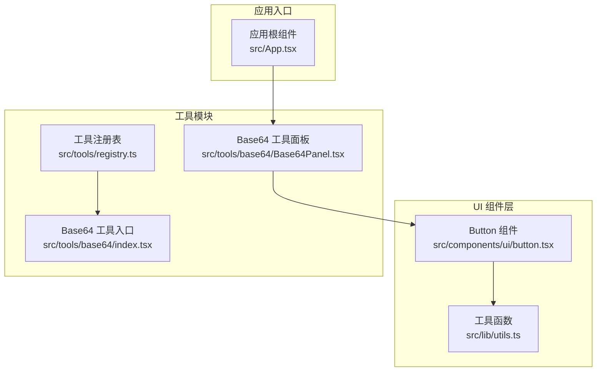
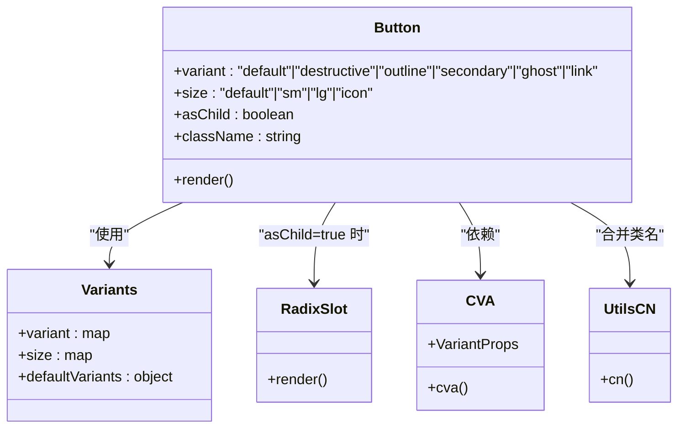
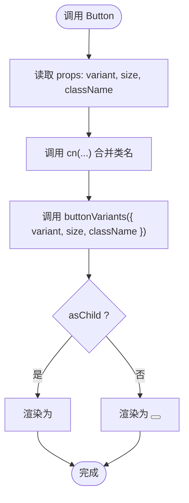
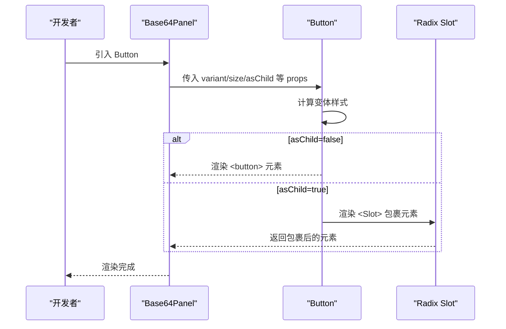
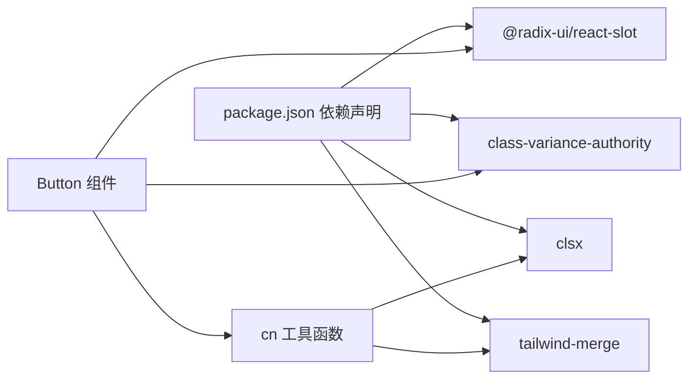

# Button 按钮组件

<cite>
**本文引用的文件**
- [button.tsx](file://src/components/ui/button.tsx)
- [utils.ts](file://src/lib/utils.ts)
- [package.json](file://package.json)
- [Base64Panel.tsx](file://src/tools/base64/Base64Panel.tsx)
- [index.tsx](file://src/tools/base64/index.tsx)
- [registry.ts](file://src/tools/registry.ts)
- [App.tsx](file://src/App.tsx)
</cite>

## 目录
1. [简介](#简介)
2. [项目结构](#项目结构)
3. [核心组件](#核心组件)
4. [架构总览](#架构总览)
5. [详细组件分析](#详细组件分析)
6. [依赖关系分析](#依赖关系分析)
7. [性能考量](#性能考量)
8. [故障排查指南](#故障排查指南)
9. [结论](#结论)
10. [附录](#附录)

## 简介
本文件为基于 Radix UI Slot 与 class-variance-authority（cva）的 Button 按钮组件提供系统化文档。内容涵盖：
- 变体系统：default、destructive、outline、secondary、ghost、link
- 尺寸规格：default、sm、lg、icon
- 属性配置：variant、size、asChild 的作用与组合效果
- 样式变体实现原理：cva 条件样式的动态应用
- 使用示例：图标按钮、链接按钮、危险操作按钮等
- 无障碍性设计：焦点状态、键盘导航支持
- 性能优化建议与最佳实践

## 项目结构
Button 组件位于 UI 组件目录中，配合通用工具函数进行类名合并，并在多个工具面板中实际使用。

图表来源
- [button.tsx:1-60](file://src/components/ui/button.tsx#L1-L60)
- [utils.ts:1-7](file://src/lib/utils.ts#L1-L7)
- [Base64Panel.tsx:1-125](file://src/tools/base64/Base64Panel.tsx#L1-L125)
- [registry.ts:1-13](file://src/tools/registry.ts#L1-L13)
- [index.tsx:1-16](file://src/tools/base64/index.tsx#L1-L16)
- [App.tsx:1-21](file://src/App.tsx#L1-L21)

章节来源
- [button.tsx:1-60](file://src/components/ui/button.tsx#L1-L60)
- [utils.ts:1-7](file://src/lib/utils.ts#L1-L7)
- [Base64Panel.tsx:1-125](file://src/tools/base64/Base64Panel.tsx#L1-L125)
- [registry.ts:1-13](file://src/tools/registry.ts#L1-L13)
- [index.tsx:1-16](file://src/tools/base64/index.tsx#L1-L16)
- [App.tsx:1-21](file://src/App.tsx#L1-L21)

## 核心组件
- 组件名称：Button
- 文件路径：[button.tsx:1-60](file://src/components/ui/button.tsx#L1-L60)
- 导出接口：
  - Button：React 组件
  - buttonVariants：cva 定义的对象，用于生成变体样式
- 关键依赖：
  - @radix-ui/react-slot：提供 Slot 组件以支持 asChild
  - class-variance-authority：提供 cva 与 VariantProps 类型
  - 自定义 cn 工具函数：基于 clsx 与 tailwind-merge 合并类名

章节来源
- [button.tsx:1-60](file://src/components/ui/button.tsx#L1-L60)
- [utils.ts:1-7](file://src/lib/utils.ts#L1-L7)
- [package.json:12-24](file://package.json#L12-L24)

## 架构总览
Button 组件采用“基础样式 + 变体系统”的设计模式：
- 基础样式：统一的布局、交互与可访问性基线（如 focus-visible、禁用态）
- 变体系统：通过 cva 定义 variant 与 size 两个维度，形成多套样式组合
- 渲染策略：根据 asChild 决定渲染为原生 button 或 Radix Slot 包裹元素

图表来源
- [button.tsx:7-36](file://src/components/ui/button.tsx#L7-L36)
- [button.tsx:38-57](file://src/components/ui/button.tsx#L38-L57)
- [utils.ts:4-6](file://src/lib/utils.ts#L4-L6)

## 详细组件分析

### 变体系统与尺寸规格
- 变体（variant）：
  - default：主色背景与前景对比，悬停有轻微透明度变化
  - destructive：破坏性动作，强调危险性，聚焦时带有破坏性环
  - outline：描边 + 背景，暗色主题下有输入色背景
  - secondary：次级背景，悬停有透明度变化
  - ghost：仅悬停时显示背景与前景变化
  - link：纯文字链接风格，悬停带下划线
- 尺寸（size）：
  - default：常规高度与内边距，图标按钮自动调整内边距
  - sm：更小尺寸，圆角与间距微调
  - lg：更大尺寸，适合重要操作
  - icon：正方形图标专用尺寸，适合工具栏图标按钮

章节来源
- [button.tsx:10-35](file://src/components/ui/button.tsx#L10-L35)

### 属性配置与行为
- variant：控制按钮外观变体
- size：控制按钮尺寸
- asChild：是否将内部渲染为 Radix Slot，从而允许父容器作为按钮承载元素
- className：额外类名，与变体样式合并
- 默认值：variant 默认 default，size 默认 default

章节来源
- [button.tsx:38-57](file://src/components/ui/button.tsx#L38-L57)

### 样式变体实现原理（cva）
- 基础样式：统一的对齐、字体、过渡、禁用态与可访问性基线
- 变体映射：通过 cva 的 variants 对象将 variant 映射到具体样式
- 尺寸映射：通过 cva 的 variants 对象将 size 映射到尺寸样式
- 类名合并：使用 cn 函数将基础样式、变体样式与用户传入 className 合并

图表来源
- [button.tsx:38-57](file://src/components/ui/button.tsx#L38-L57)
- [utils.ts:4-6](file://src/lib/utils.ts#L4-L6)

### 渲染与可访问性
- 可访问性基线：
  - focus-visible：聚焦时显示边框与环状高亮
  - aria-invalid：错误状态下的环与边框样式
  - 禁用态：禁用时禁止交互且降低不透明度
- 图标处理：当子元素为 SVG 时，自动设置合适的尺寸与指针事件
- asChild：通过 Radix Slot 允许父容器成为按钮承载元素，便于语义化与可访问性扩展

章节来源
- [button.tsx:7-8](file://src/components/ui/button.tsx#L7-L8)
- [button.tsx:48-56](file://src/components/ui/button.tsx#L48-L56)

### 使用示例与场景
- 图标按钮：在按钮内嵌入图标组件，利用默认尺寸与图标内边距适配
- 链接按钮：使用 link 变体，呈现纯文字链接风格
- 危险操作按钮：使用 destructive 变体，突出危险性
- 次要操作按钮：使用 secondary 变体，弱化主操作
- 描边按钮：使用 outline 变体，适合次要或中性操作
- 幽灵按钮：使用 ghost 变体，适合工具栏或轻量交互

图表来源
- [Base64Panel.tsx:87-107](file://src/tools/base64/Base64Panel.tsx#L87-L107)
- [button.tsx:38-57](file://src/components/ui/button.tsx#L38-L57)

章节来源
- [Base64Panel.tsx:87-107](file://src/tools/base64/Base64Panel.tsx#L87-L107)
- [button.tsx:38-57](file://src/components/ui/button.tsx#L38-L57)

### 在工具中的应用
- Base64 工具面板中广泛使用不同变体与尺寸的按钮，覆盖编码、解码、交换、清空、复制等操作
- 工具注册表与入口文件展示了工具模块的组织方式，便于扩展更多工具并复用 Button 组件

章节来源
- [Base64Panel.tsx:1-125](file://src/tools/base64/Base64Panel.tsx#L1-L125)
- [index.tsx:1-16](file://src/tools/base64/index.tsx#L1-L16)
- [registry.ts:1-13](file://src/tools/registry.ts#L1-L13)

## 依赖关系分析
- Button 组件依赖：
  - @radix-ui/react-slot：提供 Slot 渲染能力
  - class-variance-authority：提供 cva 与 VariantProps
  - 自定义 cn：基于 clsx 与 tailwind-merge 合并类名
- 运行时依赖版本：
  - @radix-ui/react-slot：^1.2.4
  - class-variance-authority：^0.7.1
  - clsx：^2.1.1
  - tailwind-merge：^3.6.0

图表来源
- [package.json:12-24](file://package.json#L12-L24)
- [button.tsx:1-5](file://src/components/ui/button.tsx#L1-L5)
- [utils.ts:1-6](file://src/lib/utils.ts#L1-L6)

章节来源
- [package.json:12-24](file://package.json#L12-L24)
- [button.tsx:1-5](file://src/components/ui/button.tsx#L1-L5)
- [utils.ts:1-6](file://src/lib/utils.ts#L1-L6)

## 性能考量
- 类名合并优化：使用 twMerge 合并 Tailwind 类，避免重复与冲突，减少 DOM 属性体积
- 变体计算：cva 在运行时按需计算样式，避免在组件外部预生成大量样式
- 渲染策略：asChild 仅在需要时启用，避免不必要的包装开销
- 无障碍基线：集中处理 focus-visible 与 aria-invalid，减少重复逻辑

## 故障排查指南
- 问题：按钮无法聚焦或无环状高亮
  - 排查：确认基础样式中 focus-visible 与 ring 样式是否被覆盖
  - 参考：基础样式包含聚焦与环状高亮规则
- 问题：图标按钮内边距异常
  - 排查：检查 size 与 has-[>svg]:px-* 的组合是否符合预期
  - 参考：不同尺寸对图标按钮的内边距有差异化处理
- 问题：asChild 渲染不符合预期
  - 排查：确认父容器是否正确接收 Slot 包裹，以及事件冒泡是否正常
  - 参考：asChild 为 true 时渲染为 Slot，否则为原生 button
- 问题：样式冲突导致变体失效
  - 排查：检查自定义 className 是否覆盖了变体样式
  - 参考：cn 会合并用户传入的 className，确保顺序正确

章节来源
- [button.tsx:7-8](file://src/components/ui/button.tsx#L7-L8)
- [button.tsx:24-29](file://src/components/ui/button.tsx#L24-L29)
- [button.tsx:48-56](file://src/components/ui/button.tsx#L48-L56)
- [utils.ts:4-6](file://src/lib/utils.ts#L4-L6)

## 结论
Button 组件通过 cva 提供清晰的变体与尺寸体系，结合 Radix Slot 的 asChild 能力，既保证了语义化与可访问性，又提供了灵活的渲染策略。在工具箱项目中，该组件被广泛应用于多种操作场景，体现了良好的可复用性与一致性。建议在实际使用中遵循变体与尺寸的最佳实践，关注无障碍性与性能优化，以获得更佳的用户体验。

## 附录
- 变体与尺寸对照表（概念性说明）
  - 变体：default、destructive、outline、secondary、ghost、link
  - 尺寸：default、sm、lg、icon
- 最佳实践
  - 优先使用语义化标签与 asChild，提升可访问性
  - 合理选择变体与尺寸，避免视觉噪音
  - 注意禁用态与错误态的样式一致性
  - 使用 cn 合并类名，避免重复与冲突