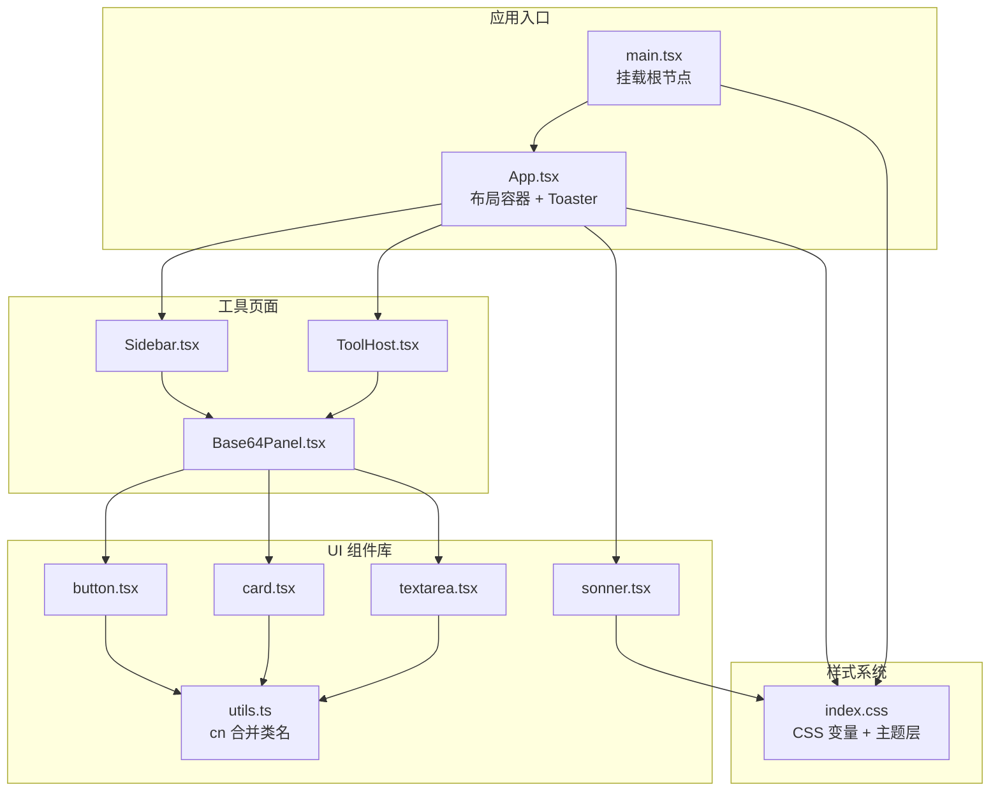
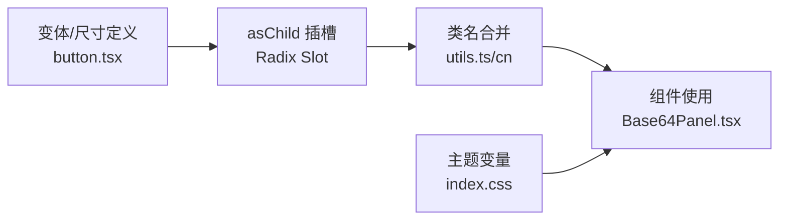
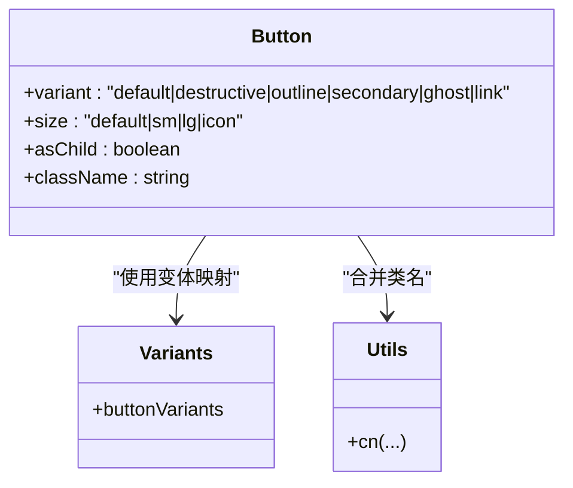
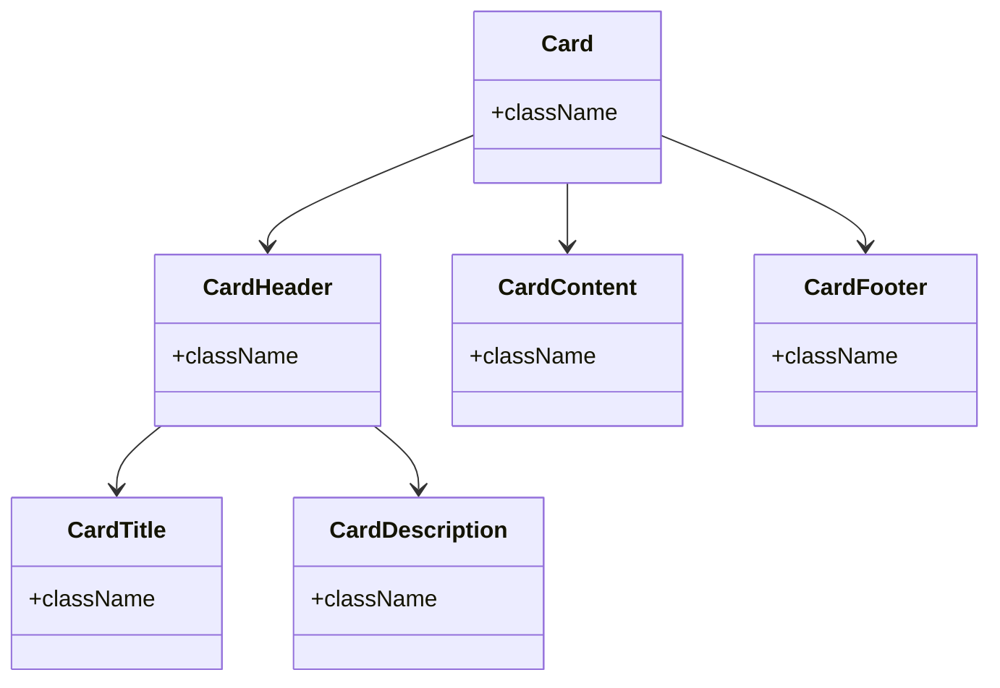
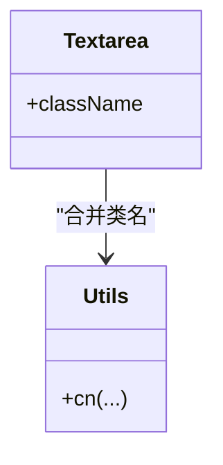
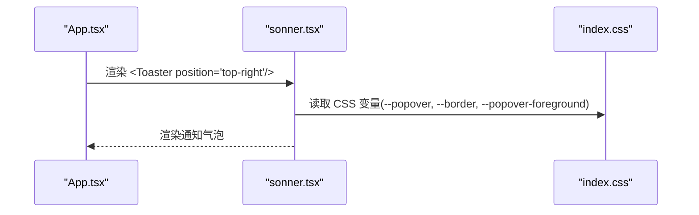
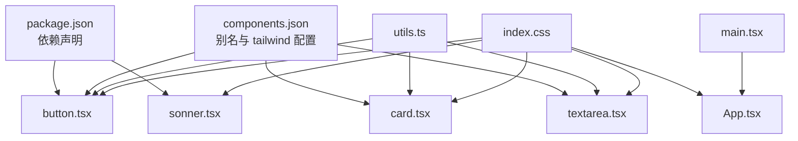

# UI 组件系统

<cite>
**本文引用的文件**
- [button.tsx](file://src/components/ui/button.tsx)
- [card.tsx](file://src/components/ui/card.tsx)
- [textarea.tsx](file://src/components/ui/textarea.tsx)
- [sonner.tsx](file://src/components/ui/sonner.tsx)
- [utils.ts](file://src/lib/utils.ts)
- [index.css](file://src/styles/index.css)
- [package.json](file://package.json)
- [components.json](file://components.json)
- [App.tsx](file://src/App.tsx)
- [main.tsx](file://src/main.tsx)
- [Base64Panel.tsx](file://src/tools/base64/Base64Panel.tsx)
- [Sidebar.tsx](file://src/layout/Sidebar.tsx)
- [ToolHost.tsx](file://src/layout/ToolHost.tsx)
- [registry.ts](file://src/tools/registry.ts)
- [types.ts](file://src/tools/types.ts)
</cite>

## 目录
1. [简介](#简介)
2. [项目结构](#项目结构)
3. [核心组件](#核心组件)
4. [架构总览](#架构总览)
5. [组件详解](#组件详解)
6. [依赖关系分析](#依赖关系分析)
7. [性能与可访问性](#性能与可访问性)
8. [故障排查指南](#故障排查指南)
9. [结论](#结论)
10. [附录](#附录)

## 简介
本文件系统化梳理 Toolbox 的 UI 组件体系，围绕 Radix UI 与 Tailwind CSS 的组合进行设计与实现，覆盖基础组件的设计原则、变体与尺寸体系、样式架构（含主题、暗色模式、响应式）、可复用性与一致性策略，并提供最佳实践与扩展建议。同时结合具体工具页面的使用示例，展示组件在真实场景中的组合与调优。

## 项目结构
UI 组件集中于 src/components/ui 下，采用“原子化 + 组合”的模块化组织方式，配合 src/lib/utils 提供通用类名合并能力，样式通过 src/styles/index.css 定义主题变量与层叠规则。应用入口在 src/main.tsx 引入全局样式并在 src/App.tsx 挂载组件树与通知系统。

图示来源
- [main.tsx:1-11](file://src/main.tsx#L1-L11)
- [App.tsx:1-21](file://src/App.tsx#L1-L21)
- [button.tsx:1-60](file://src/components/ui/button.tsx#L1-L60)
- [card.tsx:1-79](file://src/components/ui/card.tsx#L1-L79)
- [textarea.tsx:1-19](file://src/components/ui/textarea.tsx#L1-L19)
- [sonner.tsx:1-20](file://src/components/ui/sonner.tsx#L1-L20)
- [utils.ts:1-7](file://src/lib/utils.ts#L1-L7)
- [index.css:1-112](file://src/styles/index.css#L1-L112)
- [Sidebar.tsx:1-100](file://src/layout/Sidebar.tsx#L1-L100)
- [ToolHost.tsx:1-50](file://src/layout/ToolHost.tsx#L1-L50)
- [Base64Panel.tsx:1-125](file://src/tools/base64/Base64Panel.tsx#L1-L125)

章节来源
- [main.tsx:1-11](file://src/main.tsx#L1-L11)
- [App.tsx:1-21](file://src/App.tsx#L1-L21)
- [index.css:1-112](file://src/styles/index.css#L1-L112)

## 核心组件
- Button：基于 class-variance-authority 的变体与尺寸系统，支持 asChild 插槽以提升语义与可组合性；内置聚焦态、禁用态、错误态视觉反馈。
- Card：卡片复合组件，包含 Card、CardHeader、CardTitle、CardDescription、CardContent、CardFooter，统一间距与网格布局，适配操作区与标题区的组合。
- Textarea：输入域组件，统一边框、圆角、阴影、禁用与错误态样式，支持多行与可读只读场景。
- Toaster：基于 sonner 的全局通知封装，桥接 CSS 变量以适配主题色板。

章节来源
- [button.tsx:1-60](file://src/components/ui/button.tsx#L1-L60)
- [card.tsx:1-79](file://src/components/ui/card.tsx#L1-L79)
- [textarea.tsx:1-19](file://src/components/ui/textarea.tsx#L1-L19)
- [sonner.tsx:1-20](file://src/components/ui/sonner.tsx#L1-L20)

## 架构总览
组件系统遵循“变体 + 组合 + 主题变量”的三层设计：
- 变体与尺寸：通过 class-variance-authority 定义 variant/size 组合，保证同一组件在不同上下文下的一致外观。
- 组合与插槽：利用 Radix Slot 实现 asChild，允许 Button 包裹任意元素（如图标），增强语义与可访问性。
- 主题与样式：Tailwind CSS 变量驱动主题切换，CSS 层 base 层统一基础元素外观，暗色模式通过自定义选择器生效。

图示来源
- [button.tsx:1-60](file://src/components/ui/button.tsx#L1-L60)
- [utils.ts:1-7](file://src/lib/utils.ts#L1-L7)
- [index.css:1-112](file://src/styles/index.css#L1-L112)
- [Base64Panel.tsx:1-125](file://src/tools/base64/Base64Panel.tsx#L1-L125)

## 组件详解

### Button 组件
- 设计原则
  - 变体：default、destructive、outline、secondary、ghost、link，覆盖主要交互意图。
  - 尺寸：default、sm、lg、icon，满足不同密度与信息层级。
  - 可组合：asChild 使用 Radix Slot，使 Button 可包裹图标等子元素，保持语义与可访问性。
  - 视觉反馈：聚焦态 ring 效果、禁用态透明度与指针事件、错误态边框与 ring。
- 关键实现点
  - 使用 cva 定义变体与尺寸映射，最终通过 cn 合并传入 className。
  - 支持原生 button 属性透传，便于事件绑定与表单集成。
- 使用示例路径
  - [Base64Panel.tsx:87-107](file://src/tools/base64/Base64Panel.tsx#L87-L107)
- 可扩展建议
  - 新增变体时，同步补充暗色模式下的对比度与可读性校验。
  - 与图标组合时，优先使用 asChild，避免额外包裹标签。

图示来源
- [button.tsx:1-60](file://src/components/ui/button.tsx#L1-L60)
- [utils.ts:1-7](file://src/lib/utils.ts#L1-L7)

章节来源
- [button.tsx:1-60](file://src/components/ui/button.tsx#L1-L60)
- [Base64Panel.tsx:87-107](file://src/tools/base64/Base64Panel.tsx#L87-L107)

### Card 组件
- 设计原则
  - 结构化布局：Header/Title/Description/Content/Footer 组合，统一间距与网格行为。
  - 响应式与容器：使用 @container 与数据槽标记，适配不同区域布局。
  - 边框与阴影：统一圆角、边框与阴影，确保卡片在不同背景下的层次感。
- 关键实现点
  - 数据槽 data-slot 标记各子组件，便于调试与样式定位。
  - Header 在存在操作区时自动调整网格列数，提升布局灵活性。
- 使用示例路径
  - [Base64Panel.tsx:68-121](file://src/tools/base64/Base64Panel.tsx#L68-L121)

图示来源
- [card.tsx:1-79](file://src/components/ui/card.tsx#L1-L79)

章节来源
- [card.tsx:1-79](file://src/components/ui/card.tsx#L1-L79)
- [Base64Panel.tsx:68-121](file://src/tools/base64/Base64Panel.tsx#L68-L121)

### Textarea 组件
- 设计原则
  - 输入一致性：统一边框、圆角、阴影、禁用与错误态。
  - 可读性：提供只读场景与最小高度约束，适合多行文本编辑。
  - 交互反馈：聚焦态 ring、禁用态指针与透明度。
- 使用示例路径
  - [Base64Panel.tsx:78-118](file://src/tools/base64/Base64Panel.tsx#L78-L118)

图示来源
- [textarea.tsx:1-19](file://src/components/ui/textarea.tsx#L1-L19)
- [utils.ts:1-7](file://src/lib/utils.ts#L1-L7)

章节来源
- [textarea.tsx:1-19](file://src/components/ui/textarea.tsx#L1-L19)
- [Base64Panel.tsx:78-118](file://src/tools/base64/Base64Panel.tsx#L78-L118)

### Toaster 组件
- 设计原则
  - 主题桥接：通过 CSS 变量将通知背景、文字与边框映射到当前主题色板。
  - 位置控制：在应用根部统一挂载，支持位置参数。
- 使用示例路径
  - [App.tsx](file://src/App.tsx#L15)

图示来源
- [App.tsx:1-21](file://src/App.tsx#L1-L21)
- [sonner.tsx:1-20](file://src/components/ui/sonner.tsx#L1-L20)
- [index.css:1-112](file://src/styles/index.css#L1-L112)

章节来源
- [sonner.tsx:1-20](file://src/components/ui/sonner.tsx#L1-L20)
- [App.tsx:1-21](file://src/App.tsx#L1-L21)

## 依赖关系分析
- 组件依赖
  - 所有 UI 组件均依赖 src/lib/utils.ts 的 cn 函数进行类名合并，避免重复样式冲突。
  - Button 依赖 class-variance-authority 与 Radix Slot，实现变体与 asChild。
  - Toaster 依赖 sonner，并通过 CSS 变量与主题系统联动。
- 样式依赖
  - 全局样式通过 src/styles/index.css 注入，定义 CSS 变量与主题层，所有组件样式依赖该文件。
- 应用集成
  - src/main.tsx 引入全局样式后挂载应用；App.tsx 作为根容器，承载布局与通知系统。

图示来源
- [package.json:1-37](file://package.json#L1-L37)
- [components.json:1-22](file://components.json#L1-L22)
- [utils.ts:1-7](file://src/lib/utils.ts#L1-L7)
- [button.tsx:1-60](file://src/components/ui/button.tsx#L1-L60)
- [card.tsx:1-79](file://src/components/ui/card.tsx#L1-L79)
- [textarea.tsx:1-19](file://src/components/ui/textarea.tsx#L1-L19)
- [sonner.tsx:1-20](file://src/components/ui/sonner.tsx#L1-L20)
- [index.css:1-112](file://src/styles/index.css#L1-L112)
- [main.tsx:1-11](file://src/main.tsx#L1-L11)
- [App.tsx:1-21](file://src/App.tsx#L1-L21)

章节来源
- [package.json:1-37](file://package.json#L1-L37)
- [components.json:1-22](file://components.json#L1-L22)
- [utils.ts:1-7](file://src/lib/utils.ts#L1-L7)

## 性能与可访问性
- 性能
  - 类名合并：使用 twMerge 与 clsx 合并类名，减少无效样式叠加与重绘。
  - 变体计算：cva 在运行时按需生成类名，避免构建期膨胀。
  - 按需引入：组件按需导入，避免无用代码进入产物。
- 可访问性
  - 焦点管理：Button 与输入组件内置聚焦态 ring，确保键盘可达性。
  - 错误状态：通过 aria-invalid 与 destructiv 主题色提示错误，提升可感知性。
  - 语义结构：Card 子组件使用语义化容器与数据槽标记，利于屏幕阅读器识别。
- 最佳实践
  - 为交互元素提供明确的键盘焦点指示。
  - 在错误场景使用明确的文案与颜色对比。
  - 图标与文本组合时，优先使用 asChild 以保留语义。

## 故障排查指南
- 样式不生效
  - 检查全局样式是否正确引入：确认 main.tsx 中已引入 src/styles/index.css。
  - 检查 CSS 变量是否被覆盖：确认 index.css 中的主题变量未被外部样式重写。
- 暗色模式异常
  - 确认根元素具备 dark 类或 .dark 选择器生效。
  - 检查 CSS 自定义选择器与主题层是否正确加载。
- 组件变体/尺寸不生效
  - 确认传入的 variant/size 值在定义范围内。
  - 检查 className 是否被覆盖或顺序不当导致 twMerge 合并未生效。
- 通知样式异常
  - 确认 Toaster 的 CSS 变量映射正常，检查 --popover、--border、--popover-foreground 是否可用。

章节来源
- [main.tsx:1-11](file://src/main.tsx#L1-L11)
- [index.css:1-112](file://src/styles/index.css#L1-L112)
- [sonner.tsx:1-20](file://src/components/ui/sonner.tsx#L1-L20)
- [utils.ts:1-7](file://src/lib/utils.ts#L1-L7)

## 结论
本 UI 组件系统以 Radix UI 与 Tailwind CSS 为核心，通过变体/尺寸体系、组合插槽与主题变量实现了高内聚、低耦合且可扩展的基础组件库。在工具页面中，组件以卡片化布局与统一的交互反馈，保障了跨工具的一致体验。建议在新增组件时遵循现有命名与变体约定，并在暗色模式与可访问性方面持续优化。

## 附录

### 组件使用场景与示例路径
- 基础按钮与图标组合
  - [Base64Panel.tsx:87-107](file://src/tools/base64/Base64Panel.tsx#L87-L107)
- 卡片布局与输入区域
  - [Base64Panel.tsx:68-121](file://src/tools/base64/Base64Panel.tsx#L68-L121)
- 文本域输入与只读展示
  - [Base64Panel.tsx:78-118](file://src/tools/base64/Base64Panel.tsx#L78-L118)
- 通知系统集成
  - [App.tsx](file://src/App.tsx#L15)

### 主题与样式架构要点
- CSS 变量：在 :root 与 .dark 中定义主题色，通过 @theme inline 映射为 --color-* 变量。
- 基础层：@layer base 统一 border、outline-ring/50 等基础样式。
- 组件适配：Button/Textarea/Card/Toaster 均依赖主题变量与层叠规则，确保明暗模式一致表现。

章节来源
- [index.css:1-112](file://src/styles/index.css#L1-L112)
- [button.tsx:1-60](file://src/components/ui/button.tsx#L1-L60)
- [textarea.tsx:1-19](file://src/components/ui/textarea.tsx#L1-L19)
- [card.tsx:1-79](file://src/components/ui/card.tsx#L1-L79)
- [sonner.tsx:1-20](file://src/components/ui/sonner.tsx#L1-L20)