# 工具模块接口设计

<cite>
**本文档引用的文件**
- [src/tools/types.ts](file://src/tools/types.ts)
- [src/tools/registry.ts](file://src/tools/registry.ts)
- [src/tools/base64/index.tsx](file://src/tools/base64/index.tsx)
- [src/tools/base64/Base64Panel.tsx](file://src/tools/base64/Base64Panel.tsx)
- [src/tools/base64/base64.ts](file://src/tools/base64/base64.ts)
- [src/layout/ToolHost.tsx](file://src/layout/ToolHost.tsx)
- [src/layout/Sidebar.tsx](file://src/layout/Sidebar.tsx)
- [src/hooks/useActiveTool.ts](file://src/hooks/useActiveTool.ts)
- [src/App.tsx](file://src/App.tsx)
- [package.json](file://package.json)
</cite>

## 目录
1. [简介](#简介)
2. [项目结构](#项目结构)
3. [核心组件](#核心组件)
4. [架构概览](#架构概览)
5. [详细组件分析](#详细组件分析)
6. [依赖关系分析](#依赖关系分析)
7. [性能考虑](#性能考虑)
8. [故障排除指南](#故障排除指南)
9. [结论](#结论)
10. [附录](#附录)

## 简介

本项目是一个基于 React 和 Tauri 的工具箱应用，采用模块化设计思想，通过 ToolModule 接口实现工具模块的标准化管理。该系统提供了统一的工具注册表、路由管理和组件渲染机制，支持多种工具的动态加载和切换。

工具模块接口设计的核心目标是：
- 提供统一的工具抽象接口
- 实现松耦合的模块化架构
- 确保工具间的一致性和兼容性
- 支持工具的动态注册和卸载

## 项目结构

项目采用清晰的分层架构，主要目录结构如下：

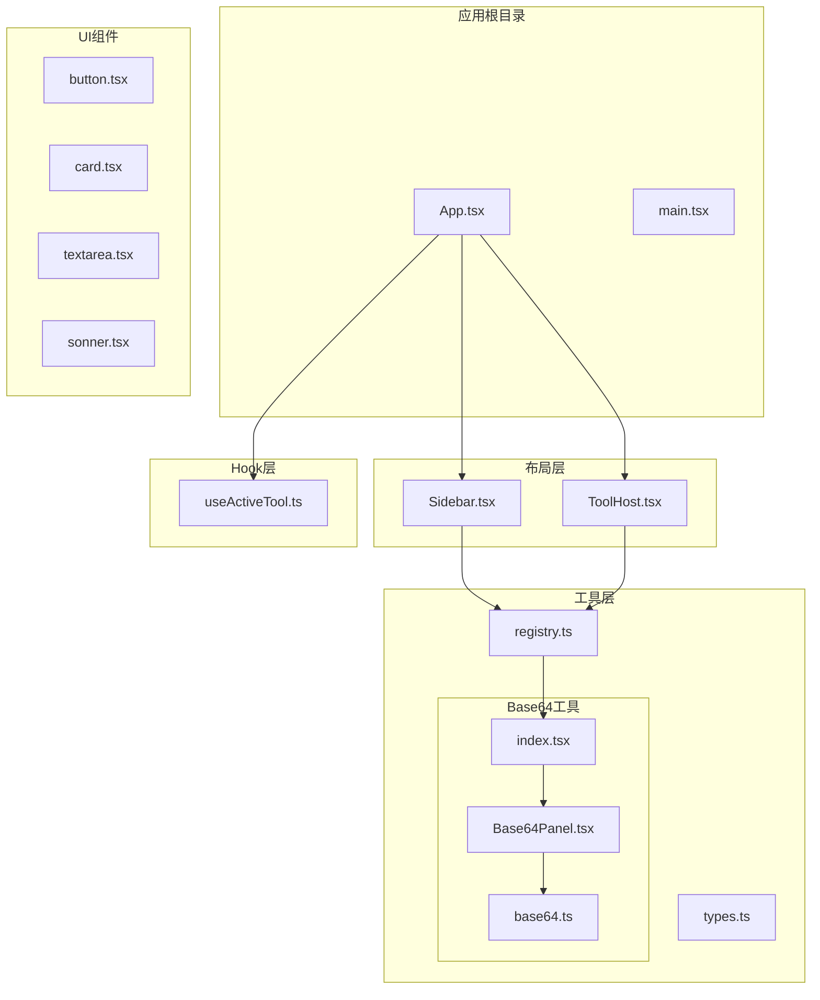

**图表来源**
- [src/App.tsx:1-21](file://src/App.tsx#L1-L21)
- [src/layout/Sidebar.tsx:1-100](file://src/layout/Sidebar.tsx#L1-L100)
- [src/layout/ToolHost.tsx:1-50](file://src/layout/ToolHost.tsx#L1-L50)
- [src/tools/registry.ts:1-13](file://src/tools/registry.ts#L1-L13)

**章节来源**
- [src/App.tsx:1-21](file://src/App.tsx#L1-L21)
- [src/layout/Sidebar.tsx:1-100](file://src/layout/Sidebar.tsx#L1-L100)
- [src/layout/ToolHost.tsx:1-50](file://src/layout/ToolHost.tsx#L1-L50)

## 核心组件

### ToolModule 接口设计

ToolModule 接口是整个工具模块系统的核心抽象，定义了工具模块的标准规范：

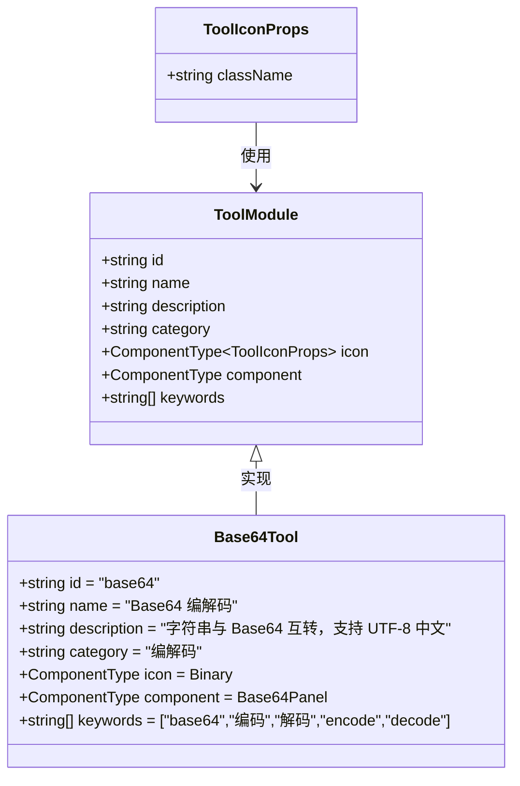

**图表来源**
- [src/tools/types.ts:7-22](file://src/tools/types.ts#L7-L22)
- [src/tools/base64/index.tsx:5-13](file://src/tools/base64/index.tsx#L5-L13)

#### 关键属性详解

**id 属性**
- 类型：string
- 作用：唯一标识符，用于 URL hash 路由
- 约束：必须全局唯一，建议使用小写字母和数字组合
- 示例：`"base64"`

**name 属性**
- 类型：string
- 作用：工具的显示名称
- 约束：用户可见，建议简洁明了
- 示例：`"Base64 编解码"`

**description 属性**
- 类型：string（可选）
- 作用：工具的简短描述
- 约束：提供工具功能的快速说明
- 示例：`"字符串与 Base64 互转，支持 UTF-8 中文"`

**category 属性**
- 类型：string（可选）
- 作用：工具分类，用于侧边栏分组显示
- 约束：影响工具的组织结构
- 示例：`"编解码"`

**icon 属性**
- 类型：React ComponentType<ToolIconProps>（可选）
- 作用：侧边栏显示的图标组件
- 约束：需要接受 className 属性
- 示例：`Binary`（来自 lucide-react）

**component 属性**
- 类型：React ComponentType
- 作用：工具的主要 UI 组件
- 约束：必须是有效的 React 组件
- 示例：`Base64Panel`

**keywords 属性**
- 类型：string[]（可选）
- 作用：用于搜索的关键词数组
- 约束：提升工具的可发现性
- 示例：`["base64","编码","解码","encode","decode"]`

**章节来源**
- [src/tools/types.ts:7-22](file://src/tools/types.ts#L7-L22)
- [src/tools/base64/index.tsx:5-13](file://src/tools/base64/index.tsx#L5-L13)

### 工具注册表系统

工具注册表提供了集中式的工具管理机制：

```mermaid
graph LR
subgraph "注册表"
Tools[ToolModule[]]
FindTool[findTool(id)]
end
subgraph "工具模块"
Base64[Base64 模块]
NewTool[新工具模块]
end
subgraph "外部访问"
Sidebar[侧边栏]
ToolHost[工具宿主]
Router[路由系统]
end
Tools --> Base64
Tools --> NewTool
Sidebar --> FindTool
ToolHost --> FindTool
Router --> FindTool
```

**图表来源**
- [src/tools/registry.ts:1-13](file://src/tools/registry.ts#L1-L13)

**章节来源**
- [src/tools/registry.ts:1-13](file://src/tools/registry.ts#L1-L13)

## 架构概览

系统采用事件驱动的架构模式，通过 URL hash 实现无刷新的工具切换：

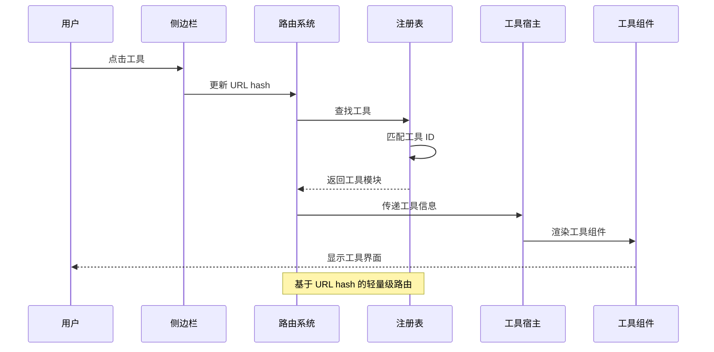

**图表来源**
- [src/hooks/useActiveTool.ts:17-33](file://src/hooks/useActiveTool.ts#L17-L33)
- [src/layout/ToolHost.tsx:10-49](file://src/layout/ToolHost.tsx#L10-L49)
- [src/tools/registry.ts:9-12](file://src/tools/registry.ts#L9-L12)

**章节来源**
- [src/App.tsx:6-18](file://src/App.tsx#L6-L18)
- [src/hooks/useActiveTool.ts:17-33](file://src/hooks/useActiveTool.ts#L17-L33)

## 详细组件分析

### 侧边栏组件分析

侧边栏组件实现了工具的分类展示和搜索功能：

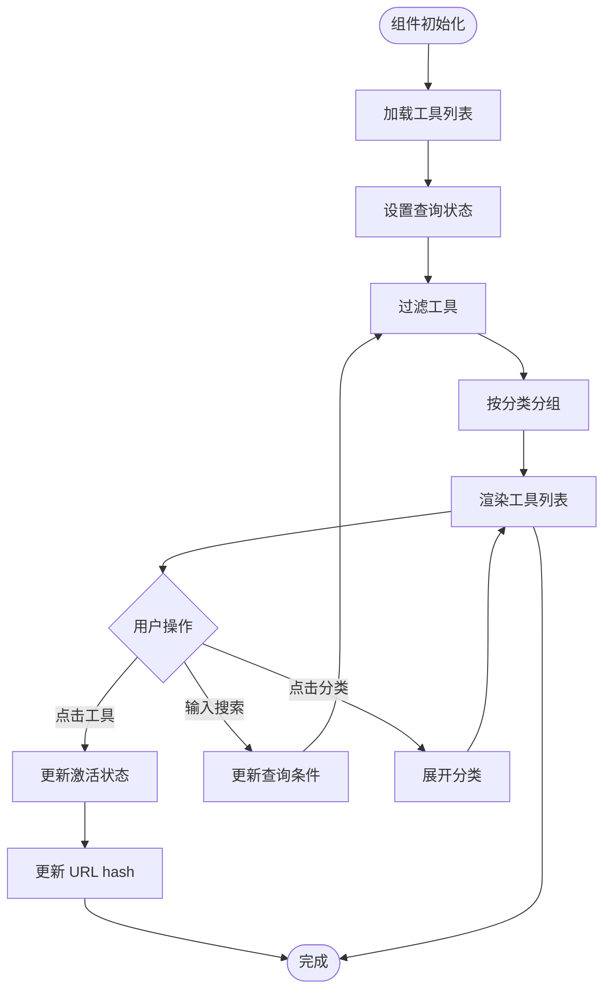

**图表来源**
- [src/layout/Sidebar.tsx:23-99](file://src/layout/Sidebar.tsx#L23-L99)

#### 搜索匹配算法

侧边栏实现了多维度的工具搜索匹配：

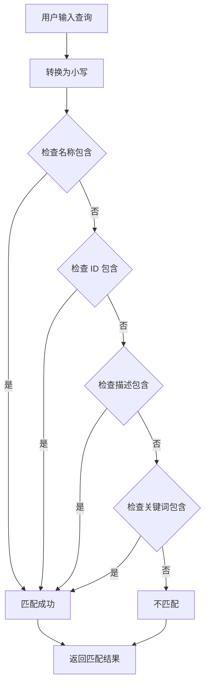

**图表来源**
- [src/layout/Sidebar.tsx:13-21](file://src/layout/Sidebar.tsx#L13-L21)

**章节来源**
- [src/layout/Sidebar.tsx:13-21](file://src/layout/Sidebar.tsx#L13-L21)
- [src/layout/Sidebar.tsx:23-99](file://src/layout/Sidebar.tsx#L23-L99)

### 工具宿主组件分析

工具宿主负责根据激活的工具 ID 动态渲染对应的工具组件：

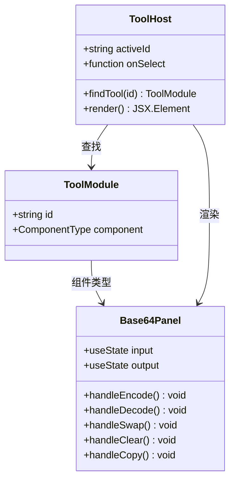

**图表来源**
- [src/layout/ToolHost.tsx:10-49](file://src/layout/ToolHost.tsx#L10-L49)
- [src/tools/types.ts:18-19](file://src/tools/types.ts#L18-L19)

#### 组件渲染流程

工具宿主的渲染逻辑遵循以下流程：

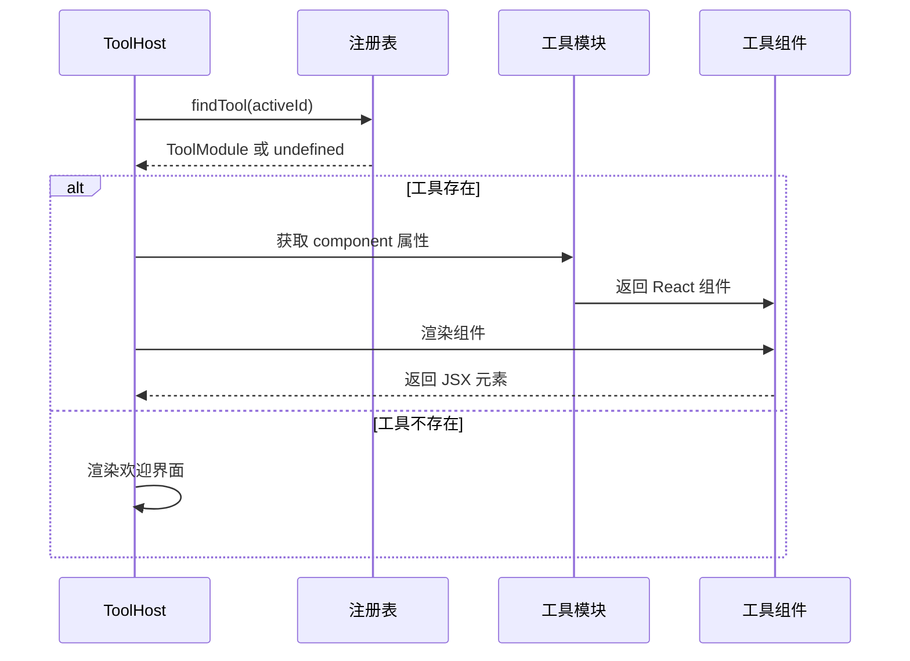

**图表来源**
- [src/layout/ToolHost.tsx:10-49](file://src/layout/ToolHost.tsx#L10-L49)
- [src/tools/registry.ts:9-12](file://src/tools/registry.ts#L9-L12)

**章节来源**
- [src/layout/ToolHost.tsx:10-49](file://src/layout/ToolHost.tsx#L10-L49)

### Base64 工具模块实现

Base64 工具模块展示了完整的工具实现示例：

#### 工具模块定义

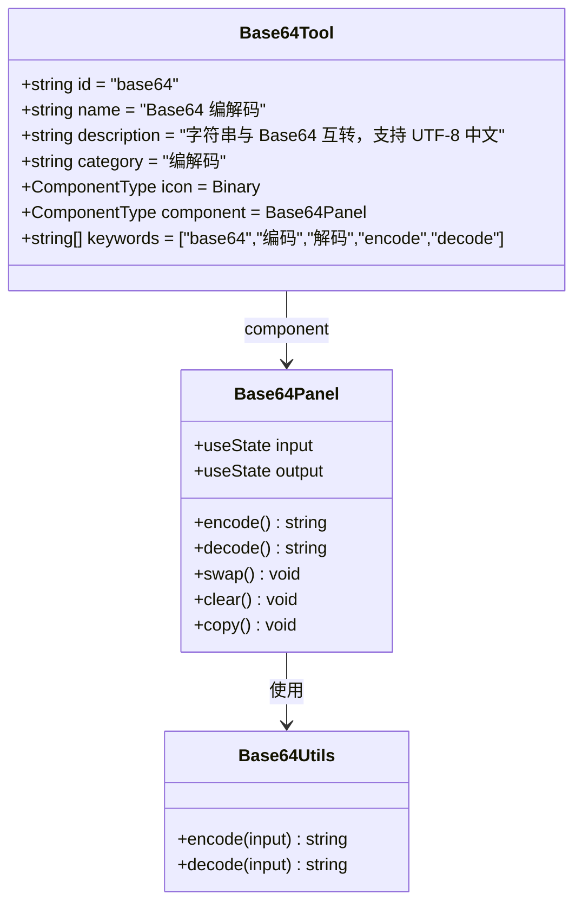

**图表来源**
- [src/tools/base64/index.tsx:5-13](file://src/tools/base64/index.tsx#L5-L13)
- [src/tools/base64/Base64Panel.tsx:23-124](file://src/tools/base64/Base64Panel.tsx#L23-L124)
- [src/tools/base64/base64.ts:5-34](file://src/tools/base64/base64.ts#L5-L34)

#### 编解码算法实现

Base64 编解码采用了 UTF-8 安全的实现方式：

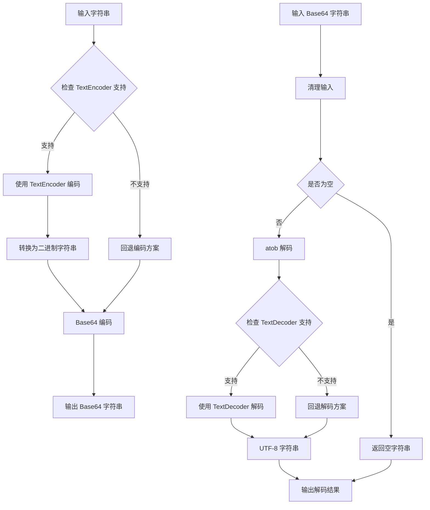

**图表来源**
- [src/tools/base64/base64.ts:5-34](file://src/tools/base64/base64.ts#L5-L34)

**章节来源**
- [src/tools/base64/index.tsx:5-13](file://src/tools/base64/index.tsx#L5-L13)
- [src/tools/base64/Base64Panel.tsx:23-124](file://src/tools/base64/Base64Panel.tsx#L23-L124)
- [src/tools/base64/base64.ts:5-34](file://src/tools/base64/base64.ts#L5-L34)

### 路由系统分析

系统采用基于 URL hash 的轻量级路由机制：

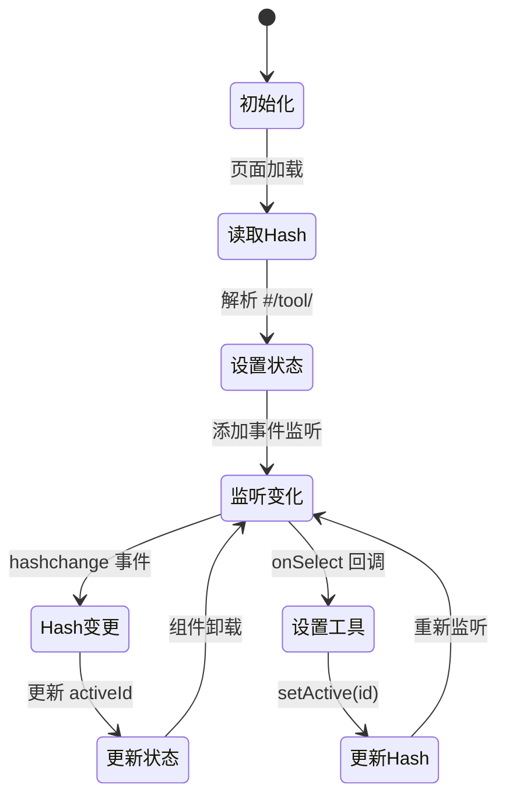

**图表来源**
- [src/hooks/useActiveTool.ts:17-33](file://src/hooks/useActiveTool.ts#L17-L33)

**章节来源**
- [src/hooks/useActiveTool.ts:17-33](file://src/hooks/useActiveTool.ts#L17-L33)

## 依赖关系分析

系统依赖关系清晰，遵循单一职责原则：

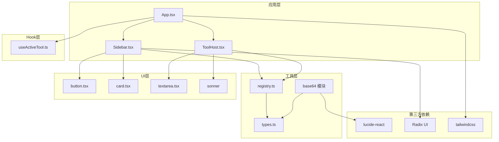

**图表来源**
- [src/App.tsx:1-21](file://src/App.tsx#L1-L21)
- [src/layout/Sidebar.tsx:1-100](file://src/layout/Sidebar.tsx#L1-L100)
- [src/layout/ToolHost.tsx:1-50](file://src/layout/ToolHost.tsx#L1-L50)
- [package.json:12-24](file://package.json#L12-L24)

**章节来源**
- [package.json:12-24](file://package.json#L12-L24)

## 性能考虑

### 渲染优化策略

1. **组件懒加载**：工具组件仅在激活时渲染，避免不必要的资源消耗
2. **状态管理**：使用 React 内置的状态管理，减少额外的依赖
3. **事件处理**：使用 useCallback 优化事件处理器的重渲染

### 内存管理

1. **事件监听器**：在组件卸载时正确移除 hashchange 事件监听器
2. **工具缓存**：工具注册表采用静态数组，避免重复创建
3. **状态清理**：工具组件在卸载时自动清理相关状态

## 故障排除指南

### 常见问题及解决方案

**工具无法显示**
- 检查工具是否正确注册到注册表
- 验证工具 ID 是否唯一且格式正确
- 确认工具组件是否导出默认组件

**路由跳转异常**
- 检查 URL hash 格式是否符合 `#/tool/<id>`
- 验证 hashchange 事件监听器是否正常工作
- 确认工具 ID 是否存在于注册表中

**图标显示问题**
- 确认图标组件是否正确导入
- 检查图标组件是否接受 className 属性
- 验证图标组件的大小和样式

**章节来源**
- [src/tools/registry.ts:9-12](file://src/tools/registry.ts#L9-L12)
- [src/hooks/useActiveTool.ts:17-33](file://src/hooks/useActiveTool.ts#L17-L33)

## 结论

本工具模块接口设计展现了优秀的软件工程实践：

1. **接口设计简洁明确**：ToolModule 接口定义了工具模块的核心要素，便于理解和扩展
2. **架构松耦合**：通过注册表实现模块间的解耦，支持动态添加新工具
3. **用户体验优秀**：基于 URL hash 的路由机制提供了流畅的工具切换体验
4. **代码组织清晰**：采用分层架构，职责分离明确

该设计为未来的功能扩展预留了充足的空间，可以轻松支持更多工具类型的集成。

## 附录

### 开发最佳实践

1. **工具模块实现步骤**
   - 在 `src/tools/` 目录下创建新的工具子目录
   - 实现工具的 UI 组件
   - 创建工具模块定义文件
   - 将工具模块添加到注册表

2. **样式集成指南**
   - 使用 Tailwind CSS 进行样式定制
   - 遵循现有的组件样式约定
   - 确保响应式设计适配

3. **测试策略**
   - 单元测试：针对工具的业务逻辑
   - 集成测试：验证工具与注册表的交互
   - 用户体验测试：验证路由和导航功能

### 扩展点预留

1. **工具元数据扩展**：可以在 ToolModule 接口中添加新的可选属性
2. **工具生命周期钩子**：可以添加工具的挂载、卸载钩子函数
3. **工具权限控制**：可以添加访问权限相关的配置项
4. **工具配置系统**：可以为工具提供自定义配置选项