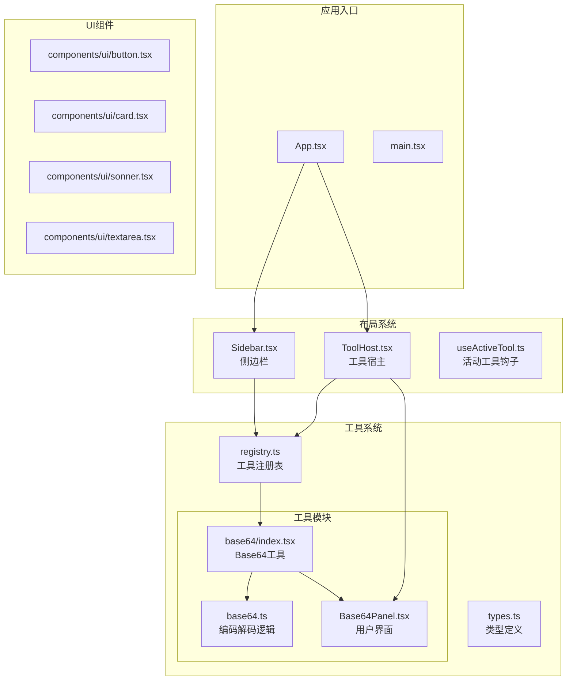
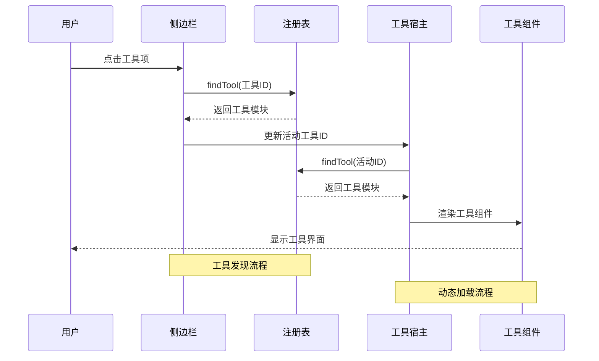
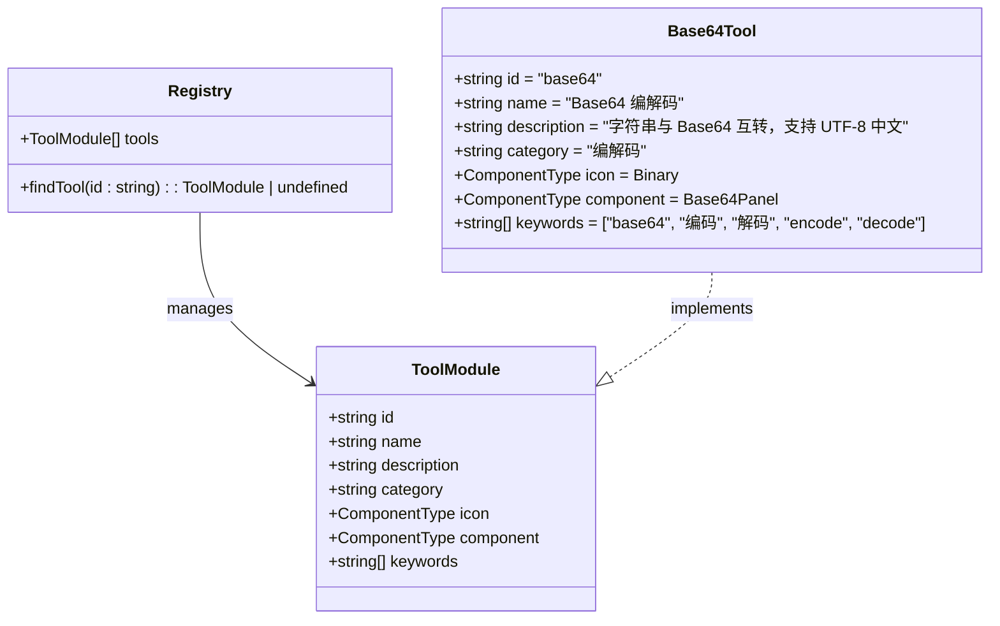
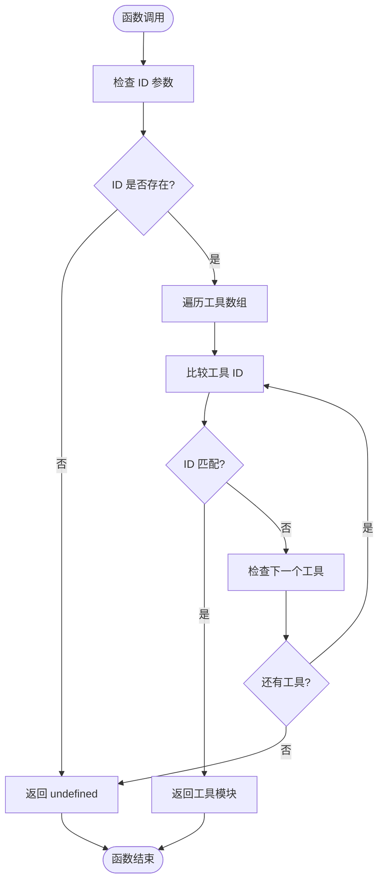
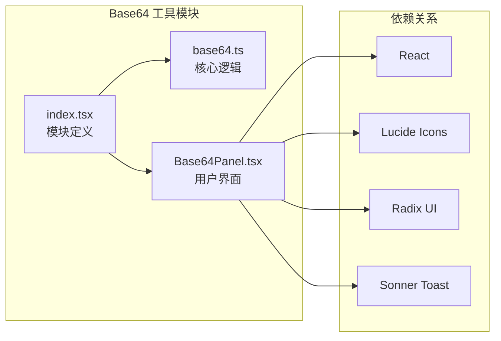
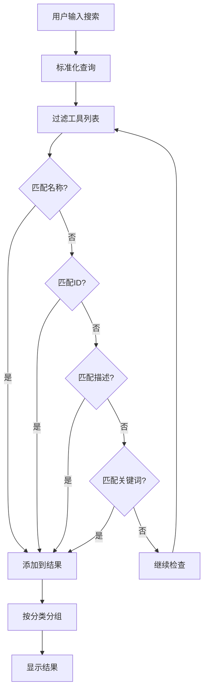
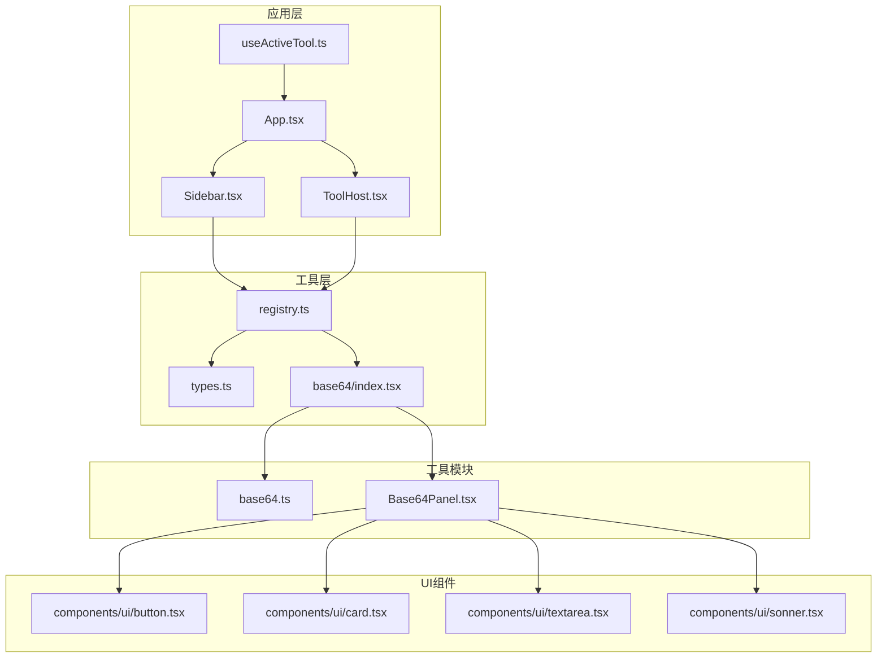

# 工具注册表机制

<cite>
**本文档引用的文件**
- [registry.ts](file://src/tools/registry.ts)
- [types.ts](file://src/tools/types.ts)
- [index.tsx](file://src/tools/base64/index.tsx)
- [base64.ts](file://src/tools/base64/base64.ts)
- [Base64Panel.tsx](file://src/tools/base64/Base64Panel.tsx)
- [useActiveTool.ts](file://src/hooks/useActiveTool.ts)
- [Sidebar.tsx](file://src/layout/Sidebar.tsx)
- [ToolHost.tsx](file://src/layout/ToolHost.tsx)
- [App.tsx](file://src/App.tsx)
- [package.json](file://package.json)
- [vite.config.ts](file://vite.config.ts)
</cite>

## 目录
1. [简介](#简介)
2. [项目结构](#项目结构)
3. [核心组件](#核心组件)
4. [架构概览](#架构概览)
5. [详细组件分析](#详细组件分析)
6. [依赖关系分析](#依赖关系分析)
7. [性能考虑](#性能考虑)
8. [故障排除指南](#故障排除指南)
9. [结论](#结论)

## 简介

本项目是一个基于 React 和 Tauri 的工具箱应用，采用模块化设计实现了灵活的工具注册表机制。该机制允许开发者轻松添加新的工具模块，而无需修改核心代码。工具注册表通过集中管理所有可用工具，提供了统一的发现、加载和渲染接口。

工具注册表的核心设计理念是：
- **声明式注册**：通过简单的数组声明添加新工具
- **类型安全**：完整的 TypeScript 类型定义确保开发时的类型检查
- **动态加载**：运行时根据 ID 动态查找和加载工具
- **可扩展性**：遵循单一职责原则，易于维护和扩展

## 项目结构

项目采用功能模块化的目录结构，主要组件分布如下：

**图表来源**
- [registry.ts:1-13](file://src/tools/registry.ts#L1-L13)
- [types.ts:1-23](file://src/tools/types.ts#L1-L23)
- [index.tsx:1-16](file://src/tools/base64/index.tsx#L1-L16)

**章节来源**
- [App.tsx:1-21](file://src/App.tsx#L1-L21)
- [vite.config.ts:1-39](file://vite.config.ts#L1-L39)

## 核心组件

### 工具注册表 (Registry)

工具注册表是整个工具系统的核心，负责管理和协调所有可用工具模块。它提供了两个主要功能：

1. **工具集合管理**：维护一个包含所有已注册工具的数组
2. **工具查找服务**：根据工具 ID 快速定位和返回对应的工具模块

### 工具模块接口 (ToolModule)

每个工具模块都必须实现统一的接口规范，确保系统的一致性和可预测性：

- **唯一标识符 (id)**：用于路由和状态管理的唯一字符串
- **显示名称 (name)**：用户界面中显示的人类可读名称
- **描述信息 (description)**：简短的功能说明
- **分类标签 (category)**：用于分组显示的类别
- **图标组件 (icon)**：侧边栏显示的 SVG 图标
- **主组件 (component)**：工具的主要用户界面组件
- **关键词 (keywords)**：用于搜索匹配的辅助词汇

### 工具发现机制 (findTool)

findTool 函数实现了高效的工具查找算法，具有以下特点：

- **参数验证**：检查输入 ID 的有效性
- **精确匹配**：使用严格相等比较工具 ID
- **快速返回**：找到匹配项后立即返回
- **类型安全**：返回值明确标注可能为 undefined

**章节来源**
- [registry.ts:1-13](file://src/tools/registry.ts#L1-L13)
- [types.ts:7-22](file://src/tools/types.ts#L7-L22)

## 架构概览

工具注册表机制采用了清晰的分层架构，确保了良好的关注点分离：

**图表来源**
- [Sidebar.tsx:23-100](file://src/layout/Sidebar.tsx#L23-L100)
- [ToolHost.tsx:10-50](file://src/layout/ToolHost.tsx#L10-L50)
- [registry.ts:9-12](file://src/tools/registry.ts#L9-L12)

### 数据流分析

系统中的数据流向体现了典型的单向数据流模式：

1. **用户交互** → **侧边栏** → **更新状态**
2. **状态变化** → **工具宿主** → **动态渲染**
3. **工具模块** → **UI 组件** → **用户反馈**

这种设计确保了状态的一致性和可预测性。

## 详细组件分析

### 工具注册表实现

#### 注册表结构设计

**图表来源**
- [types.ts:7-22](file://src/tools/types.ts#L7-L22)
- [registry.ts:7](file://src/tools/registry.ts#L7)
- [index.tsx:5-15](file://src/tools/base64/index.tsx#L5-L15)

#### 注册流程详解

工具注册过程遵循严格的步骤：

1. **模块导出**：每个工具模块导出实现 ToolModule 接口的对象
2. **导入注册**：在 registry.ts 中导入工具模块
3. **数组聚合**：将工具模块添加到 tools 数组中
4. **自动发现**：通过 findTool 函数实现动态查找

#### findTool 函数实现

**图表来源**
- [registry.ts:9-12](file://src/tools/registry.ts#L9-L12)

**章节来源**
- [registry.ts:1-13](file://src/tools/registry.ts#L1-L13)
- [types.ts:7-22](file://src/tools/types.ts#L7-L22)

### 工具模块示例分析

#### Base64 工具模块

Base64 工具作为系统的核心示例，展示了完整的工具实现模式：

**图表来源**
- [index.tsx:1-16](file://src/tools/base64/index.tsx#L1-L16)
- [base64.ts:1-35](file://src/tools/base64/base64.ts#L1-L35)
- [Base64Panel.tsx:1-125](file://src/tools/base64/Base64Panel.tsx#L1-L125)

#### 编码解码算法实现

Base64 编码解码算法考虑了多种环境兼容性：

- **现代浏览器支持**：优先使用 TextEncoder/TextDecoder API
- **降级兼容**：回退到传统的 escape/unescape 方法
- **错误处理**：完善的异常捕获和错误消息
- **输入验证**：对空输入进行特殊处理

**章节来源**
- [index.tsx:5-15](file://src/tools/base64/index.tsx#L5-L15)
- [base64.ts:5-34](file://src/tools/base64/base64.ts#L5-L34)
- [Base64Panel.tsx:23-64](file://src/tools/base64/Base64Panel.tsx#L23-L64)

### 搜索和分类机制

#### 侧边栏搜索算法

侧边栏实现了智能的工具搜索功能，支持多维度匹配：

**图表来源**
- [Sidebar.tsx:13-21](file://src/layout/Sidebar.tsx#L13-L21)

#### 分类显示逻辑

工具按照分类进行智能分组显示，未分类的工具默认归入"其他"类别。

**章节来源**
- [Sidebar.tsx:26-35](file://src/layout/Sidebar.tsx#L26-L35)

## 依赖关系分析

### 模块依赖图

**图表来源**
- [App.tsx:1-21](file://src/App.tsx#L1-L21)
- [Sidebar.tsx:1-100](file://src/layout/Sidebar.tsx#L1-L100)
- [ToolHost.tsx:1-50](file://src/layout/ToolHost.tsx#L1-L50)
- [registry.ts:1-13](file://src/tools/registry.ts#L1-L13)

### 外部依赖管理

项目使用现代化的依赖管理系统：

- **构建工具**：Vite 提供快速开发体验
- **UI 库**：Radix UI + Tailwind CSS 实现现代化界面
- **图标系统**：Lucide React 提供一致的图标风格
- **通知系统**：Sonner 提供优雅的用户反馈
- **状态管理**：React 内置状态管理满足需求

**章节来源**
- [package.json:12-24](file://package.json#L12-L24)
- [vite.config.ts:10-15](file://vite.config.ts#L10-L15)

## 性能考虑

### 运行时性能优化

1. **懒加载策略**：工具组件仅在需要时渲染，避免不必要的初始化
2. **内存管理**：工具模块作为静态常量存储，减少内存占用
3. **渲染优化**：使用 React.memo 和 useMemo 避免重复渲染
4. **搜索性能**：过滤操作在小规模工具集上执行，性能开销可忽略

### 开发时性能优化

1. **热重载**：Vite 提供快速的模块热替换
2. **类型检查**：TypeScript 在开发时提供即时反馈
3. **构建优化**：生产构建自动进行代码分割和压缩

## 故障排除指南

### 常见问题及解决方案

#### 工具无法显示

**症状**：添加新工具后在侧边栏看不到
**原因**：
- 工具模块未正确导入到注册表
- 工具 ID 重复或格式不正确
- 工具组件未正确导出

**解决方法**：
1. 检查 registry.ts 中的导入语句
2. 验证工具 ID 的唯一性
3. 确认工具模块的默认导出

#### 工具页面空白

**症状**：点击工具后页面显示空白
**原因**：
- 工具组件未正确实现
- 组件渲染逻辑错误
- 缺少必要的依赖

**解决方法**：
1. 检查工具组件的实现
2. 验证组件的导出格式
3. 确认所有依赖都已正确安装

#### 搜索功能异常

**症状**：工具搜索无法正常工作
**原因**：
- 关键词数组格式不正确
- 搜索算法逻辑错误
- 文本匹配规则不符合预期

**解决方法**：
1. 检查工具模块的 keywords 字段
2. 验证搜索算法的实现
3. 测试不同类型的搜索查询

**章节来源**
- [registry.ts:9-12](file://src/tools/registry.ts#L9-L12)
- [Sidebar.tsx:13-21](file://src/layout/Sidebar.tsx#L13-L21)

## 结论

工具注册表机制成功实现了工具系统的可发现性和可扩展性目标。通过简洁而强大的设计，该机制为开发者提供了：

1. **简单易用的注册方式**：仅需一行导入和数组添加
2. **类型安全的开发体验**：完整的 TypeScript 支持
3. **高效的运行时性能**：常量时间的工具查找
4. **灵活的扩展能力**：易于添加新工具模块

该机制的核心优势在于其极简的设计哲学：通过最少的样板代码实现最大的功能价值。开发者可以专注于工具本身的实现，而无需担心复杂的集成问题。

未来可以考虑的改进方向包括：
- 添加工具元数据的版本控制
- 实现工具的条件加载
- 增强工具间的依赖管理
- 提供工具的生命周期钩子