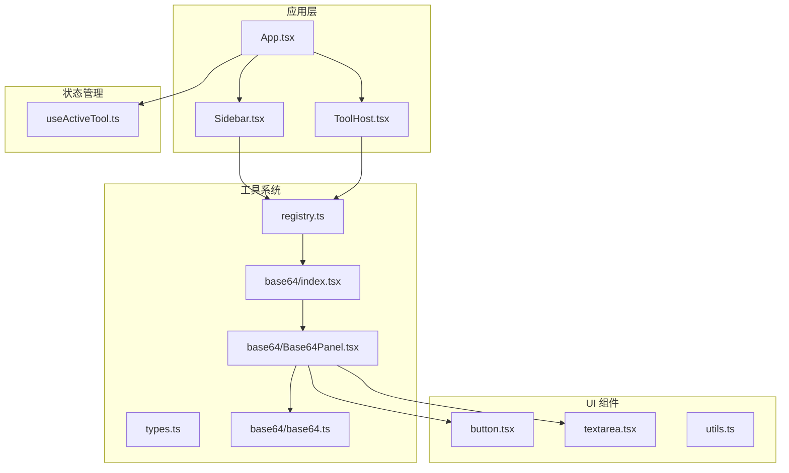
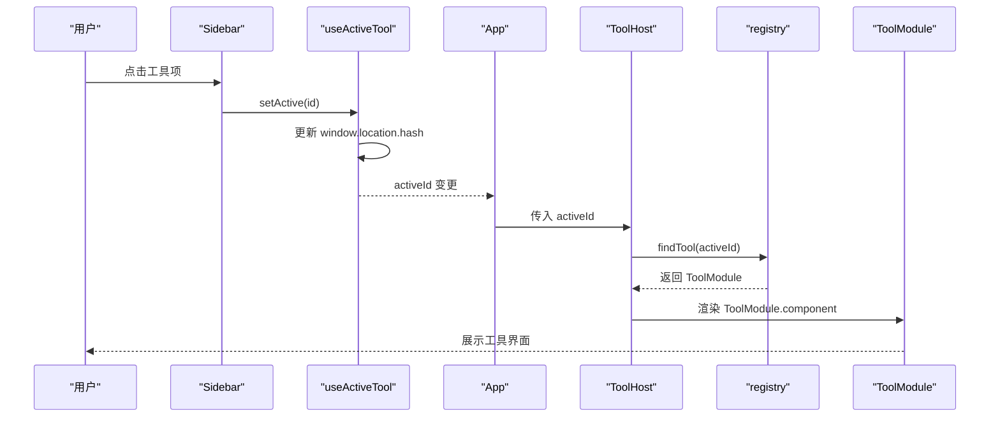
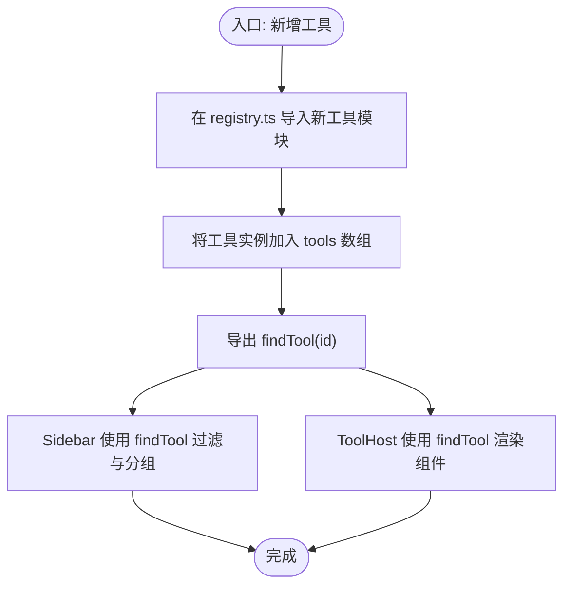
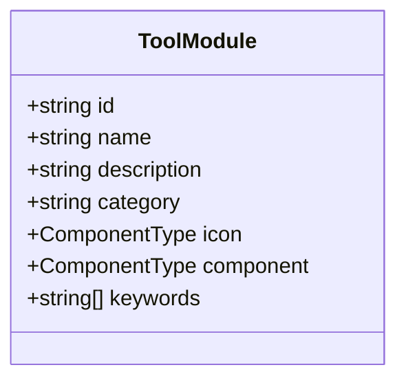
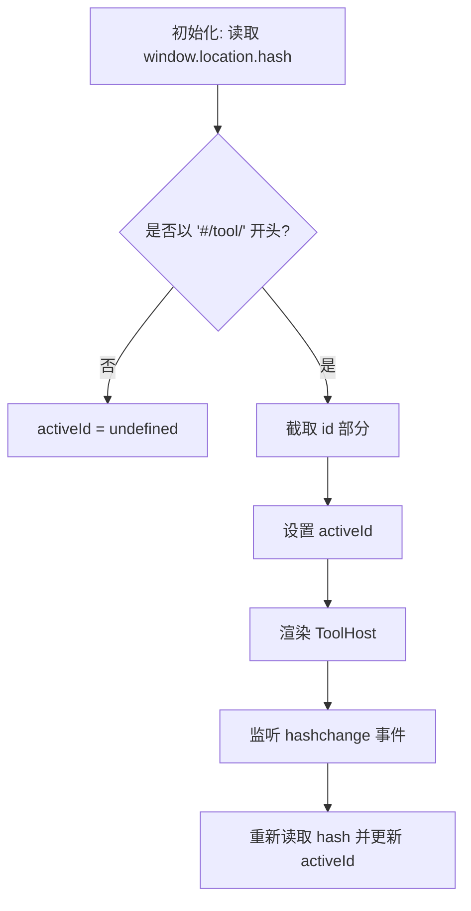
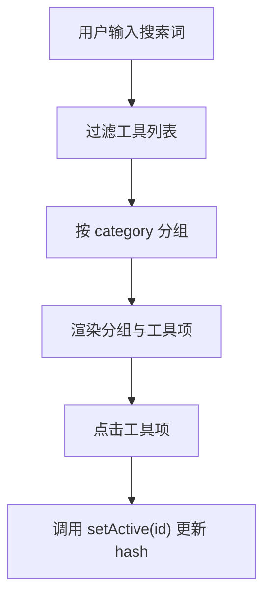
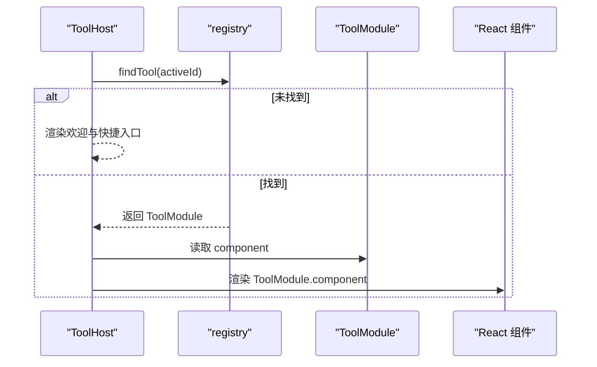
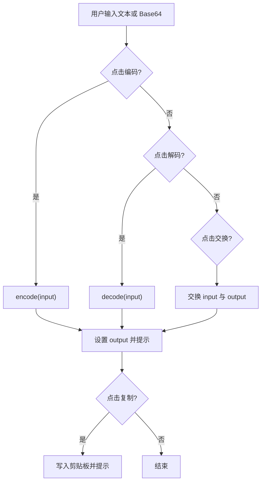
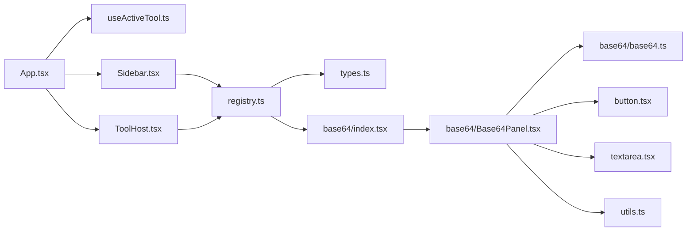

# 工具系统

<cite>
**本文引用的文件**
- [src/tools/registry.ts](file://src/tools/registry.ts)
- [src/tools/types.ts](file://src/tools/types.ts)
- [src/tools/base64/index.tsx](file://src/tools/base64/index.tsx)
- [src/tools/base64/Base64Panel.tsx](file://src/tools/base64/Base64Panel.tsx)
- [src/tools/base64/base64.ts](file://src/tools/base64/base64.ts)
- [src/layout/Sidebar.tsx](file://src/layout/Sidebar.tsx)
- [src/layout/ToolHost.tsx](file://src/layout/ToolHost.tsx)
- [src/hooks/useActiveTool.ts](file://src/hooks/useActiveTool.ts)
- [src/App.tsx](file://src/App.tsx)
- [src/components/ui/button.tsx](file://src/components/ui/button.tsx)
- [src/components/ui/textarea.tsx](file://src/components/ui/textarea.tsx)
- [src/lib/utils.ts](file://src/lib/utils.ts)
- [package.json](file://package.json)
</cite>

## 目录
1. [简介](#简介)
2. [项目结构](#项目结构)
3. [核心组件](#核心组件)
4. [架构总览](#架构总览)
5. [详细组件分析](#详细组件分析)
6. [依赖关系分析](#依赖关系分析)
7. [性能考虑](#性能考虑)
8. [故障排查指南](#故障排查指南)
9. [结论](#结论)
10. [附录](#附录)

## 简介
本文件为 Toolbox 工具系统的综合技术文档，围绕工具注册表机制、ToolModule 接口规范、URL hash 状态管理、工具开发最佳实践以及现有 Base64 工具的实现进行深入解析。文档旨在帮助开发者快速理解系统设计思想，安全地扩展新工具并集成到现有框架中。

## 项目结构
Toolbox 采用前端单页应用架构，核心工具系统位于 src/tools 下，UI 采用 React + TailwindCSS，工具通过“注册表”集中管理，侧边栏负责导航与搜索，工具宿主负责渲染当前激活工具，状态通过 URL hash 实现无刷新切换与持久化。

图表来源
- [src/App.tsx:1-21](file://src/App.tsx#L1-L21)
- [src/layout/Sidebar.tsx:1-100](file://src/layout/Sidebar.tsx#L1-L100)
- [src/layout/ToolHost.tsx:1-50](file://src/layout/ToolHost.tsx#L1-L50)
- [src/tools/registry.ts:1-13](file://src/tools/registry.ts#L1-L13)
- [src/tools/types.ts:1-23](file://src/tools/types.ts#L1-L23)
- [src/tools/base64/index.tsx:1-16](file://src/tools/base64/index.tsx#L1-L16)
- [src/tools/base64/Base64Panel.tsx:1-125](file://src/tools/base64/Base64Panel.tsx#L1-L125)
- [src/tools/base64/base64.ts:1-35](file://src/tools/base64/base64.ts#L1-L35)
- [src/components/ui/button.tsx:1-60](file://src/components/ui/button.tsx#L1-L60)
- [src/components/ui/textarea.tsx:1-19](file://src/components/ui/textarea.tsx#L1-L19)
- [src/lib/utils.ts:1-7](file://src/lib/utils.ts#L1-L7)
- [src/hooks/useActiveTool.ts:1-34](file://src/hooks/useActiveTool.ts#L1-L34)

章节来源
- [src/App.tsx:1-21](file://src/App.tsx#L1-L21)
- [src/layout/Sidebar.tsx:1-100](file://src/layout/Sidebar.tsx#L1-L100)
- [src/layout/ToolHost.tsx:1-50](file://src/layout/ToolHost.tsx#L1-L50)
- [src/tools/registry.ts:1-13](file://src/tools/registry.ts#L1-L13)
- [src/tools/types.ts:1-23](file://src/tools/types.ts#L1-L23)
- [src/hooks/useActiveTool.ts:1-34](file://src/hooks/useActiveTool.ts#L1-L34)

## 核心组件
- 工具注册表：集中声明可用工具，提供查找函数，便于扩展与维护。
- ToolModule 接口：定义工具的标准元数据与渲染组件，确保工具间一致性。
- 侧边栏导航：按分类分组展示工具，支持关键词搜索与高亮。
- 工具宿主：根据激活 ID 动态渲染对应工具面板。
- URL hash 状态管理：以 #/tool/<id> 形式保存当前工具，实现无刷新切换与分享。
- Base64 工具：提供 UTF-8 安全的编解码能力与直观的用户界面。

章节来源
- [src/tools/registry.ts:1-13](file://src/tools/registry.ts#L1-L13)
- [src/tools/types.ts:1-23](file://src/tools/types.ts#L1-L23)
- [src/layout/Sidebar.tsx:1-100](file://src/layout/Sidebar.tsx#L1-L100)
- [src/layout/ToolHost.tsx:1-50](file://src/layout/ToolHost.tsx#L1-L50)
- [src/hooks/useActiveTool.ts:1-34](file://src/hooks/useActiveTool.ts#L1-L34)
- [src/tools/base64/Base64Panel.tsx:1-125](file://src/tools/base64/Base64Panel.tsx#L1-L125)

## 架构总览
系统采用“注册表 + 模块化工具 + 状态驱动”的轻量架构：
- 注册表统一暴露工具清单与查找方法，新增工具仅需在注册表导入并加入数组。
- ToolModule 规范了工具的元信息与组件接口，保证扩展的一致性。
- 侧边栏负责用户交互与筛选，工具宿主负责渲染当前工具。
- URL hash 作为单一事实来源，驱动工具切换与状态持久化。

图表来源
- [src/layout/Sidebar.tsx:1-100](file://src/layout/Sidebar.tsx#L1-L100)
- [src/hooks/useActiveTool.ts:1-34](file://src/hooks/useActiveTool.ts#L1-L34)
- [src/App.tsx:1-21](file://src/App.tsx#L1-L21)
- [src/layout/ToolHost.tsx:1-50](file://src/layout/ToolHost.tsx#L1-L50)
- [src/tools/registry.ts:1-13](file://src/tools/registry.ts#L1-L13)
- [src/tools/types.ts:1-23](file://src/tools/types.ts#L1-L23)

## 详细组件分析

### 工具注册表与发现机制
- 注册表职责：集中导入工具模块并导出工具列表与查找函数。
- 发现机制：findTool(id) 基于 id 精确匹配，未命中返回 undefined，避免运行时错误。
- 扩展策略：新增工具只需在注册表中导入并加入数组，即可被侧边栏与工具宿主识别。

图表来源
- [src/tools/registry.ts:1-13](file://src/tools/registry.ts#L1-L13)
- [src/layout/Sidebar.tsx:1-100](file://src/layout/Sidebar.tsx#L1-L100)
- [src/layout/ToolHost.tsx:1-50](file://src/layout/ToolHost.tsx#L1-L50)

章节来源
- [src/tools/registry.ts:1-13](file://src/tools/registry.ts#L1-L13)

### ToolModule 接口设计与标准规范
- 元信息字段：id、name、description、category、keywords 等，用于导航、搜索与分组。
- 组件字段：icon 与 component，分别承担侧边栏图标与工具主界面渲染。
- 设计理念：通过统一接口约束工具行为，降低耦合，提升可维护性与可扩展性。

图表来源
- [src/tools/types.ts:1-23](file://src/tools/types.ts#L1-L23)

章节来源
- [src/tools/types.ts:1-23](file://src/tools/types.ts#L1-L23)

### 基于 URL hash 的工具状态管理
- 状态格式：#/tool/<id>，其中 id 对应 ToolModule.id。
- 初始化：首次加载读取 hash，若不匹配前缀则视为未选择任何工具。
- 切换：setActive(id) 写入 hash，触发 hashchange 事件，更新 activeId。
- 持久化：通过 hash 可直接分享链接，打开即处于指定工具状态。

图表来源
- [src/hooks/useActiveTool.ts:1-34](file://src/hooks/useActiveTool.ts#L1-L34)
- [src/layout/ToolHost.tsx:1-50](file://src/layout/ToolHost.tsx#L1-L50)

章节来源
- [src/hooks/useActiveTool.ts:1-34](file://src/hooks/useActiveTool.ts#L1-L34)

### 侧边栏导航与搜索
- 分类分组：按 category 将工具分组展示，默认“其他”兜底。
- 搜索匹配：支持 name、id、description、keywords 的模糊匹配。
- 选中高亮：当前激活工具项高亮显示，便于用户定位。

图表来源
- [src/layout/Sidebar.tsx:1-100](file://src/layout/Sidebar.tsx#L1-L100)
- [src/hooks/useActiveTool.ts:1-34](file://src/hooks/useActiveTool.ts#L1-L34)

章节来源
- [src/layout/Sidebar.tsx:1-100](file://src/layout/Sidebar.tsx#L1-L100)

### 工具宿主渲染与默认占位
- 未激活：展示欢迎语与快捷入口，一键跳转到任一工具。
- 已激活：通过 findTool 获取 ToolModule，渲染其 component。

图表来源
- [src/layout/ToolHost.tsx:1-50](file://src/layout/ToolHost.tsx#L1-L50)
- [src/tools/registry.ts:1-13](file://src/tools/registry.ts#L1-L13)
- [src/tools/types.ts:1-23](file://src/tools/types.ts#L1-L23)

章节来源
- [src/layout/ToolHost.tsx:1-50](file://src/layout/ToolHost.tsx#L1-L50)

### Base64 工具实现详解
- 编码流程：优先使用 TextEncoder/TextDecoder 实现 UTF-8 安全编码；回退方案兼容旧环境。
- 解码流程：去除空白后尝试解码，UTF-8 安全解码并处理异常。
- 用户界面：输入区、操作按钮（编码、解码、交换、清空、复制）、输出区，响应式布局与可访问性良好。
- 交互逻辑：按钮级联错误提示，剪贴板写入成功/失败反馈，输入输出双向绑定。

图表来源
- [src/tools/base64/Base64Panel.tsx:1-125](file://src/tools/base64/Base64Panel.tsx#L1-L125)
- [src/tools/base64/base64.ts:1-35](file://src/tools/base64/base64.ts#L1-L35)

章节来源
- [src/tools/base64/Base64Panel.tsx:1-125](file://src/tools/base64/Base64Panel.tsx#L1-L125)
- [src/tools/base64/base64.ts:1-35](file://src/tools/base64/base64.ts#L1-L35)

### 工具开发最佳实践指南
- 工具模板
  - 在 src/tools/<your-tool>/ 下建立目录，包含 index.tsx、组件文件与业务逻辑文件。
  - index.tsx 导出 ToolModule 实例，确保 id 唯一且语义清晰。
- 命名规范
  - id 使用短横线分隔的小写标识，如 "url-encoder"。
  - name 为中文可读名称，description 提供简要说明，keywords 便于搜索。
- 文件组织结构
  - index.tsx：导出 ToolModule。
  - <ToolName>Panel.tsx：工具主界面组件。
  - <tool>.ts：纯函数或工具逻辑，避免副作用。
- UI 组件复用
  - 使用 src/components/ui/* 组件，保持一致的交互与视觉风格。
  - 使用 cn 合并样式，遵循 TailwindCSS 类名约定。
- 状态与路由
  - 通过 useActiveTool 管理 hash 状态，无需引入重型路由库。
  - 在组件内避免直接操作 history，统一通过 setActive(id) 更新。
- 错误处理
  - 对外部输入进行校验与清理（如 trim），捕获异常并友好提示。
  - 使用全局通知组件（如 Sonner）反馈结果。

章节来源
- [src/tools/types.ts:1-23](file://src/tools/types.ts#L1-L23)
- [src/tools/base64/index.tsx:1-16](file://src/tools/base64/index.tsx#L1-L16)
- [src/components/ui/button.tsx:1-60](file://src/components/ui/button.tsx#L1-L60)
- [src/components/ui/textarea.tsx:1-19](file://src/components/ui/textarea.tsx#L1-L19)
- [src/lib/utils.ts:1-7](file://src/lib/utils.ts#L1-L7)
- [src/hooks/useActiveTool.ts:1-34](file://src/hooks/useActiveTool.ts#L1-L34)

### 扩展示例：新增一个工具模块
- 步骤
  1) 在 src/tools/registry.ts 中导入你的工具模块并加入 tools 数组。
  2) 在 src/tools/<your-tool>/index.tsx 中导出 ToolModule 实例，填写 id、name、icon、component 等。
  3) 在 src/tools/<your-tool>/ 下编写组件与逻辑文件。
  4) 在 src/layout/Sidebar.tsx 或 src/layout/ToolHost.tsx 中无需修改即可生效。
- 注意事项
  - id 必须唯一，建议使用短横线分隔的小写标识。
  - icon 为可选，但建议提供以增强可发现性。
  - keywords 有助于提升搜索体验。

章节来源
- [src/tools/registry.ts:1-13](file://src/tools/registry.ts#L1-L13)
- [src/tools/base64/index.tsx:1-16](file://src/tools/base64/index.tsx#L1-L16)
- [src/layout/Sidebar.tsx:1-100](file://src/layout/Sidebar.tsx#L1-L100)
- [src/layout/ToolHost.tsx:1-50](file://src/layout/ToolHost.tsx#L1-L50)

## 依赖关系分析
- 应用层依赖：App 依赖 useActiveTool 提供的状态，依赖 Sidebar 与 ToolHost 进行界面组织。
- 工具系统依赖：Sidebar 与 ToolHost 依赖 registry 提供的工具清单与查找函数。
- UI 组件依赖：工具面板依赖 button、textarea 等通用组件，样式合并依赖 utils。
- 第三方依赖：React、Lucide React、TailwindCSS、Sonner、Radix UI 等。

图表来源
- [src/App.tsx:1-21](file://src/App.tsx#L1-L21)
- [src/hooks/useActiveTool.ts:1-34](file://src/hooks/useActiveTool.ts#L1-L34)
- [src/layout/Sidebar.tsx:1-100](file://src/layout/Sidebar.tsx#L1-L100)
- [src/layout/ToolHost.tsx:1-50](file://src/layout/ToolHost.tsx#L1-L50)
- [src/tools/registry.ts:1-13](file://src/tools/registry.ts#L1-L13)
- [src/tools/types.ts:1-23](file://src/tools/types.ts#L1-L23)
- [src/tools/base64/index.tsx:1-16](file://src/tools/base64/index.tsx#L1-L16)
- [src/tools/base64/Base64Panel.tsx:1-125](file://src/tools/base64/Base64Panel.tsx#L1-L125)
- [src/tools/base64/base64.ts:1-35](file://src/tools/base64/base64.ts#L1-L35)
- [src/components/ui/button.tsx:1-60](file://src/components/ui/button.tsx#L1-L60)
- [src/components/ui/textarea.tsx:1-19](file://src/components/ui/textarea.tsx#L1-L19)
- [src/lib/utils.ts:1-7](file://src/lib/utils.ts#L1-L7)

章节来源
- [package.json:1-37](file://package.json#L1-L37)

## 性能考虑
- 渲染优化
  - Sidebar 使用 useMemo 缓存分组与过滤结果，减少重复计算。
  - ToolHost 条件渲染欢迎页与工具面板，避免不必要的组件挂载。
- 状态同步
  - hash 变更触发的重渲染范围可控，仅影响状态钩子与工具宿主。
- 资源加载
  - 工具按需渲染，未激活工具不会占用内存与计算资源。
- UI 组件
  - 使用轻量级 UI 组件与 TailwindCSS，避免过度样式计算。

章节来源
- [src/layout/Sidebar.tsx:1-100](file://src/layout/Sidebar.tsx#L1-L100)
- [src/layout/ToolHost.tsx:1-50](file://src/layout/ToolHost.tsx#L1-L50)
- [src/hooks/useActiveTool.ts:1-34](file://src/hooks/useActiveTool.ts#L1-L34)

## 故障排查指南
- 工具未显示在侧边栏
  - 检查是否已在 registry.ts 导入并加入 tools 数组。
  - 确认 ToolModule 的 id、name、icon、component 是否正确导出。
- 点击工具无反应
  - 检查 setActive(id) 是否被调用，确认 hash 前缀是否为 “#/tool/”。
  - 确认 ToolHost 的 findTool 返回值是否为 ToolModule。
- Base64 编解码报错
  - 输入为空时 decode 返回空字符串；非法 Base64 字符串会抛出错误，请检查输入格式。
  - UTF-8 场景下优先使用现代浏览器 API，旧环境使用回退方案。
- 剪贴板写入失败
  - 确保页面上下文允许剪贴板访问（HTTPS、用户手势触发）。
  - 捕获异常并提示用户。

章节来源
- [src/tools/registry.ts:1-13](file://src/tools/registry.ts#L1-L13)
- [src/layout/ToolHost.tsx:1-50](file://src/layout/ToolHost.tsx#L1-L50)
- [src/hooks/useActiveTool.ts:1-34](file://src/hooks/useActiveTool.ts#L1-L34)
- [src/tools/base64/base64.ts:1-35](file://src/tools/base64/base64.ts#L1-L35)
- [src/tools/base64/Base64Panel.tsx:1-125](file://src/tools/base64/Base64Panel.tsx#L1-L125)

## 结论
Toolbox 工具系统通过简洁的注册表与 ToolModule 接口实现了高度可扩展的工具生态；借助 URL hash 的状态管理，实现了工具间的无缝切换与分享；Base64 工具展示了从接口设计到 UI 交互的完整实现范式。按照本文档的最佳实践，开发者可以快速开发并集成新的工具模块，同时保持系统的稳定性与可维护性。

## 附录
- 关键文件速览
  - 注册表与类型：[src/tools/registry.ts:1-13](file://src/tools/registry.ts#L1-L13)、[src/tools/types.ts:1-23](file://src/tools/types.ts#L1-L23)
  - Base64 工具：[src/tools/base64/index.tsx:1-16](file://src/tools/base64/index.tsx#L1-L16)、[src/tools/base64/Base64Panel.tsx:1-125](file://src/tools/base64/Base64Panel.tsx#L1-L125)、[src/tools/base64/base64.ts:1-35](file://src/tools/base64/base64.ts#L1-L35)
  - 状态管理：[src/hooks/useActiveTool.ts:1-34](file://src/hooks/useActiveTool.ts#L1-L34)
  - 界面与布局：[src/layout/Sidebar.tsx:1-100](file://src/layout/Sidebar.tsx#L1-L100)、[src/layout/ToolHost.tsx:1-50](file://src/layout/ToolHost.tsx#L1-L50)、[src/App.tsx:1-21](file://src/App.tsx#L1-L21)
  - UI 组件与工具类：[src/components/ui/button.tsx:1-60](file://src/components/ui/button.tsx#L1-L60)、[src/components/ui/textarea.tsx:1-19](file://src/components/ui/textarea.tsx#L1-L19)、[src/lib/utils.ts:1-7](file://src/lib/utils.ts#L1-L7)
  - 依赖与脚本：[package.json:1-37](file://package.json#L1-L37)