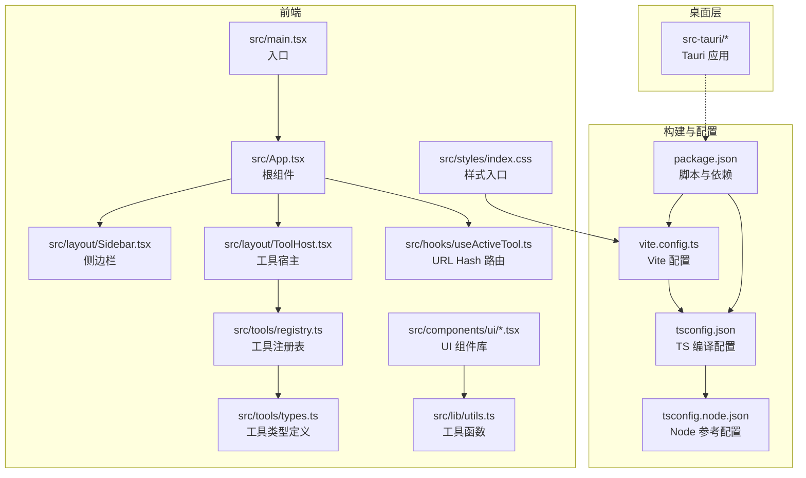
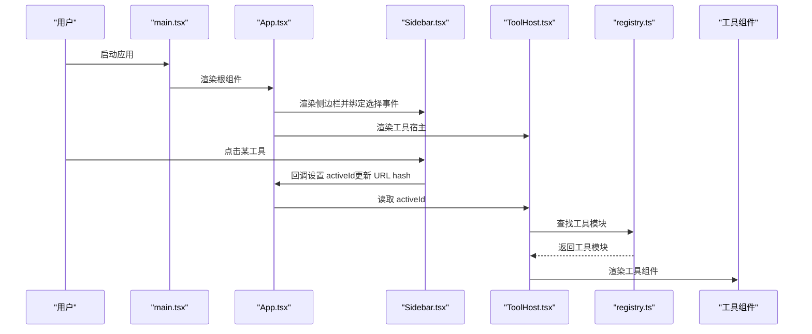
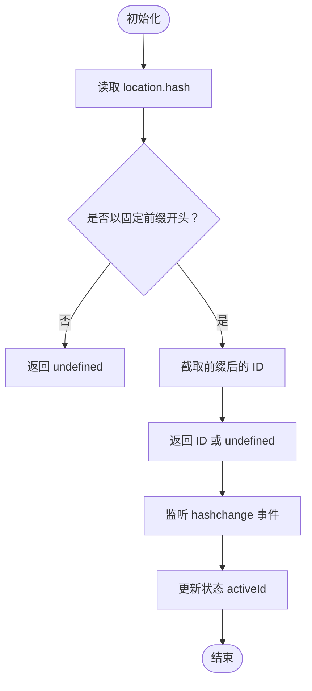
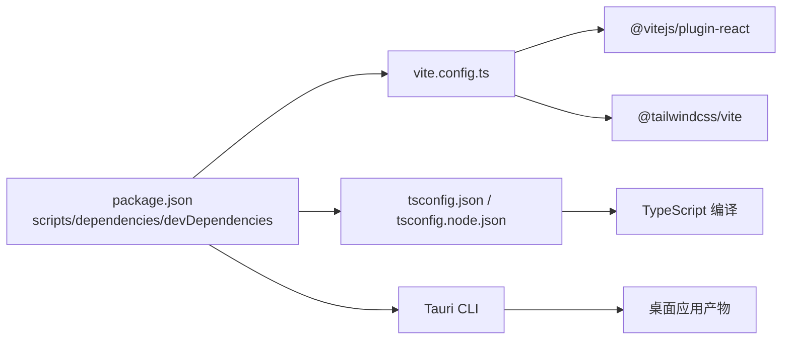

# 开发指南

<cite>
**本文引用的文件**
- [package.json](file://package.json)
- [vite.config.ts](file://vite.config.ts)
- [tsconfig.json](file://tsconfig.json)
- [tsconfig.node.json](file://tsconfig.node.json)
- [src/main.tsx](file://src/main.tsx)
- [src/App.tsx](file://src/App.tsx)
- [src/lib/utils.ts](file://src/lib/utils.ts)
- [src/hooks/useActiveTool.ts](file://src/hooks/useActiveTool.ts)
- [src/layout/Sidebar.tsx](file://src/layout/Sidebar.tsx)
- [src/layout/ToolHost.tsx](file://src/layout/ToolHost.tsx)
- [src/tools/registry.ts](file://src/tools/registry.ts)
- [src/tools/types.ts](file://src/tools/types.ts)
- [src/components/ui/button.tsx](file://src/components/ui/button.tsx)
- [src/components/ui/card.tsx](file://src/components/ui/card.tsx)
- [src/styles/index.css](file://src/styles/index.css)
- [README.md](file://README.md)
</cite>

## 目录
1. [简介](#简介)
2. [项目结构](#项目结构)
3. [核心组件](#核心组件)
4. [架构总览](#架构总览)
5. [详细组件分析](#详细组件分析)
6. [依赖分析](#依赖分析)
7. [性能考虑](#性能考虑)
8. [故障排除指南](#故障排除指南)
9. [结论](#结论)
10. [附录](#附录)

## 简介
本开发指南面向 Toolbox 项目的新老开发者，系统性地介绍开发工作流程、代码规范、分支与代码审查流程、TypeScript 与 Vite 的配置与优化、代码质量保障（ESLint、Prettier、测试）、组件开发最佳实践、性能监控与调试技巧，以及常见问题与环境故障排除方法。目标是帮助团队在保持高质量的同时提升开发效率。

## 项目结构
项目采用“前端为主 + Tauri 桌面桥接”的双层结构：
- 前端层：React + TypeScript + Vite，负责 UI、路由（基于 URL hash）、工具模块注册与渲染。
- 桌面层：Tauri（Rust），通过 CLI 与能力配置进行桌面应用打包与运行。

图表来源
- [src/main.tsx:1-11](file://src/main.tsx#L1-L11)
- [src/App.tsx:1-21](file://src/App.tsx#L1-L21)
- [src/layout/Sidebar.tsx:1-100](file://src/layout/Sidebar.tsx#L1-L100)
- [src/layout/ToolHost.tsx:1-50](file://src/layout/ToolHost.tsx#L1-L50)
- [src/hooks/useActiveTool.ts:1-34](file://src/hooks/useActiveTool.ts#L1-L34)
- [src/tools/registry.ts:1-13](file://src/tools/registry.ts#L1-L13)
- [src/tools/types.ts:1-23](file://src/tools/types.ts#L1-L23)
- [src/components/ui/button.tsx:1-60](file://src/components/ui/button.tsx#L1-L60)
- [src/components/ui/card.tsx:1-79](file://src/components/ui/card.tsx#L1-L79)
- [src/lib/utils.ts:1-7](file://src/lib/utils.ts#L1-L7)
- [src/styles/index.css:1-112](file://src/styles/index.css#L1-L112)
- [vite.config.ts:1-39](file://vite.config.ts#L1-L39)
- [tsconfig.json:1-31](file://tsconfig.json#L1-L31)
- [tsconfig.node.json:1-12](file://tsconfig.node.json#L1-L12)
- [package.json:1-37](file://package.json#L1-L37)

章节来源
- [README.md:1-8](file://README.md#L1-L8)
- [package.json:1-37](file://package.json#L1-L37)
- [vite.config.ts:1-39](file://vite.config.ts#L1-L39)
- [tsconfig.json:1-31](file://tsconfig.json#L1-L31)
- [tsconfig.node.json:1-12](file://tsconfig.node.json#L1-L12)

## 核心组件
- 应用入口与根组件
  - 入口文件负责挂载 React 根节点并引入全局样式。
  - 根组件负责布局：左侧为工具列表，右侧为工具内容区，并集成全局通知组件。
- 路由与状态
  - 使用 URL hash 管理当前激活工具，避免引入额外路由库，保持最小依赖。
- 工具系统
  - 工具注册表集中管理所有可用工具；工具类型定义统一字段与约束。
- UI 组件库
  - 基于 class-variance-authority 与 Tailwind CSS 提供可变按钮、卡片等组件。
- 样式体系
  - 使用 Tailwind v4 主题变量与暗色模式支持，结合 tw-animate-css 实现动画。

章节来源
- [src/main.tsx:1-11](file://src/main.tsx#L1-L11)
- [src/App.tsx:1-21](file://src/App.tsx#L1-L21)
- [src/hooks/useActiveTool.ts:1-34](file://src/hooks/useActiveTool.ts#L1-L34)
- [src/layout/Sidebar.tsx:1-100](file://src/layout/Sidebar.tsx#L1-L100)
- [src/layout/ToolHost.tsx:1-50](file://src/layout/ToolHost.tsx#L1-L50)
- [src/tools/registry.ts:1-13](file://src/tools/registry.ts#L1-L13)
- [src/tools/types.ts:1-23](file://src/tools/types.ts#L1-L23)
- [src/components/ui/button.tsx:1-60](file://src/components/ui/button.tsx#L1-L60)
- [src/components/ui/card.tsx:1-79](file://src/components/ui/card.tsx#L1-L79)
- [src/lib/utils.ts:1-7](file://src/lib/utils.ts#L1-L7)
- [src/styles/index.css:1-112](file://src/styles/index.css#L1-L112)

## 架构总览
下图展示了从入口到工具渲染的调用链路，以及样式与构建配置对运行时的影响。

图表来源
- [src/main.tsx:1-11](file://src/main.tsx#L1-L11)
- [src/App.tsx:1-21](file://src/App.tsx#L1-L21)
- [src/layout/Sidebar.tsx:1-100](file://src/layout/Sidebar.tsx#L1-L100)
- [src/layout/ToolHost.tsx:1-50](file://src/layout/ToolHost.tsx#L1-L50)
- [src/tools/registry.ts:1-13](file://src/tools/registry.ts#L1-L13)

## 详细组件分析

### 路由与状态：useActiveTool
- 功能要点
  - 从 URL hash 中解析当前激活工具 ID。
  - 监听 hash 变化以响应浏览器前进/后退。
  - 提供设置方法更新 hash，从而切换工具。
- 设计考量
  - 无外部路由库，降低包体与复杂度。
  - 通过常量前缀统一 hash 结构，便于扩展。

图表来源
- [src/hooks/useActiveTool.ts:1-34](file://src/hooks/useActiveTool.ts#L1-L34)

章节来源
- [src/hooks/useActiveTool.ts:1-34](file://src/hooks/useActiveTool.ts#L1-L34)

### 侧边栏：Sidebar
- 功能要点
  - 支持按名称、ID、描述、关键词进行模糊搜索与分组展示。
  - 点击项触发父级回调，更新 URL hash 以切换工具。
- 性能与交互
  - 使用 useMemo 对过滤与分组结果进行缓存，减少重复计算。
  - 输入框聚焦态与图标位置通过 Tailwind 类实现一致视觉。

章节来源
- [src/layout/Sidebar.tsx:1-100](file://src/layout/Sidebar.tsx#L1-L100)

### 工具宿主：ToolHost
- 功能要点
  - 根据 activeId 查找对应工具模块并渲染其组件。
  - 若无工具被选中，提供欢迎界面与一键快速选择工具的能力。
- 扩展性
  - 通过工具注册表集中管理，新增工具仅需在注册表中导入并加入数组。

章节来源
- [src/layout/ToolHost.tsx:1-50](file://src/layout/ToolHost.tsx#L1-L50)
- [src/tools/registry.ts:1-13](file://src/tools/registry.ts#L1-L13)

### 工具类型与注册表
- 类型定义
  - 统一字段：id、name、description、category、icon、component、keywords。
  - 便于后续扩展搜索、分类与元数据管理。
- 注册表
  - 集中维护工具清单与查找逻辑，简化宿主组件的调用。

章节来源
- [src/tools/types.ts:1-23](file://src/tools/types.ts#L1-L23)
- [src/tools/registry.ts:1-13](file://src/tools/registry.ts#L1-L13)

### UI 组件库：Button 与 Card
- Button
  - 基于 class-variance-authority 定义多套变体与尺寸，支持 asChild 透传。
  - 通过 cn 合并类名，确保样式覆盖与可组合性。
- Card
  - 提供卡片容器与头部/标题/描述/内容/底部的标准结构，配合主题变量与暗色模式。

章节来源
- [src/components/ui/button.tsx:1-60](file://src/components/ui/button.tsx#L1-L60)
- [src/components/ui/card.tsx:1-79](file://src/components/ui/card.tsx#L1-L79)
- [src/lib/utils.ts:1-7](file://src/lib/utils.ts#L1-L7)

### 样式体系：Tailwind v4 与主题变量
- 主题变量
  - 在 :root 与 .dark 中定义颜色变量，并通过 @theme inline 映射为 Tailwind 变量。
- 基础层
  - 在 @layer base 中统一 border、outline-ring/50、html/body/root 高度与基础排版。
- 动画
  - 引入 tw-animate-css，结合 Tailwind 类实现动画效果。

章节来源
- [src/styles/index.css:1-112](file://src/styles/index.css#L1-L112)

## 依赖分析
- 前端依赖
  - React 19、React DOM、Radix Slot、class-variance-authority、clsx、tailwind-merge、lucide-react、sonner、tw-animate-css。
- 开发依赖
  - @vitejs/plugin-react、@tailwindcss/vite、tailwindcss、typescript、vite、@tauri-apps/cli、@types/*。
- 构建脚本
  - dev、build、preview、tauri 分别对应 Vite 开发、TypeScript 编译+Vite 构建、本地预览、Tauri CLI。

图表来源
- [package.json:1-37](file://package.json#L1-L37)
- [vite.config.ts:1-39](file://vite.config.ts#L1-L39)
- [tsconfig.json:1-31](file://tsconfig.json#L1-L31)
- [tsconfig.node.json:1-12](file://tsconfig.node.json#L1-L12)

章节来源
- [package.json:1-37](file://package.json#L1-L37)

## 性能考虑
- 构建与打包
  - 使用 Vite 的原生 ES 模块解析与按需加载，减少打包体积与冷启动时间。
  - TypeScript 采用 bundler 模式与 noEmit，结合 Vite 进行类型检查与增量编译。
- 运行时
  - UI 组件通过 cn/tailwind-merge 合并类名，避免冗余样式。
  - 侧边栏使用 useMemo 缓存过滤与分组结果，降低渲染压力。
- 样式
  - Tailwind v4 主题变量集中管理，减少重复定义与样式冲突。
- 热重载与开发体验
  - Vite HMR 在 Tauri 开发模式下支持指定 host 与自定义端口，提升联调效率。

章节来源
- [vite.config.ts:1-39](file://vite.config.ts#L1-L39)
- [tsconfig.json:1-31](file://tsconfig.json#L1-L31)
- [src/lib/utils.ts:1-7](file://src/lib/utils.ts#L1-L7)
- [src/layout/Sidebar.tsx:1-100](file://src/layout/Sidebar.tsx#L1-L100)
- [src/styles/index.css:1-112](file://src/styles/index.css#L1-L112)

## 故障排除指南
- Vite 开发端口占用
  - 现象：启动失败或端口被占用。
  - 处理：确认 1420 端口空闲；若使用 Tauri 开发，严格端口与 host 设置由配置决定。
- HMR 不生效或跨主机连接异常
  - 现象：修改代码不刷新或 WebSocket 连接失败。
  - 处理：检查 TAURI_DEV_HOST 环境变量与 HMR 配置；确保 host 与端口一致。
- 忽略目录导致变更不触发
  - 现象：修改 src-tauri 后前端未热更。
  - 处理：Vite 已明确忽略 src-tauri；如需监听，请调整配置。
- TypeScript 报错
  - 现象：类型检查失败或模块解析错误。
  - 处理：核对 tsconfig.json 的 moduleResolution、jsx 与 baseUrl；确保路径映射正确。
- 样式未生效或主题变量缺失
  - 现象：颜色、圆角、动画不显示。
  - 处理：确认 Tailwind 插件已启用、@theme 与 @layer base 正确引入；检查暗色模式切换逻辑。

章节来源
- [vite.config.ts:1-39](file://vite.config.ts#L1-L39)
- [tsconfig.json:1-31](file://tsconfig.json#L1-L31)
- [tsconfig.node.json:1-12](file://tsconfig.node.json#L1-L12)
- [src/styles/index.css:1-112](file://src/styles/index.css#L1-L112)

## 结论
本指南围绕 Toolbox 的前端与构建配置，给出了从开发流程、代码规范、质量保障到性能优化与故障排除的完整建议。遵循本文档可显著提升开发效率与代码质量，同时确保工具模块的可扩展性与一致的用户体验。

## 附录

### 开发工作流程与规范
- 代码编写规范
  - 统一使用 TypeScript，开启严格模式与未使用变量/参数检查。
  - 组件命名采用帕斯卡命名法；文件夹按功能拆分，组件与样式分离。
  - 使用 class-variance-authority 与 Tailwind 类组合，避免内联样式。
- Git 分支管理
  - 主分支保护：仅允许通过合并请求（Pull Request）合并。
  - 分支命名：feature/xxx、fix/xxx、docs/xxx、chore/xxx。
  - 提交信息：采用动宾结构，简明扼要，必要时附上 Issue 编号。
- 代码审查流程
  - 至少一名同行评审，关注可读性、性能、安全性与一致性。
  - 审查要点：类型安全、副作用控制、错误处理、样式与可访问性。

章节来源
- [tsconfig.json:1-31](file://tsconfig.json#L1-L31)
- [src/components/ui/button.tsx:1-60](file://src/components/ui/button.tsx#L1-L60)
- [src/components/ui/card.tsx:1-79](file://src/components/ui/card.tsx#L1-L79)

### TypeScript 配置优化
- 关键点
  - 目标与模块：ES2020 + ESNext，bundler 解析，noEmit 由 Vite 处理。
  - JSX：react-jsx，配合 React 19。
  - 路径别名：baseUrl 与 paths，统一 @/* 到 src/*。
  - 严格性：strict、noUnusedLocals、noUnusedParameters、noFallthroughCasesInSwitch。
- 参考文件
  - [tsconfig.json:1-31](file://tsconfig.json#L1-L31)
  - [tsconfig.node.json:1-12](file://tsconfig.node.json#L1-L12)

章节来源
- [tsconfig.json:1-31](file://tsconfig.json#L1-L31)
- [tsconfig.node.json:1-12](file://tsconfig.node.json#L1-L12)

### Vite 配置与优化
- 关键点
  - 插件：@vitejs/plugin-react、@tailwindcss/vite。
  - 别名：@ -> src，提升导入可读性。
  - 服务器：固定端口 1420，strictPort；host 支持跨主机开发；HMR 可配置。
  - 监视：忽略 src-tauri，避免无关变更触发。
- 参考文件
  - [vite.config.ts:1-39](file://vite.config.ts#L1-L39)

章节来源
- [vite.config.ts:1-39](file://vite.config.ts#L1-L39)

### 代码质量保障
- ESLint（建议）
  - 推荐规则集：@typescript-eslint/recommended、eslint:recommended。
  - 重点：禁用隐式 any、强制一致的类型声明、禁止未使用的变量/参数。
- Prettier（建议）
  - 规则：单引号、尾随逗号、分号关闭、2 空格缩进、一行最大长度 100。
  - 与 ESLint 协同：prettier --check/--write，编辑器保存时自动格式化。
- 测试策略（建议）
  - 单元测试：Jest + React Testing Library，覆盖核心 Hook 与工具函数。
  - 组件测试：快照与交互测试，确保 UI 与行为稳定。
  - 端到端：Cypress 或 Playwright，验证工具链路与路由切换。

章节来源
- [src/hooks/useActiveTool.ts:1-34](file://src/hooks/useActiveTool.ts#L1-L34)
- [src/layout/Sidebar.tsx:1-100](file://src/layout/Sidebar.tsx#L1-L100)
- [src/layout/ToolHost.tsx:1-50](file://src/layout/ToolHost.tsx#L1-L50)

### 组件开发最佳实践
- 文件组织
  - 组件按功能拆分至 src/components/ui，公共工具放入 src/lib。
  - 工具模块统一在 src/tools 下，注册表集中管理。
- 命名约定
  - 组件首字母大写；类型接口以 I 前缀或直接使用名词；常量全大写。
- 文档标准
  - 组件导出注释说明 props、用途与注意事项；工具模块补充 description 与 keywords，提升搜索体验。

章节来源
- [src/tools/types.ts:1-23](file://src/tools/types.ts#L1-L23)
- [src/tools/registry.ts:1-13](file://src/tools/registry.ts#L1-L13)
- [src/components/ui/button.tsx:1-60](file://src/components/ui/button.tsx#L1-L60)
- [src/components/ui/card.tsx:1-79](file://src/components/ui/card.tsx#L1-L79)

### 性能监控与调试技巧
- 性能监控
  - React Profiler：定位长任务与重渲染热点。
  - Lighthouse：评估首次内容绘制、交互时间与可访问性。
- 调试技巧
  - 使用浏览器 DevTools 的网络面板观察 HMR 与资源加载。
  - 在 Vite 中开启严格端口与固定 host，确保联调稳定性。
  - Tailwind 样式调试：利用 data-slot 属性与可视化辅助类。

章节来源
- [vite.config.ts:1-39](file://vite.config.ts#L1-L39)
- [src/styles/index.css:1-112](file://src/styles/index.css#L1-L112)