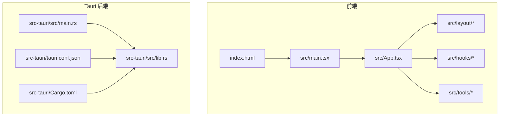
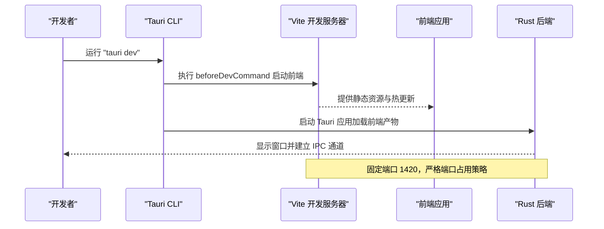
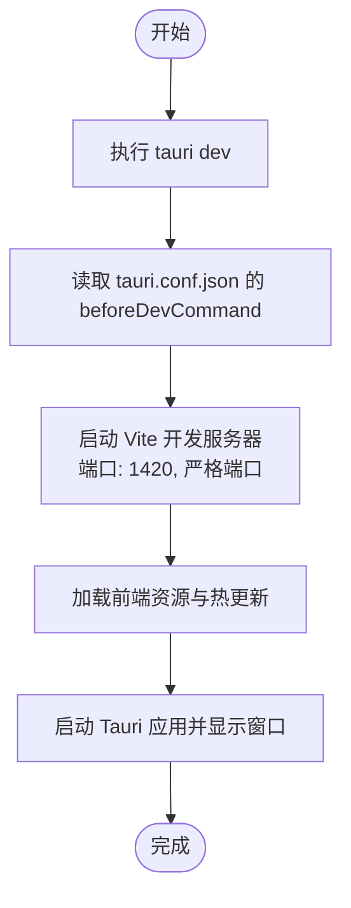
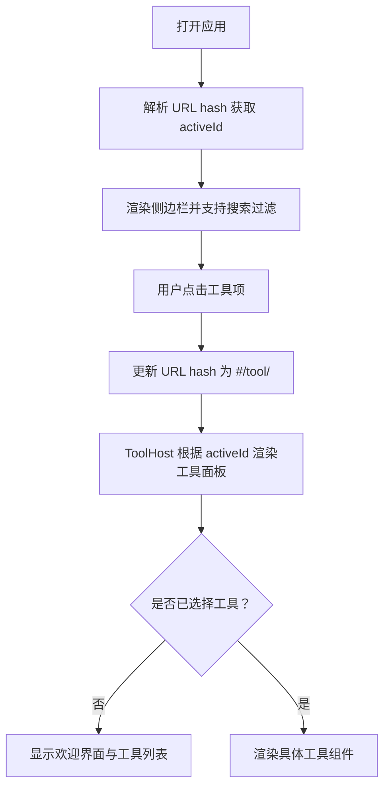
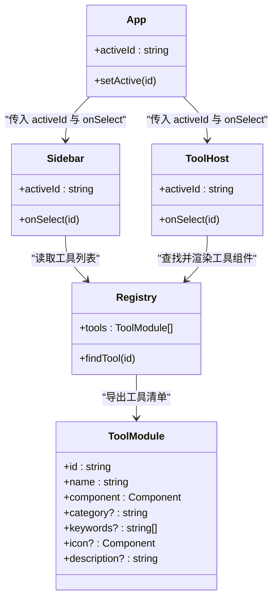

# 快速开始

<cite>
**本文引用的文件**
- [README.md](file://README.md)
- [package.json](file://package.json)
- [vite.config.ts](file://vite.config.ts)
- [src-tauri/tauri.conf.json](file://src-tauri/tauri.conf.json)
- [src-tauri/Cargo.toml](file://src-tauri/Cargo.toml)
- [src-tauri/src/main.rs](file://src-tauri/src/main.rs)
- [src-tauri/src/lib.rs](file://src-tauri/src/lib.rs)
- [src/main.tsx](file://src/main.tsx)
- [src/App.tsx](file://src/App.tsx)
- [index.html](file://index.html)
- [tsconfig.json](file://tsconfig.json)
- [src/hooks/useActiveTool.ts](file://src/hooks/useActiveTool.ts)
- [src/layout/Sidebar.tsx](file://src/layout/Sidebar.tsx)
- [src/layout/ToolHost.tsx](file://src/layout/ToolHost.tsx)
- [src/tools/registry.ts](file://src/tools/registry.ts)
</cite>

## 目录
1. [简介](#简介)
2. [项目结构](#项目结构)
3. [核心组件](#核心组件)
4. [架构总览](#架构总览)
5. [详细组件分析](#详细组件分析)
6. [依赖分析](#依赖分析)
7. [性能考虑](#性能考虑)
8. [故障排除指南](#故障排除指南)
9. [结论](#结论)
10. [附录](#附录)

## 简介
本指南面向首次接触 Toolbox 项目的开发者，帮助你在本地快速完成环境准备、依赖安装、开发服务器启动与 Tauri 应用运行，并理解项目基本结构与启动流程。项目采用 Tauri + React + TypeScript + Vite 技术栈，前端通过 Vite 提供开发体验，后端由 Rust 驱动并通过 Tauri 暴露能力。

## 项目结构
项目采用“前端 + Tauri 后端”的分层组织方式：
- 前端位于 src 及其子目录，包含 React 组件、布局、工具模块与样式等
- Tauri 后端位于 src-tauri，包含 Rust 入口、配置与构建脚本
- 根目录提供包管理、Vite 配置、TypeScript 配置与入口 HTML

图表来源
- [index.html:1-15](file://index.html#L1-L15)
- [src/main.tsx:1-11](file://src/main.tsx#L1-L11)
- [src/App.tsx:1-21](file://src/App.tsx#L1-L21)
- [src/layout/Sidebar.tsx:1-100](file://src/layout/Sidebar.tsx#L1-L100)
- [src/layout/ToolHost.tsx:1-50](file://src/layout/ToolHost.tsx#L1-L50)
- [src/hooks/useActiveTool.ts:1-34](file://src/hooks/useActiveTool.ts#L1-L34)
- [src/tools/registry.ts:1-13](file://src/tools/registry.ts#L1-L13)
- [src-tauri/src/main.rs:1-7](file://src-tauri/src/main.rs#L1-L7)
- [src-tauri/src/lib.rs:1-11](file://src-tauri/src/lib.rs#L1-L11)
- [src-tauri/tauri.conf.json:1-39](file://src-tauri/tauri.conf.json#L1-L39)
- [src-tauri/Cargo.toml:1-26](file://src-tauri/Cargo.toml#L1-L26)

章节来源
- [README.md:1-8](file://README.md#L1-L8)
- [package.json:1-37](file://package.json#L1-L37)
- [vite.config.ts:1-39](file://vite.config.ts#L1-L39)
- [src-tauri/tauri.conf.json:1-39](file://src-tauri/tauri.conf.json#L1-L39)
- [src-tauri/Cargo.toml:1-26](file://src-tauri/Cargo.toml#L1-L26)
- [index.html:1-15](file://index.html#L1-L15)
- [src/main.tsx:1-11](file://src/main.tsx#L1-L11)
- [src/App.tsx:1-21](file://src/App.tsx#L1-L21)

## 核心组件
- 前端入口与渲染
  - index.html 提供挂载点与基础页面元信息
  - src/main.tsx 负责挂载 React 根节点并渲染 App
  - src/App.tsx 是应用根组件，组合侧边栏与工具宿主区域，并集成全局提示组件
- 布局与状态
  - src/layout/Sidebar.tsx 实现工具分类与搜索展示，支持点击切换激活工具
  - src/layout/ToolHost.tsx 根据激活工具 ID 渲染对应工具面板
  - src/hooks/useActiveTool.ts 基于 URL hash 管理当前激活工具，避免引入额外路由依赖
- 工具注册与扩展
  - src/tools/registry.ts 维护工具清单，新增工具只需在此导入并加入数组即可
- Tauri 后端
  - src-tauri/src/main.rs 为可执行程序入口
  - src-tauri/src/lib.rs 初始化 Tauri 应用、注册插件并运行上下文
  - src-tauri/tauri.conf.json 定义开发命令、前端构建产物路径、窗口属性与打包配置
  - src-tauri/Cargo.toml 声明 Rust 依赖与构建特性

章节来源
- [index.html:1-15](file://index.html#L1-L15)
- [src/main.tsx:1-11](file://src/main.tsx#L1-L11)
- [src/App.tsx:1-21](file://src/App.tsx#L1-L21)
- [src/layout/Sidebar.tsx:1-100](file://src/layout/Sidebar.tsx#L1-L100)
- [src/layout/ToolHost.tsx:1-50](file://src/layout/ToolHost.tsx#L1-L50)
- [src/hooks/useActiveTool.ts:1-34](file://src/hooks/useActiveTool.ts#L1-L34)
- [src/tools/registry.ts:1-13](file://src/tools/registry.ts#L1-L13)
- [src-tauri/src/main.rs:1-7](file://src-tauri/src/main.rs#L1-L7)
- [src-tauri/src/lib.rs:1-11](file://src-tauri/src/lib.rs#L1-L11)
- [src-tauri/tauri.conf.json:1-39](file://src-tauri/tauri.conf.json#L1-L39)
- [src-tauri/Cargo.toml:1-26](file://src-tauri/Cargo.toml#L1-L26)

## 架构总览
下图展示了从开发到运行的关键流程：Vite 开发服务器提供前端资源，Tauri 在开发模式下通过 beforeDevCommand 启动前端并在固定端口监听；构建阶段先编译前端，再由 Tauri 打包生成桌面应用。

图表来源
- [src-tauri/tauri.conf.json:6-11](file://src-tauri/tauri.conf.json#L6-L11)
- [vite.config.ts:22-37](file://vite.config.ts#L22-L37)
- [src-tauri/src/lib.rs:4-10](file://src-tauri/src/lib.rs#L4-L10)

章节来源
- [src-tauri/tauri.conf.json:1-39](file://src-tauri/tauri.conf.json#L1-L39)
- [vite.config.ts:1-39](file://vite.config.ts#L1-L39)
- [src-tauri/src/lib.rs:1-11](file://src-tauri/src/lib.rs#L1-L11)

## 详细组件分析

### 启动流程与控制流
- 开发启动
  - 使用 Tauri CLI 触发 beforeDevCommand，启动 Vite 开发服务器
  - Vite 在固定端口 1420 提供前端资源，严格端口占用策略确保一致性
  - Tauri 加载前端产物并创建窗口，启用 HMR（在指定主机时）
- 构建流程
  - 先执行前端构建，再由 Tauri 打包生成多平台安装包

图表来源
- [src-tauri/tauri.conf.json:6-11](file://src-tauri/tauri.conf.json#L6-L11)
- [vite.config.ts:22-37](file://vite.config.ts#L22-L37)
- [src-tauri/src/lib.rs:4-10](file://src-tauri/src/lib.rs#L4-L10)

章节来源
- [src-tauri/tauri.conf.json:1-39](file://src-tauri/tauri.conf.json#L1-L39)
- [vite.config.ts:1-39](file://vite.config.ts#L1-L39)
- [src-tauri/src/lib.rs:1-11](file://src-tauri/src/lib.rs#L1-L11)

### 布局与工具选择逻辑
- 侧边栏根据工具分类与关键词进行过滤与分组展示
- 工具宿主根据激活 ID 动态渲染对应工具组件
- URL hash 用于在不引入复杂路由的情况下维护当前工具状态

图表来源
- [src/hooks/useActiveTool.ts:5-30](file://src/hooks/useActiveTool.ts#L5-L30)
- [src/layout/Sidebar.tsx:13-35](file://src/layout/Sidebar.tsx#L13-L35)
- [src/layout/ToolHost.tsx:10-48](file://src/layout/ToolHost.tsx#L10-L48)
- [src/tools/registry.ts:9-12](file://src/tools/registry.ts#L9-L12)

章节来源
- [src/hooks/useActiveTool.ts:1-34](file://src/hooks/useActiveTool.ts#L1-L34)
- [src/layout/Sidebar.tsx:1-100](file://src/layout/Sidebar.tsx#L1-L100)
- [src/layout/ToolHost.tsx:1-50](file://src/layout/ToolHost.tsx#L1-L50)
- [src/tools/registry.ts:1-13](file://src/tools/registry.ts#L1-L13)

### 类关系与模块交互

图表来源
- [src/App.tsx:1-21](file://src/App.tsx#L1-L21)
- [src/layout/Sidebar.tsx:1-100](file://src/layout/Sidebar.tsx#L1-L100)
- [src/layout/ToolHost.tsx:1-50](file://src/layout/ToolHost.tsx#L1-L50)
- [src/tools/registry.ts:1-13](file://src/tools/registry.ts#L1-L13)

章节来源
- [src/App.tsx:1-21](file://src/App.tsx#L1-L21)
- [src/layout/Sidebar.tsx:1-100](file://src/layout/Sidebar.tsx#L1-L100)
- [src/layout/ToolHost.tsx:1-50](file://src/layout/ToolHost.tsx#L1-L50)
- [src/tools/registry.ts:1-13](file://src/tools/registry.ts#L1-L13)

## 依赖分析
- 包管理与脚本
  - package.json 定义了开发、构建、预览与 Tauri 命令，前端使用 Vite，Tauri CLI 作为开发工具
- 前端技术栈
  - React 19、TypeScript、TailwindCSS（v4）与 Vite 配合提供现代化开发体验
- Tauri 后端
  - Rust 工程通过 Cargo 管理依赖，Tauri 2 作为框架，tauri-plugin-opener 提供系统打开能力
- 开发服务器与端口
  - Vite 固定端口 1420，严格端口占用，必要时可设置 TAURI_DEV_HOST 支持跨设备访问

章节来源
- [package.json:1-37](file://package.json#L1-L37)
- [vite.config.ts:1-39](file://vite.config.ts#L1-L39)
- [src-tauri/Cargo.toml:1-26](file://src-tauri/Cargo.toml#L1-L26)
- [src-tauri/tauri.conf.json:6-11](file://src-tauri/tauri.conf.json#L6-L11)

## 性能考虑
- 开发阶段
  - Vite 的 HMR 与严格端口策略提升调试效率，注意避免端口冲突
  - 忽略对 src-tauri 的监控以减少不必要的文件系统开销
- 构建阶段
  - 前端构建产物输出至 dist，Tauri 打包时指向该目录
  - 合理拆分工具组件，按需渲染以降低初始渲染成本

章节来源
- [vite.config.ts:33-37](file://vite.config.ts#L33-L37)
- [src-tauri/tauri.conf.json:9-11](file://src-tauri/tauri.conf.json#L9-L11)

## 故障排除指南
- 端口被占用
  - 症状：启动失败或 HMR 失败
  - 处理：确保端口 1420 未被占用；如需远程联调，设置 TAURI_DEV_HOST 并确认防火墙放行
- Rust 工具链缺失
  - 症状：无法编译 Tauri 后端或安装依赖时报错
  - 处理：安装 Rust 工具链与目标组件（如 Windows 目标），参考官方安装指引
- Bun 或 Node.js 版本不兼容
  - 症状：安装依赖失败或构建报错
  - 处理：使用推荐版本（见环境要求），若使用 Bun，请确认其与 Tauri CLI 的兼容性
- 无法加载前端资源
  - 症状：窗口空白或白屏
  - 处理：检查 beforeDevCommand 是否正确执行；确认 dist 目录存在且包含构建产物
- TypeScript 路径别名无效
  - 症状：导入 @/* 报错
  - 处理：检查 tsconfig.json 中 baseUrl 与 paths 配置，确保与实际目录一致

章节来源
- [vite.config.ts:6-37](file://vite.config.ts#L6-L37)
- [src-tauri/tauri.conf.json:6-11](file://src-tauri/tauri.conf.json#L6-L11)
- [tsconfig.json:23-26](file://tsconfig.json#L23-L26)

## 结论
通过本指南，你可以在本地完成环境准备与项目启动，理解前端与 Tauri 后端的协作机制，并掌握常见问题的排查方法。建议在首次运行后，尝试切换不同工具并验证 UI 与交互，随后可基于工具注册表扩展更多功能模块。

## 附录

### 环境要求
- Node.js：用于前端依赖与 Vite 开发服务器
- Bun：用于执行开发与构建脚本（与 Tauri CLI 协同）
- Rust 工具链：用于编译 Tauri 后端与相关原生依赖

章节来源
- [README.md:1-8](file://README.md#L1-L8)
- [package.json:1-37](file://package.json#L1-L37)
- [src-tauri/Cargo.toml:1-26](file://src-tauri/Cargo.toml#L1-L26)

### 安装与初始化步骤
- 安装依赖
  - 使用包管理器安装前端依赖与 Tauri CLI
- 启动开发服务器
  - 执行 Tauri 开发命令，自动启动 Vite 并加载前端资源
- 运行 Tauri 应用
  - 在开发模式下，Tauri 将加载前端产物并显示窗口
- 构建应用
  - 先构建前端，再由 Tauri 打包生成多平台安装包

章节来源
- [package.json:6-11](file://package.json#L6-L11)
- [src-tauri/tauri.conf.json:6-11](file://src-tauri/tauri.conf.json#L6-L11)
- [vite.config.ts:1-39](file://vite.config.ts#L1-L39)

### 第一次运行验证
- 启动后应看到工具箱窗口，左侧为工具列表，右侧为空白区域
- 点击任意工具，右侧应显示对应工具面板
- 若无工具可用，欢迎界面会列出所有工具供选择
- 确认 URL hash 正确更新为 #/tool/<id>

章节来源
- [src/layout/ToolHost.tsx:10-48](file://src/layout/ToolHost.tsx#L10-L48)
- [src/hooks/useActiveTool.ts:17-30](file://src/hooks/useActiveTool.ts#L17-L30)
- [src-tauri/src/lib.rs:4-10](file://src-tauri/src/lib.rs#L4-L10)