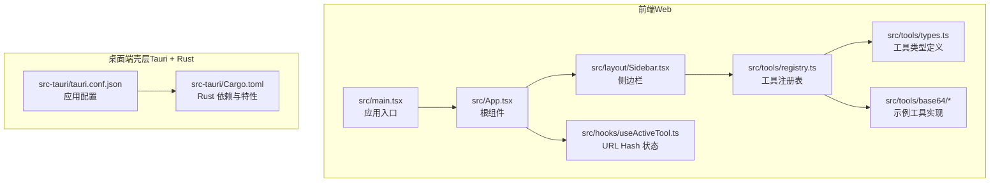
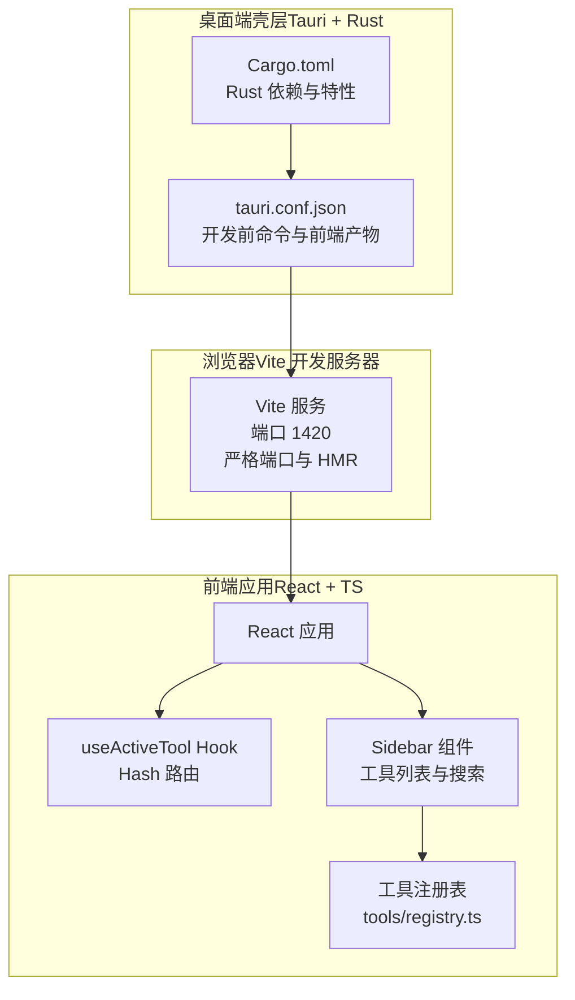
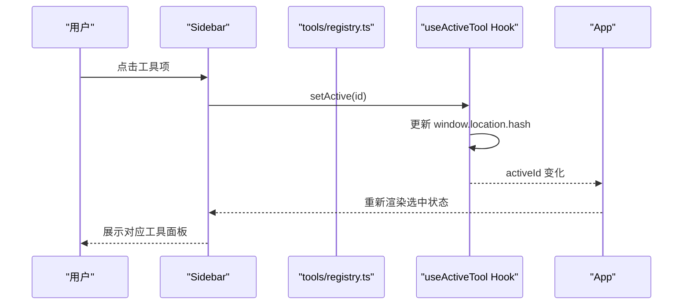
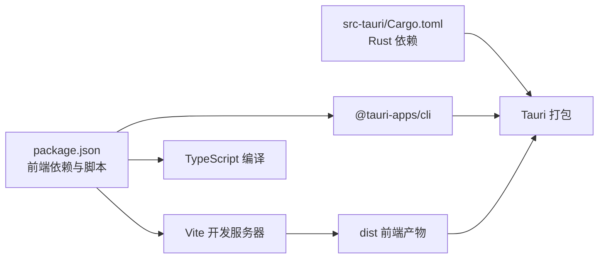

# 快速开始

<cite>
**本文引用的文件**
- [README.md](file://README.md)
- [package.json](file://package.json)
- [vite.config.ts](file://vite.config.ts)
- [tsconfig.json](file://tsconfig.json)
- [tsconfig.node.json](file://tsconfig.node.json)
- [src-tauri/Cargo.toml](file://src-tauri/Cargo.toml)
- [src-tauri/tauri.conf.json](file://src-tauri/tauri.conf.json)
- [src/main.tsx](file://src/main.tsx)
- [src/App.tsx](file://src/App.tsx)
- [src/hooks/useActiveTool.ts](file://src/hooks/useActiveTool.ts)
- [src/layout/Sidebar.tsx](file://src/layout/Sidebar.tsx)
- [src/tools/registry.ts](file://src/tools/registry.ts)
- [src/tools/types.ts](file://src/tools/types.ts)
- [src/tools/base64/index.tsx](file://src/tools/base64/index.tsx)
- [src/tools/base64/Base64Panel.tsx](file://src/tools/base64/Base64Panel.tsx)
</cite>

## 目录
1. [简介](#简介)
2. [项目结构](#项目结构)
3. [核心组件](#核心组件)
4. [架构总览](#架构总览)
5. [详细组件分析](#详细组件分析)
6. [依赖分析](#依赖分析)
7. [性能考虑](#性能考虑)
8. [故障排除指南](#故障排除指南)
9. [结论](#结论)
10. [附录](#附录)

## 简介
本指南面向首次接触 Toolbox 项目的开发者，帮助你在最短时间内完成开发环境准备、项目克隆、依赖安装与开发服务器启动，并进行基础的功能验证。项目基于 Tauri + React + TypeScript + Vite 构建，前端使用 Bun 作为包管理器与构建工具，后端 Rust 提供系统能力与打包能力。

## 项目结构
该仓库采用“前端 + 桌面端壳层”的分层组织方式：
- 前端（React + TypeScript + Vite）位于根目录，包含页面入口、布局、UI 组件、工具模块等。
- 桌面端壳层（Tauri + Rust）位于 src-tauri，负责窗口、系统集成、打包与安全策略等。

图表来源
- [src/main.tsx:1-11](file://src/main.tsx#L1-L11)
- [src/App.tsx:1-21](file://src/App.tsx#L1-L21)
- [src/layout/Sidebar.tsx:1-100](file://src/layout/Sidebar.tsx#L1-L100)
- [src/hooks/useActiveTool.ts:1-34](file://src/hooks/useActiveTool.ts#L1-L34)
- [src/tools/registry.ts:1-13](file://src/tools/registry.ts#L1-L13)
- [src/tools/types.ts:1-23](file://src/tools/types.ts#L1-L23)
- [src/tools/base64/index.tsx:1-16](file://src/tools/base64/index.tsx#L1-L16)
- [src-tauri/tauri.conf.json:1-39](file://src-tauri/tauri.conf.json#L1-L39)
- [src-tauri/Cargo.toml:1-26](file://src-tauri/Cargo.toml#L1-L26)

章节来源
- [README.md:1-8](file://README.md#L1-L8)
- [package.json:1-37](file://package.json#L1-L37)
- [vite.config.ts:1-39](file://vite.config.ts#L1-L39)
- [tsconfig.json:1-31](file://tsconfig.json#L1-L31)
- [tsconfig.node.json:1-12](file://tsconfig.node.json#L1-L12)
- [src-tauri/tauri.conf.json:1-39](file://src-tauri/tauri.conf.json#L1-L39)
- [src-tauri/Cargo.toml:1-26](file://src-tauri/Cargo.toml#L1-L26)

## 核心组件
- 应用入口与根组件：负责挂载 React 根节点与渲染应用整体布局。
- 侧边栏与工具选择：通过 URL Hash 管理当前激活工具，支持按分类与关键词搜索。
- 工具注册表与类型定义：统一声明工具的元信息与 UI 组件，便于扩展新工具。
- 示例工具（Base64）：展示输入输出面板、编码/解码、交换、清空、复制等交互。

章节来源
- [src/main.tsx:1-11](file://src/main.tsx#L1-L11)
- [src/App.tsx:1-21](file://src/App.tsx#L1-L21)
- [src/layout/Sidebar.tsx:1-100](file://src/layout/Sidebar.tsx#L1-L100)
- [src/hooks/useActiveTool.ts:1-34](file://src/hooks/useActiveTool.ts#L1-L34)
- [src/tools/registry.ts:1-13](file://src/tools/registry.ts#L1-L13)
- [src/tools/types.ts:1-23](file://src/tools/types.ts#L1-L23)
- [src/tools/base64/index.tsx:1-16](file://src/tools/base64/index.tsx#L1-L16)
- [src/tools/base64/Base64Panel.tsx:1-125](file://src/tools/base64/Base64Panel.tsx#L1-L125)

## 架构总览
下图展示了从浏览器到桌面壳层的请求路径与配置关系，以及 Vite 在开发模式下的热更新与端口策略。

图表来源
- [vite.config.ts:17-38](file://vite.config.ts#L17-L38)
- [src/hooks/useActiveTool.ts:17-33](file://src/hooks/useActiveTool.ts#L17-L33)
- [src/layout/Sidebar.tsx:23-96](file://src/layout/Sidebar.tsx#L23-L96)
- [src/tools/registry.ts:4-7](file://src/tools/registry.ts#L4-L7)
- [src-tauri/tauri.conf.json:6-11](file://src-tauri/tauri.conf.json#L6-L11)
- [src-tauri/Cargo.toml:10-25](file://src-tauri/Cargo.toml#L10-L25)

## 详细组件分析

### Vite 开发环境配置要点
- 固定端口与严格端口：开发服务器固定监听 1420 端口，若被占用会直接失败，避免端口漂移导致的调试问题。
- HMR 配置：当检测到 TAURI_DEV_HOST 环境变量时，启用 WebSocket 热更新并指定 HMR 端口，便于跨设备或容器内联调试。
- 屏蔽屏幕清理：防止 Vite 在错误时隐藏 Rust 编译输出，提升可观测性。
- 监视忽略：忽略对 src-tauri 的文件变更，避免不必要的重载。
- 别名解析：将 @ 映射到 src 目录，简化导入路径。

章节来源
- [vite.config.ts:6-38](file://vite.config.ts#L6-L38)

### TypeScript 类型检查设置
- 模块解析：使用 bundler 模式，适配 Vite 的打包流程。
- JSX 与严格模式：启用 react-jsx 与严格模式，开启未使用变量/参数与 switch 穿透检查。
- 路径别名：与 Vite 的 @/* 别名保持一致，保证编辑器与编译器一致解析。
- 参考配置：通过 references 引入 tsconfig.node.json，确保 Vite 配置文件类型正确。

章节来源
- [tsconfig.json:10-26](file://tsconfig.json#L10-L26)
- [tsconfig.node.json:1-12](file://tsconfig.node.json#L1-L12)

### Tauri 开发与构建配置
- 开发前命令：beforeDevCommand 指向前端开发脚本，确保在 tauri dev 时先启动前端。
- 前端地址：devUrl 指向本地 1420 端口，与 Vite 配置一致。
- 构建前命令：beforeBuildCommand 指向前端构建脚本，生成 dist 供打包使用。
- 前端产物：frontendDist 指向 dist 目录，作为桌面端资源。
- 窗口尺寸与可调整性：定义了默认窗口大小、最小尺寸与可调整属性。
- 安全策略：CSP 设为 null，便于开发阶段灵活调试。

章节来源
- [src-tauri/tauri.conf.json:6-26](file://src-tauri/tauri.conf.json#L6-L26)

### 工具注册与路由机制
- 工具注册表：在 tools/registry.ts 中集中注册工具模块，新增工具只需在此导入并加入数组。
- 工具类型：tools/types.ts 定义了工具的 id、名称、描述、分类、图标、组件与关键词等字段。
- Hash 路由：useActiveTool 通过 URL Hash 管理当前激活工具，不引入额外路由库，保持最小依赖。
- 侧边栏交互：Sidebar 支持搜索与分组展示，点击按钮切换激活工具。

图表来源
- [src/layout/Sidebar.tsx:70-80](file://src/layout/Sidebar.tsx#L70-L80)
- [src/hooks/useActiveTool.ts:28-30](file://src/hooks/useActiveTool.ts#L28-L30)
- [src/tools/registry.ts:9-12](file://src/tools/registry.ts#L9-L12)
- [src/App.tsx:6-18](file://src/App.tsx#L6-L18)

章节来源
- [src/tools/registry.ts:4-12](file://src/tools/registry.ts#L4-L12)
- [src/tools/types.ts:7-22](file://src/tools/types.ts#L7-L22)
- [src/hooks/useActiveTool.ts:17-33](file://src/hooks/useActiveTool.ts#L17-L33)
- [src/layout/Sidebar.tsx:23-96](file://src/layout/Sidebar.tsx#L23-L96)

### 示例工具：Base64 编解码
- 功能：支持 UTF-8 文本与 Base64 互转，提供编码、解码、交换、清空、复制结果等操作。
- 交互：使用 Toast 提示错误与成功信息；使用剪贴板 API 复制结果。
- 结构：工具模块在 index.tsx 中声明元信息，面板组件在 Base64Panel.tsx 中实现 UI 与逻辑。

章节来源
- [src/tools/base64/index.tsx:5-13](file://src/tools/base64/index.tsx#L5-L13)
- [src/tools/base64/Base64Panel.tsx:23-64](file://src/tools/base64/Base64Panel.tsx#L23-L64)

## 依赖分析
- 前端依赖：React、React DOM、@tauri-apps/api、@tauri-apps/plugin-opener、Radix UI、Lucide、Tailwind 相关等。
- 开发依赖：@vitejs/plugin-react、@tailwindcss/vite、tailwindcss、TypeScript、Vite、@tauri-apps/cli、@types/*。
- 桌面端依赖：tauri、tauri-plugin-opener、serde、serde_json 等。
- 包管理：使用 Bun 作为包管理器与构建工具，脚本通过 tauri.conf.json 的 beforeDevCommand/beforeBuildCommand 调用。

图表来源
- [package.json:6-11](file://package.json#L6-L11)
- [package.json:12-35](file://package.json#L12-L35)
- [src-tauri/Cargo.toml:20-25](file://src-tauri/Cargo.toml#L20-L25)
- [src-tauri/tauri.conf.json:6-11](file://src-tauri/tauri.conf.json#L6-L11)

章节来源
- [package.json:1-37](file://package.json#L1-L37)
- [src-tauri/Cargo.toml:1-26](file://src-tauri/Cargo.toml#L1-L26)
- [src-tauri/tauri.conf.json:1-39](file://src-tauri/tauri.conf.json#L1-L39)

## 性能考虑
- Vite 固定端口与严格端口：减少端口冲突与重连成本，提升开发稳定性。
- HMR 条件启用：仅在存在 TAURI_DEV_HOST 时启用 WebSocket HMR，避免不必要的网络开销。
- 监视忽略：忽略 src-tauri 目录，降低文件系统监听压力。
- TypeScript 严格模式：提前发现潜在问题，减少运行时错误带来的性能损耗。
- Tailwind Vite 插件：在开发阶段按需生成样式，避免生产前的样式抖动。

## 故障排除指南
- 端口占用（1420/1421）
  - 现象：启动失败或 HMR 不生效。
  - 排查：确认 1420 与 1421 端口未被占用；若需要远程/容器调试，设置 TAURI_DEV_HOST 并重启开发服务器。
  - 参考：[vite.config.ts:22-32](file://vite.config.ts#L22-L32)
- Rust 工具链未安装或版本过低
  - 现象：无法执行 tauri 命令或构建失败。
  - 排查：安装 Rust 工具链（建议使用 rustup），确保 tauri 2 兼容的版本。
  - 参考：[src-tauri/Cargo.toml:1-26](file://src-tauri/Cargo.toml#L1-L26)
- Bun 未安装或版本不兼容
  - 现象：脚本报错或无法启动开发服务器。
  - 排查：安装 Bun 并确保版本满足项目脚本要求；确认 package.json 中的脚本可用。
  - 参考：[package.json:6-11](file://package.json#L6-L11)
- TypeScript 类型错误
  - 现象：编辑器报错或构建失败。
  - 排查：检查 tsconfig.json 与 tsconfig.node.json 的路径别名与模块解析是否一致；确保所有模块导入路径正确。
  - 参考：[tsconfig.json:24-26](file://tsconfig.json#L24-L26)
- Tauri 开发前命令未执行
  - 现象：打开应用后白屏或加载失败。
  - 排查：确认 beforeDevCommand 指向的前端开发脚本已成功启动；检查 devUrl 是否为 http://localhost:1420。
  - 参考：[src-tauri/tauri.conf.json:7-9](file://src-tauri/tauri.conf.json#L7-L9)
- 侧边栏无工具或搜索无效
  - 现象：工具列表为空或无法按关键词搜索。
  - 排查：确认 tools/registry.ts 中已注册工具；检查工具的 id、name、keywords 等字段是否完整。
  - 参考：[src/tools/registry.ts:4-7](file://src/tools/registry.ts#L4-L7)，[src/tools/types.ts:7-22](file://src/tools/types.ts#L7-L22)

## 结论
通过本指南，你可以在本地快速完成环境准备、项目克隆、依赖安装与开发服务器启动，并基于现有工具与注册表扩展新的功能模块。建议在开发过程中遵循固定端口与严格端口策略、启用 TypeScript 严格模式与 Tailwind 插件，以获得更稳定与高效的开发体验。

## 附录

### 开发环境准备清单
- Node.js：用于运行包管理器与构建工具。
- Bun：作为包管理器与构建工具，执行前端脚本与构建。
- Rust 工具链：安装 rustup 与 tauri 2 所需的组件。
- VS Code：推荐安装 Tauri 与 rust-analyzer 插件以获得更好的开发体验。
  - 参考：[README.md:5-8](file://README.md#L5-L8)

### 项目克隆与依赖安装步骤
- 克隆仓库至本地。
- 使用 Bun 安装依赖。
  - 参考：[package.json:6-11](file://package.json#L6-L11)

### 启动开发服务器
- 在终端执行前端开发脚本，启动 Vite 开发服务器。
  - 参考：[package.json:7](file://package.json#L7)，[vite.config.ts:6-38](file://vite.config.ts#L6-L38)
- 在另一个终端执行 Tauri 开发命令，启动桌面应用。
  - 参考：[src-tauri/tauri.conf.json:7](file://src-tauri/tauri.conf.json#L7)

### 常见开发工具推荐配置
- VS Code 插件：Tauri、rust-analyzer。
  - 参考：[README.md:7-8](file://README.md#L7-L8)
- TypeScript：启用严格模式与路径别名，确保与 Vite 配置一致。
  - 参考：[tsconfig.json:18-26](file://tsconfig.json#L18-L26)

### 功能验证步骤
- 启动开发服务器后，打开应用窗口。
- 在侧边栏中选择“Base64 编解码”工具。
- 输入一段文本，点击“编码”，验证结果是否为合法的 Base64 字符串。
- 点击“解码”，验证能否还原原始文本。
- 使用“交换”、“清空”、“复制结果”等功能，确认交互正常。
  - 参考：[src/tools/base64/Base64Panel.tsx:27-64](file://src/tools/base64/Base64Panel.tsx#L27-L64)