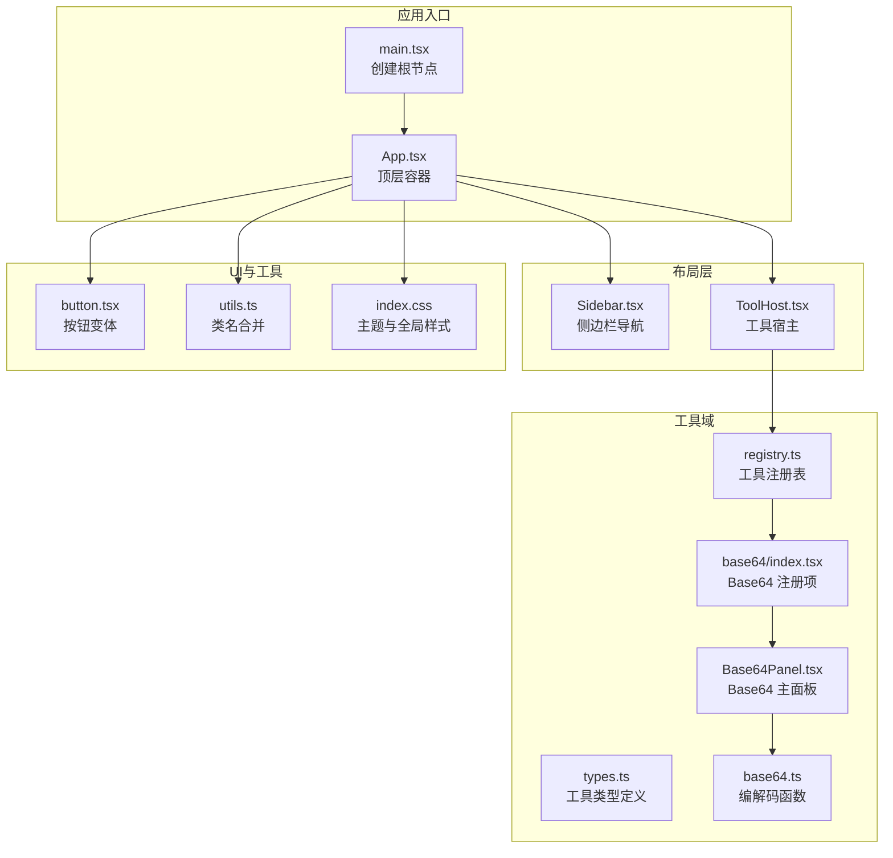
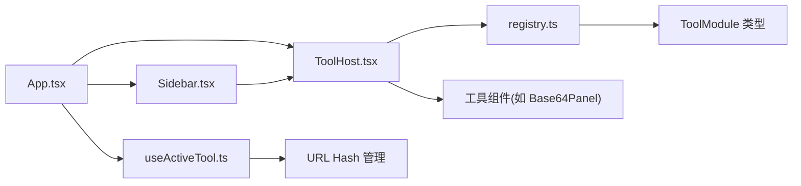
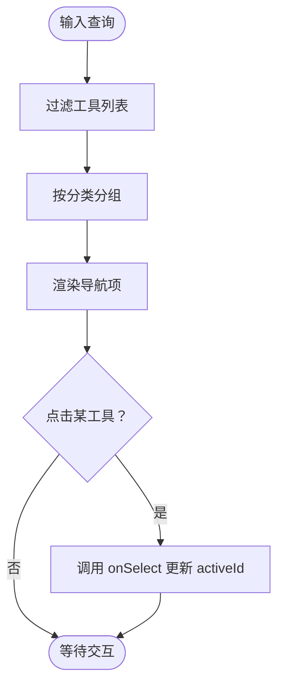
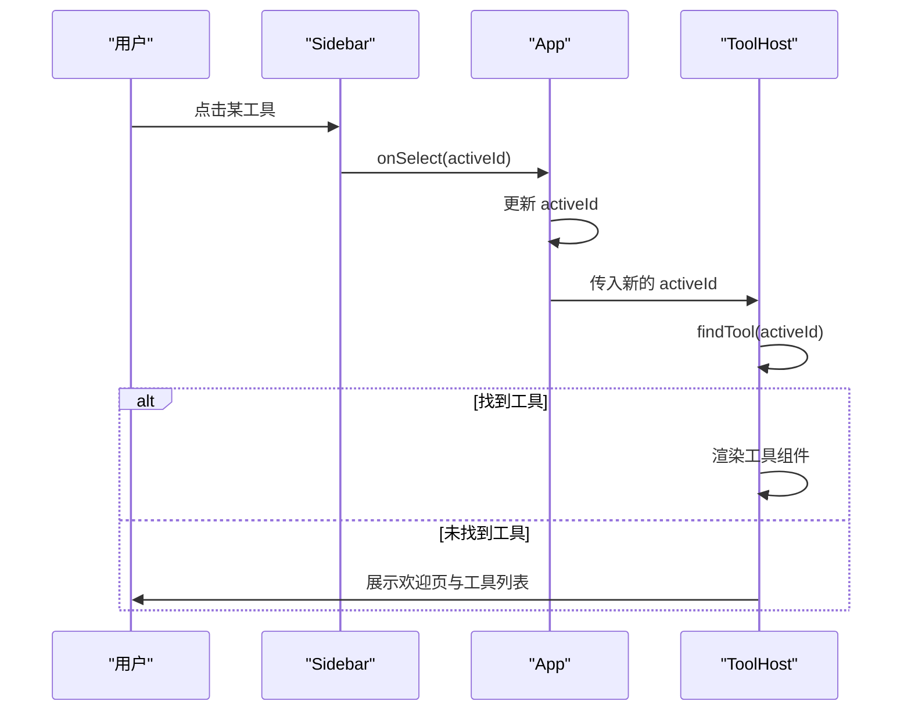
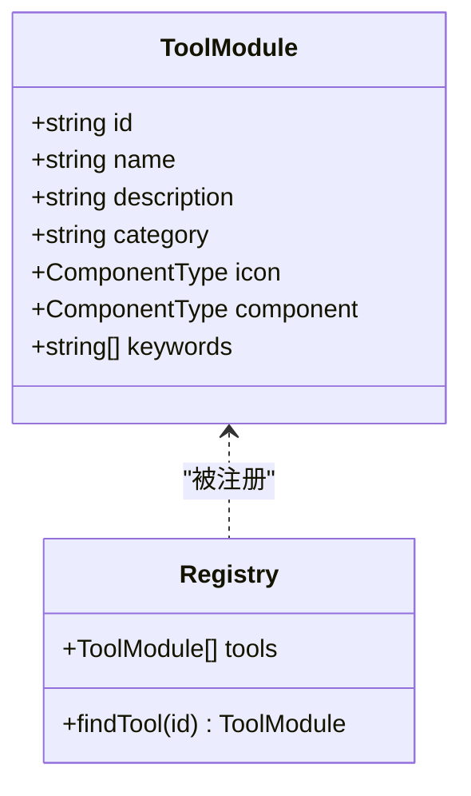
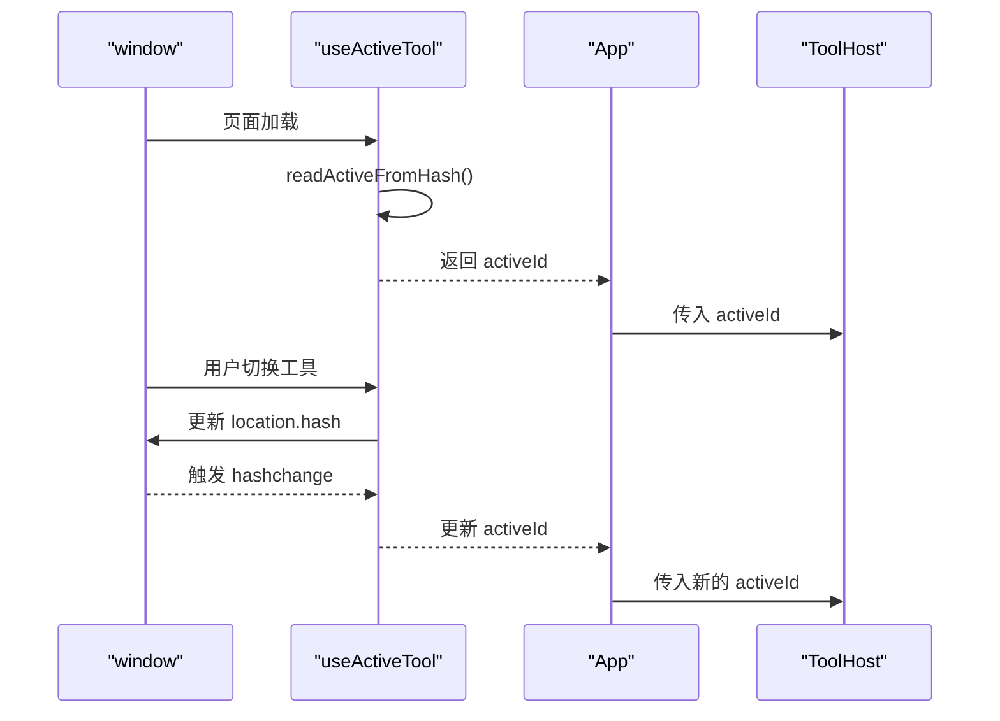
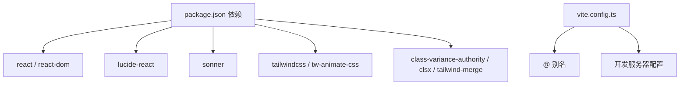

# 应用架构

<cite>
**本文引用的文件**
- [src/App.tsx](file://src/App.tsx)
- [src/main.tsx](file://src/main.tsx)
- [src/layout/Sidebar.tsx](file://src/layout/Sidebar.tsx)
- [src/layout/ToolHost.tsx](file://src/layout/ToolHost.tsx)
- [src/hooks/useActiveTool.ts](file://src/hooks/useActiveTool.ts)
- [src/tools/registry.ts](file://src/tools/registry.ts)
- [src/tools/types.ts](file://src/tools/types.ts)
- [src/tools/base64/index.tsx](file://src/tools/base64/index.tsx)
- [src/tools/base64/Base64Panel.tsx](file://src/tools/base64/Base64Panel.tsx)
- [src/tools/base64/base64.ts](file://src/tools/base64/base64.ts)
- [src/lib/utils.ts](file://src/lib/utils.ts)
- [src/styles/index.css](file://src/styles/index.css)
- [src/components/ui/button.tsx](file://src/components/ui/button.tsx)
- [package.json](file://package.json)
- [vite.config.ts](file://vite.config.ts)
</cite>

## 目录
1. [简介](#简介)
2. [项目结构](#项目结构)
3. [核心组件](#核心组件)
4. [架构总览](#架构总览)
5. [组件详解](#组件详解)
6. [依赖关系分析](#依赖关系分析)
7. [性能考量](#性能考量)
8. [故障排查指南](#故障排查指南)
9. [结论](#结论)
10. [附录](#附录)

## 简介
本文件系统性梳理 Toolbox 的应用架构，围绕基于 React 的组件化设计展开，重点阐释根组件 App 的职责划分、布局系统的分层设计，以及 Sidebar 侧边栏导航与 ToolHost 工具宿主之间的协作机制。文档还涵盖应用启动流程、初始化过程、错误处理策略、组件复用原则、props 传递策略、事件处理机制、响应式布局与主题系统，并提供组件关系图与数据流图，帮助开发者快速理解整体架构思路。

## 项目结构
项目采用“功能域+分层”的组织方式：
- 根入口与应用根组件：main.tsx 负责挂载 React 根节点，App.tsx 作为顶层容器协调布局与状态。
- 布局层：Sidebar 与 ToolHost 分别承担导航与内容渲染职责。
- 工具域：tools 子目录下按工具模块组织，每个工具通过 registry 汇聚，ToolHost 动态加载对应组件。
- UI 组件库：components/ui 提供可复用的基础 UI 组件。
- 工具函数与样式：lib/utils 提供类名合并工具，styles/index.css 提供主题与全局样式。
- Hook：hooks/useActiveTool 提供基于 URL hash 的轻量路由状态管理。
- 构建与运行：vite.config.ts 配置开发服务器与别名，package.json 管理依赖与脚本。

图表来源
- [src/main.tsx:1-11](file://src/main.tsx#L1-L11)
- [src/App.tsx:1-21](file://src/App.tsx#L1-L21)
- [src/layout/Sidebar.tsx:1-100](file://src/layout/Sidebar.tsx#L1-L100)
- [src/layout/ToolHost.tsx:1-50](file://src/layout/ToolHost.tsx#L1-L50)
- [src/tools/registry.ts:1-13](file://src/tools/registry.ts#L1-L13)
- [src/tools/types.ts:1-23](file://src/tools/types.ts#L1-L23)
- [src/tools/base64/index.tsx:1-16](file://src/tools/base64/index.tsx#L1-L16)
- [src/tools/base64/Base64Panel.tsx:1-125](file://src/tools/base64/Base64Panel.tsx#L1-L125)
- [src/tools/base64/base64.ts:1-35](file://src/tools/base64/base64.ts#L1-L35)
- [src/components/ui/button.tsx:1-60](file://src/components/ui/button.tsx#L1-L60)
- [src/lib/utils.ts:1-7](file://src/lib/utils.ts#L1-L7)
- [src/styles/index.css:1-112](file://src/styles/index.css#L1-L112)

章节来源
- [src/main.tsx:1-11](file://src/main.tsx#L1-L11)
- [src/App.tsx:1-21](file://src/App.tsx#L1-L21)
- [src/layout/Sidebar.tsx:1-100](file://src/layout/Sidebar.tsx#L1-L100)
- [src/layout/ToolHost.tsx:1-50](file://src/layout/ToolHost.tsx#L1-L50)
- [src/tools/registry.ts:1-13](file://src/tools/registry.ts#L1-L13)
- [src/tools/types.ts:1-23](file://src/tools/types.ts#L1-L23)
- [src/tools/base64/index.tsx:1-16](file://src/tools/base64/index.tsx#L1-L16)
- [src/tools/base64/Base64Panel.tsx:1-125](file://src/tools/base64/Base64Panel.tsx#L1-L125)
- [src/tools/base64/base64.ts:1-35](file://src/tools/base64/base64.ts#L1-L35)
- [src/components/ui/button.tsx:1-60](file://src/components/ui/button.tsx#L1-L60)
- [src/lib/utils.ts:1-7](file://src/lib/utils.ts#L1-L7)
- [src/styles/index.css:1-112](file://src/styles/index.css#L1-L112)

## 核心组件
- App.tsx：顶层容器，负责布局划分与状态注入，将 activeId 与 onSelect 通过 props 下发给 Sidebar 与 ToolHost。
- Sidebar.tsx：左侧导航，支持搜索过滤、分类展示、选中态高亮，触发 onSelect 切换工具。
- ToolHost.tsx：右侧内容区，根据 activeId 查找工具并动态渲染对应组件；若无工具则展示引导页。
- useActiveTool.ts：基于 URL hash 的轻量状态管理，读取初始 hash、监听变更、设置新 hash。
- registry.ts 与 types.ts：工具类型定义与注册表，集中管理工具清单与查找逻辑。
- UI 组件与工具函数：button.tsx 提供变体按钮，utils.ts 提供类名合并，styles/index.css 提供主题变量与全局样式。

章节来源
- [src/App.tsx:1-21](file://src/App.tsx#L1-L21)
- [src/layout/Sidebar.tsx:1-100](file://src/layout/Sidebar.tsx#L1-L100)
- [src/layout/ToolHost.tsx:1-50](file://src/layout/ToolHost.tsx#L1-L50)
- [src/hooks/useActiveTool.ts:1-34](file://src/hooks/useActiveTool.ts#L1-L34)
- [src/tools/registry.ts:1-13](file://src/tools/registry.ts#L1-L13)
- [src/tools/types.ts:1-23](file://src/tools/types.ts#L1-L23)
- [src/lib/utils.ts:1-7](file://src/lib/utils.ts#L1-L7)
- [src/styles/index.css:1-112](file://src/styles/index.css#L1-L112)

## 架构总览
应用采用“根组件 + 布局层 + 工具域 + UI 基础设施”的分层架构。Sidebar 与 ToolHost 通过 App 协调，共享同一份 activeId 状态；ToolHost 依据 activeId 在运行时动态渲染具体工具组件。工具注册表集中管理工具清单，便于扩展与维护。

图表来源
- [src/App.tsx:1-21](file://src/App.tsx#L1-L21)
- [src/layout/Sidebar.tsx:1-100](file://src/layout/Sidebar.tsx#L1-L100)
- [src/layout/ToolHost.tsx:1-50](file://src/layout/ToolHost.tsx#L1-L50)
- [src/hooks/useActiveTool.ts:1-34](file://src/hooks/useActiveTool.ts#L1-L34)
- [src/tools/registry.ts:1-13](file://src/tools/registry.ts#L1-L13)
- [src/tools/types.ts:1-23](file://src/tools/types.ts#L1-L23)

## 组件详解

### App 根组件
- 职责：统一布局容器，注入 activeId 与 onSelect，承载全局通知组件。
- 数据流：从 useActiveTool 获取 activeId；将 activeId 与 onSelect 同步传递给 Sidebar 与 ToolHost。
- 响应式布局：外层容器使用 flex 布局，Sidebar 固定宽度，ToolHost 占据剩余空间，内部再以 flex 控制内容区域滚动与填充。

章节来源
- [src/App.tsx:1-21](file://src/App.tsx#L1-L21)
- [src/hooks/useActiveTool.ts:1-34](file://src/hooks/useActiveTool.ts#L1-L34)

### Sidebar 侧边栏导航
- 搜索过滤：基于输入查询对工具列表进行过滤，支持名称、id、描述、关键词匹配。
- 分类展示：按 category 分组，未分类归入“其他”，提升可发现性。
- 选中态：根据 activeId 高亮当前工具，点击触发 onSelect 更新状态。
- 性能优化：使用 useMemo 对过滤与分组结果进行缓存，避免重复计算。

图表来源
- [src/layout/Sidebar.tsx:13-35](file://src/layout/Sidebar.tsx#L13-L35)
- [src/layout/Sidebar.tsx:68-91](file://src/layout/Sidebar.tsx#L68-L91)

章节来源
- [src/layout/Sidebar.tsx:1-100](file://src/layout/Sidebar.tsx#L1-L100)

### ToolHost 工具宿主
- 无工具时：展示欢迎语与工具列表，用户可直接点击进入工具。
- 有工具时：通过 findTool 根据 activeId 查找工具，动态渲染其 component。
- 错误兜底：当 activeId 无效或找不到工具时，回到欢迎页，保证用户体验连续性。

图表来源
- [src/layout/ToolHost.tsx:10-49](file://src/layout/ToolHost.tsx#L10-L49)
- [src/tools/registry.ts:9-12](file://src/tools/registry.ts#L9-L12)

章节来源
- [src/layout/ToolHost.tsx:1-50](file://src/layout/ToolHost.tsx#L1-L50)
- [src/tools/registry.ts:1-13](file://src/tools/registry.ts#L1-L13)

### 工具注册与类型系统
- ToolModule：统一描述工具的 id、name、description、category、icon、component、keywords。
- registry.ts：集中管理工具数组与查找函数，新增工具只需在注册表中加入即可生效。
- base64 示例：通过 index.tsx 导出 ToolModule，ToolHost 动态渲染 Base64Panel。

图表来源
- [src/tools/types.ts:7-22](file://src/tools/types.ts#L7-L22)
- [src/tools/registry.ts:4-12](file://src/tools/registry.ts#L4-L12)
- [src/tools/base64/index.tsx:5-13](file://src/tools/base64/index.tsx#L5-L13)

章节来源
- [src/tools/types.ts:1-23](file://src/tools/types.ts#L1-L23)
- [src/tools/registry.ts:1-13](file://src/tools/registry.ts#L1-L13)
- [src/tools/base64/index.tsx:1-16](file://src/tools/base64/index.tsx#L1-L16)

### 状态管理与路由策略
- 使用 URL hash (#/tool/<id>) 表示当前激活工具，无需引入完整路由库。
- 初始化：读取 location.hash，提取工具 id。
- 变更监听：监听 hashchange，更新 activeId。
- 设置新值：通过设置 location.hash 切换工具。

图表来源
- [src/hooks/useActiveTool.ts:5-30](file://src/hooks/useActiveTool.ts#L5-L30)
- [src/App.tsx:6-18](file://src/App.tsx#L6-L18)
- [src/layout/ToolHost.tsx:10-11](file://src/layout/ToolHost.tsx#L10-L11)

章节来源
- [src/hooks/useActiveTool.ts:1-34](file://src/hooks/useActiveTool.ts#L1-L34)
- [src/App.tsx:1-21](file://src/App.tsx#L1-L21)

### UI 组件与复用原则
- Button：通过 class-variance-authority 定义多种变体与尺寸，支持 asChild 透传，便于组合与复用。
- 类名合并：cn 函数结合 clsx 与 tailwind-merge，确保样式覆盖与冲突最小化。
- 卡片与输入：ToolHost 中使用 Card 与 Textarea 等 UI 组件，形成一致的视觉与交互体验。

章节来源
- [src/components/ui/button.tsx:1-60](file://src/components/ui/button.tsx#L1-L60)
- [src/lib/utils.ts:1-7](file://src/lib/utils.ts#L1-L7)
- [src/layout/ToolHost.tsx:14-40](file://src/layout/ToolHost.tsx#L14-L40)

### 响应式设计与主题系统
- 全局样式：index.css 使用 oklch 色彩模型与自定义属性，定义背景、前景、卡片、侧边栏等色值。
- 暗色主题：通过 .dark 选择器与自定义属性实现暗色变体，适配系统偏好。
- 布局基元：根元素与 #root 高度设为 100%，配合 flex 布局实现全屏占满与滚动隔离。

章节来源
- [src/styles/index.css:1-112](file://src/styles/index.css#L1-L112)

## 依赖关系分析
- 组件耦合：App 与 Sidebar/ToolHost 弱耦合，通过 props 传递状态；ToolHost 与工具组件通过 registry 解耦。
- 外部依赖：React 生态、lucide-react 图标、sonner 通知、tailwindcss/tw-animate-css 样式系统。
- 构建链路：Vite + React 插件 + TailwindCSS 插件，路径别名 @ 指向 src，开发服务器固定端口与 HMR 配置。

图表来源
- [package.json:12-24](file://package.json#L12-L24)
- [vite.config.ts:10-15](file://vite.config.ts#L10-L15)

章节来源
- [package.json:1-37](file://package.json#L1-37)
- [vite.config.ts:1-39](file://vite.config.ts#L1-L39)

## 性能考量
- 计算缓存：Sidebar 使用 useMemo 对过滤与分组结果进行缓存，降低渲染成本。
- 条件渲染：ToolHost 在无工具时渲染欢迎页，避免不必要的组件实例化。
- 状态同步：App 仅在状态变化时重渲染，Sidebar 与 ToolHost 也仅在相关 props 变化时更新。
- 样式合并：cn 函数减少重复类名与冲突，提升样式计算效率。

章节来源
- [src/layout/Sidebar.tsx:26-35](file://src/layout/Sidebar.tsx#L26-L35)
- [src/layout/ToolHost.tsx:13-41](file://src/layout/ToolHost.tsx#L13-L41)
- [src/lib/utils.ts:4-6](file://src/lib/utils.ts#L4-L6)

## 故障排查指南
- 工具未显示或空白：检查 registry 是否正确注册工具，确认 activeId 与工具 id 匹配。
- 搜索无结果：确认工具 keywords、name、description 是否包含查询词。
- 点击无反应：检查 Sidebar 的 onSelect 是否正确传递至 App，App 是否更新 activeId。
- 复制/编码异常：查看工具组件中的错误提示与日志，确认输入合法性与浏览器兼容性。
- 样式异常：核对 index.css 主题变量是否正确，Tailwind 配置是否启用。

章节来源
- [src/layout/ToolHost.tsx:13-41](file://src/layout/ToolHost.tsx#L13-L41)
- [src/layout/Sidebar.tsx:13-21](file://src/layout/Sidebar.tsx#L13-L21)
- [src/tools/base64/Base64Panel.tsx:27-41](file://src/tools/base64/Base64Panel.tsx#L27-L41)

## 结论
Toolbox 采用简洁清晰的分层架构：根组件 App 负责布局与状态注入，Sidebar 与 ToolHost 通过 props 与状态协同工作，工具通过注册表集中管理，具备良好的可扩展性与可维护性。基于 URL hash 的轻量路由策略降低了外部依赖，同时保留了良好的可访问性与书签能力。UI 组件与工具函数遵循单一职责与可复用原则，主题系统与响应式布局提升了跨设备体验。

## 附录
- 启动流程概览
  - main.tsx 创建根节点并包裹 StrictMode。
  - App 初始化 useActiveTool，读取初始 hash，将 activeId 与 onSelect 传递给 Sidebar 与 ToolHost。
  - Sidebar 渲染导航并支持搜索过滤；ToolHost 根据 activeId 动态渲染工具组件。
  - 构建阶段通过 Vite 与 TailwindCSS 插件完成资源打包与样式生成。

章节来源
- [src/main.tsx:6-10](file://src/main.tsx#L6-L10)
- [src/hooks/useActiveTool.ts:18-30](file://src/hooks/useActiveTool.ts#L18-L30)
- [src/App.tsx:6-18](file://src/App.tsx#L6-L18)
- [vite.config.ts:9-15](file://vite.config.ts#L9-L15)