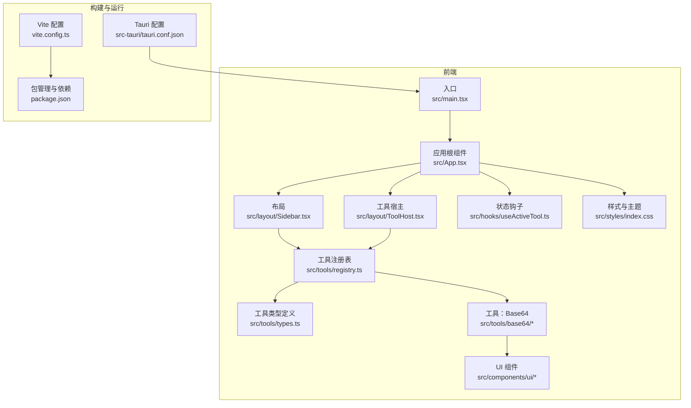
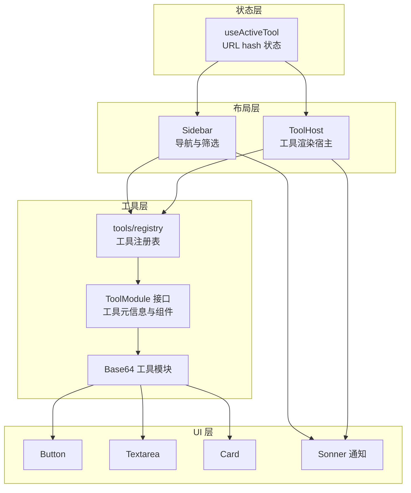
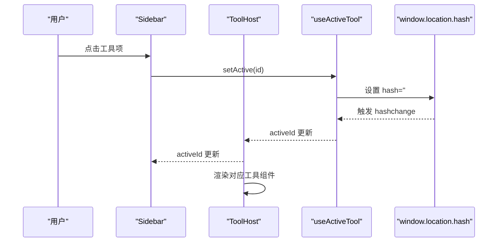
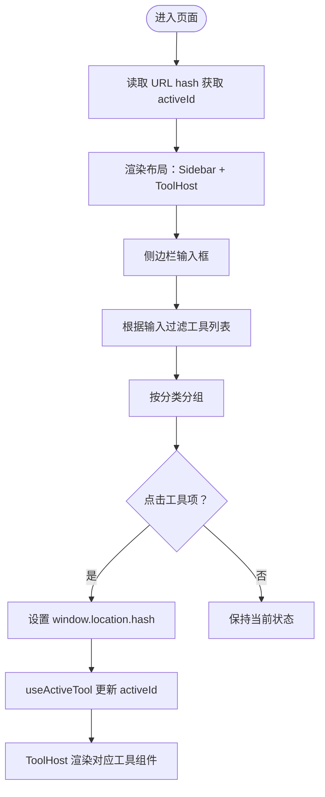
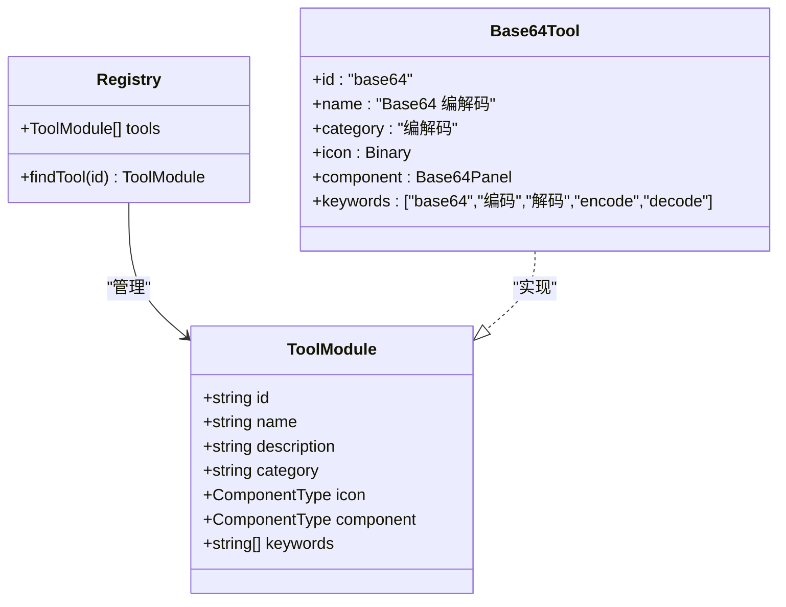
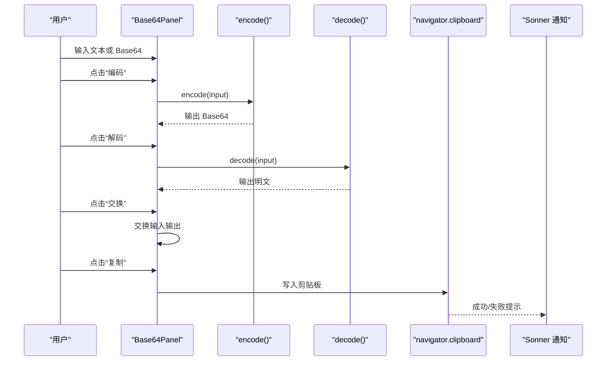
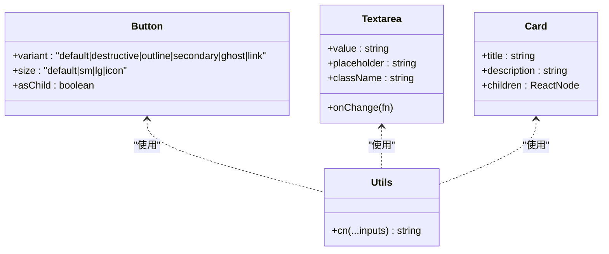
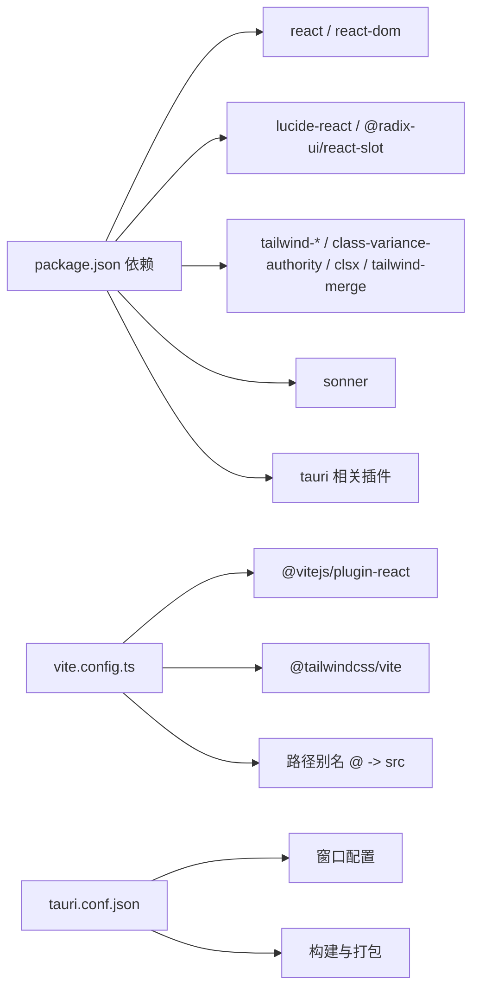

# 架构设计

<cite>
**本文引用的文件**
- [README.md](file://README.md)
- [package.json](file://package.json)
- [vite.config.ts](file://vite.config.ts)
- [src-tauri/tauri.conf.json](file://src-tauri/tauri.conf.json)
- [src/main.tsx](file://src/main.tsx)
- [src/App.tsx](file://src/App.tsx)
- [src/hooks/useActiveTool.ts](file://src/hooks/useActiveTool.ts)
- [src/layout/Sidebar.tsx](file://src/layout/Sidebar.tsx)
- [src/layout/ToolHost.tsx](file://src/layout/ToolHost.tsx)
- [src/tools/registry.ts](file://src/tools/registry.ts)
- [src/tools/types.ts](file://src/tools/types.ts)
- [src/tools/base64/index.tsx](file://src/tools/base64/index.tsx)
- [src/tools/base64/Base64Panel.tsx](file://src/tools/base64/Base64Panel.tsx)
- [src/tools/base64/base64.ts](file://src/tools/base64/base64.ts)
- [src/components/ui/button.tsx](file://src/components/ui/button.tsx)
- [src/components/ui/textarea.tsx](file://src/components/ui/textarea.tsx)
- [src/components/ui/card.tsx](file://src/components/ui/card.tsx)
- [src/components/ui/sonner.tsx](file://src/components/ui/sonner.tsx)
- [src/lib/utils.ts](file://src/lib/utils.ts)
- [src/styles/index.css](file://src/styles/index.css)
</cite>

## 目录
1. [简介](#简介)
2. [项目结构](#项目结构)
3. [核心组件](#核心组件)
4. [架构总览](#架构总览)
5. [详细组件分析](#详细组件分析)
6. [依赖分析](#依赖分析)
7. [性能考虑](#性能考虑)
8. [故障排查指南](#故障排查指南)
9. [结论](#结论)
10. [附录](#附录)

## 简介
本项目采用 Tauri + React + TypeScript 技术栈，结合 Vite 进行开发与构建。前端通过轻量级的状态管理模式（基于 URL hash）实现工具切换与路由同步，后端通过 Tauri 配置进行窗口与打包集成。整体架构强调模块化工具系统、清晰的布局分层以及可扩展的工具注册表机制。

## 项目结构
项目采用按功能域划分的目录组织方式：
- 根目录包含前端与 Tauri 配置、包管理与构建脚本
- src 目录下包含入口、布局、工具、UI 组件、工具库与样式
- src/tools 下为工具模块的集合，每个工具独立子目录，包含注册项与具体实现
- src/layout 提供侧边栏与工具宿主两大布局组件
- src/hooks 提供自定义 Hook，如基于 hash 的状态管理
- src/components/ui 提供通用 UI 组件与样式工具
- src/styles 提供主题与全局样式
- src-tauri 包含 Tauri 应用配置与原生能力声明

**图表来源**
- [src/main.tsx:1-11](file://src/main.tsx#L1-L11)
- [src/App.tsx:1-21](file://src/App.tsx#L1-L21)
- [src/layout/Sidebar.tsx:1-100](file://src/layout/Sidebar.tsx#L1-L100)
- [src/layout/ToolHost.tsx:1-50](file://src/layout/ToolHost.tsx#L1-L50)
- [src/hooks/useActiveTool.ts:1-34](file://src/hooks/useActiveTool.ts#L1-L34)
- [src/tools/registry.ts:1-13](file://src/tools/registry.ts#L1-L13)
- [src/tools/types.ts:1-23](file://src/tools/types.ts#L1-L23)
- [src/tools/base64/index.tsx:1-16](file://src/tools/base64/index.tsx#L1-L16)
- [src/components/ui/button.tsx:1-60](file://src/components/ui/button.tsx#L1-L60)
- [src/styles/index.css:1-112](file://src/styles/index.css#L1-L112)
- [vite.config.ts:1-39](file://vite.config.ts#L1-L39)
- [package.json:1-37](file://package.json#L1-L37)
- [src-tauri/tauri.conf.json:1-39](file://src-tauri/tauri.conf.json#L1-L39)

**章节来源**
- [README.md:1-8](file://README.md#L1-L8)
- [package.json:1-37](file://package.json#L1-L37)
- [vite.config.ts:1-39](file://vite.config.ts#L1-L39)
- [src-tauri/tauri.conf.json:1-39](file://src-tauri/tauri.conf.json#L1-L39)

## 核心组件
- 应用根组件：负责布局容器与全局通知组件渲染
- 状态钩子：基于 URL hash 实现轻量级状态管理，避免引入完整路由库
- 布局系统：侧边栏负责工具筛选与导航，工具宿主负责渲染当前工具
- 工具注册表：集中管理工具清单与查找逻辑
- 工具模块：遵循统一接口，包含元信息与 UI 组件
- UI 组件库：基于 Radix 和 Tailwind，提供一致的交互与视觉风格

**章节来源**
- [src/App.tsx:1-21](file://src/App.tsx#L1-L21)
- [src/hooks/useActiveTool.ts:1-34](file://src/hooks/useActiveTool.ts#L1-L34)
- [src/layout/Sidebar.tsx:1-100](file://src/layout/Sidebar.tsx#L1-L100)
- [src/layout/ToolHost.tsx:1-50](file://src/layout/ToolHost.tsx#L1-L50)
- [src/tools/registry.ts:1-13](file://src/tools/registry.ts#L1-L13)
- [src/tools/types.ts:1-23](file://src/tools/types.ts#L1-L23)

## 架构总览
系统采用“布局 + 注册表 + 工具模块”的分层架构：
- 布局层：Sidebar 负责导航与筛选，ToolHost 负责渲染当前工具
- 状态层：useActiveTool 通过 URL hash 同步激活工具 ID
- 工具层：tools/registry 统一注册与查找工具，工具以模块形式存在
- UI 层：通用组件与样式提供一致的交互体验
- 构建层：Vite + Tauri 配置实现开发与打包流程

**图表来源**
- [src/hooks/useActiveTool.ts:1-34](file://src/hooks/useActiveTool.ts#L1-L34)
- [src/layout/Sidebar.tsx:1-100](file://src/layout/Sidebar.tsx#L1-L100)
- [src/layout/ToolHost.tsx:1-50](file://src/layout/ToolHost.tsx#L1-L50)
- [src/tools/registry.ts:1-13](file://src/tools/registry.ts#L1-L13)
- [src/tools/types.ts:1-23](file://src/tools/types.ts#L1-L23)
- [src/tools/base64/index.tsx:1-16](file://src/tools/base64/index.tsx#L1-L16)
- [src/components/ui/button.tsx:1-60](file://src/components/ui/button.tsx#L1-L60)
- [src/components/ui/textarea.tsx](file://src/components/ui/textarea.tsx)
- [src/components/ui/card.tsx](file://src/components/ui/card.tsx)
- [src/components/ui/sonner.tsx](file://src/components/ui/sonner.tsx)

## 详细组件分析

### 状态管理：基于 URL Hash 的轻量级状态
- 设计目标：避免引入完整路由库，仅使用浏览器 hash 实现工具切换
- 关键点：
  - 读取与写入：通过 window.location.hash 读取与设置激活工具 ID
  - 初始化：首次进入页面时从 hash 解析初始值
  - 监听变更：监听 hashchange 事件，实时更新激活状态
  - 导航触发：点击侧边栏或工具宿主中的快捷按钮时写入 hash

**图表来源**
- [src/hooks/useActiveTool.ts:17-34](file://src/hooks/useActiveTool.ts#L17-L34)
- [src/layout/Sidebar.tsx:73-89](file://src/layout/Sidebar.tsx#L73-L89)
- [src/layout/ToolHost.tsx:29-36](file://src/layout/ToolHost.tsx#L29-L36)

**章节来源**
- [src/hooks/useActiveTool.ts:1-34](file://src/hooks/useActiveTool.ts#L1-L34)

### 布局系统：侧边栏导航与工具宿主协作
- 侧边栏：
  - 输入框实现搜索过滤，支持名称、ID、描述与关键词匹配
  - 按分类聚合展示工具，高亮当前激活项
  - 点击触发状态更新，联动工具宿主渲染
- 工具宿主：
  - 根据激活 ID 查找工具并渲染其组件
  - 若无激活工具，展示欢迎页与一键跳转按钮

**图表来源**
- [src/layout/Sidebar.tsx:13-35](file://src/layout/Sidebar.tsx#L13-L35)
- [src/layout/ToolHost.tsx:10-49](file://src/layout/ToolHost.tsx#L10-L49)
- [src/hooks/useActiveTool.ts:17-34](file://src/hooks/useActiveTool.ts#L17-L34)

**章节来源**
- [src/layout/Sidebar.tsx:1-100](file://src/layout/Sidebar.tsx#L1-L100)
- [src/layout/ToolHost.tsx:1-50](file://src/layout/ToolHost.tsx#L1-L50)

### 工具系统：模块化工具架构与注册表机制
- 工具模块接口：
  - id、name、description、category、icon、component、keywords
  - 统一规范便于注册表管理与 UI 展示
- 注册表：
  - 集中导入与导出工具清单
  - 提供按 ID 查找工具的函数
- 动态加载：
  - 通过注册表查找工具并渲染其组件
  - 新增工具只需在注册表中添加导入与条目

**图表来源**
- [src/tools/types.ts:7-22](file://src/tools/types.ts#L7-L22)
- [src/tools/registry.ts:4-12](file://src/tools/registry.ts#L4-L12)
- [src/tools/base64/index.tsx:5-15](file://src/tools/base64/index.tsx#L5-L15)

**章节来源**
- [src/tools/types.ts:1-23](file://src/tools/types.ts#L1-L23)
- [src/tools/registry.ts:1-13](file://src/tools/registry.ts#L1-L13)
- [src/tools/base64/index.tsx:1-16](file://src/tools/base64/index.tsx#L1-L16)

### 具体工具：Base64 编解码
- 功能特性：
  - 支持 UTF-8 安全的编码与解码
  - 提供交换、清空、复制等便捷操作
  - 使用通用 UI 组件与通知系统
- 数据流：
  - 用户在输入区输入文本或 Base64 字符串
  - 点击按钮触发编码/解码，结果输出到输出区
  - 错误与成功提示通过通知组件反馈

**图表来源**
- [src/tools/base64/Base64Panel.tsx:23-125](file://src/tools/base64/Base64Panel.tsx#L23-L125)
- [src/tools/base64/base64.ts:5-34](file://src/tools/base64/base64.ts#L5-L34)
- [src/components/ui/sonner.tsx](file://src/components/ui/sonner.tsx)

**章节来源**
- [src/tools/base64/Base64Panel.tsx:1-125](file://src/tools/base64/Base64Panel.tsx#L1-L125)
- [src/tools/base64/base64.ts:1-35](file://src/tools/base64/base64.ts#L1-L35)

### UI 组件与样式体系
- Button：基于 Variance Authority 的变体系统，支持多种尺寸与外观
- Textarea：多行文本输入，适配代码类工具场景
- Card：卡片容器，用于工具面板的结构化展示
- 样式：Tailwind 主题变量与暗色模式支持，cn 工具函数合并类名

**图表来源**
- [src/components/ui/button.tsx:38-60](file://src/components/ui/button.tsx#L38-L60)
- [src/components/ui/textarea.tsx](file://src/components/ui/textarea.tsx)
- [src/components/ui/card.tsx](file://src/components/ui/card.tsx)
- [src/lib/utils.ts:4-7](file://src/lib/utils.ts#L4-L7)

**章节来源**
- [src/components/ui/button.tsx:1-60](file://src/components/ui/button.tsx#L1-L60)
- [src/components/ui/textarea.tsx](file://src/components/ui/textarea.tsx)
- [src/components/ui/card.tsx](file://src/components/ui/card.tsx)
- [src/lib/utils.ts:1-7](file://src/lib/utils.ts#L1-L7)
- [src/styles/index.css:1-112](file://src/styles/index.css#L1-L112)

## 依赖分析
- 前端依赖：React、Lucide React、Tailwind 与相关工具库
- 构建工具：Vite、React 插件、Tailwind Vite 插件
- 打包与运行：Tauri CLI、Tauri 配置与窗口参数
- 开发与热更新：固定端口与 HMR 配置

**图表来源**
- [package.json:12-35](file://package.json#L12-L35)
- [vite.config.ts:1-39](file://vite.config.ts#L1-L39)
- [src-tauri/tauri.conf.json:6-38](file://src-tauri/tauri.conf.json#L6-L38)

**章节来源**
- [package.json:1-37](file://package.json#L1-L37)
- [vite.config.ts:1-39](file://vite.config.ts#L1-L39)
- [src-tauri/tauri.conf.json:1-39](file://src-tauri/tauri.conf.json#L1-L39)

## 性能考虑
- 轻量状态管理：仅使用 hash 与少量事件监听，避免复杂路由开销
- 懒渲染：工具组件按需渲染，未激活时不占用资源
- UI 组件复用：统一的 Button/Textarea/Card 降低重复实现与维护成本
- 样式优化：Tailwind 变量与合并类名减少样式体积与冲突
- 构建优化：Vite 快速冷启动与热更新，Tauri 固定端口与 HMR 配置提升开发效率

## 故障排查指南
- 工具未显示或无法切换
  - 检查注册表是否正确导入并导出工具
  - 确认工具 ID 与侧边栏导航一致
- 点击无效或状态不更新
  - 检查 useActiveTool 是否正确设置与读取 hash
  - 确认 hash 前缀与解析逻辑一致
- 样式异常或主题不生效
  - 检查 Tailwind 配置与主题变量
  - 确认 cn 工具函数正确合并类名
- 构建或运行问题
  - 检查 Vite 端口与 HMR 配置
  - 确认 Tauri 配置与构建脚本

**章节来源**
- [src/tools/registry.ts:4-12](file://src/tools/registry.ts#L4-L12)
- [src/hooks/useActiveTool.ts:3-11](file://src/hooks/useActiveTool.ts#L3-L11)
- [src/lib/utils.ts:4-7](file://src/lib/utils.ts#L4-L7)
- [vite.config.ts:22-37](file://vite.config.ts#L22-L37)
- [src-tauri/tauri.conf.json:6-11](file://src-tauri/tauri.conf.json#L6-L11)

## 结论
该架构以“布局 + 注册表 + 工具模块”为核心，通过 URL hash 实现轻量级状态管理，确保了低耦合与高可扩展性。模块化工具设计使新增工具变得简单，而统一的 UI 组件与样式体系保证了良好的用户体验与一致性。结合 Vite 与 Tauri 的配置，系统具备优秀的开发体验与打包能力。

## 附录
- 新增工具步骤建议
  - 在 tools 目录下创建新工具子目录
  - 实现工具组件与业务逻辑
  - 在 tools/registry.ts 中导入并加入工具数组
  - 在工具模块中提供元信息与关键词
- 最佳实践
  - 保持工具组件纯函数与无副作用
  - 使用统一的 UI 组件与样式变量
  - 为工具提供清晰的描述与关键词，提升可发现性