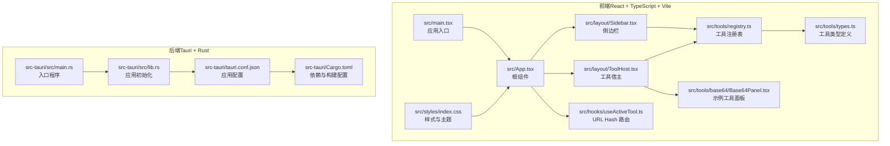
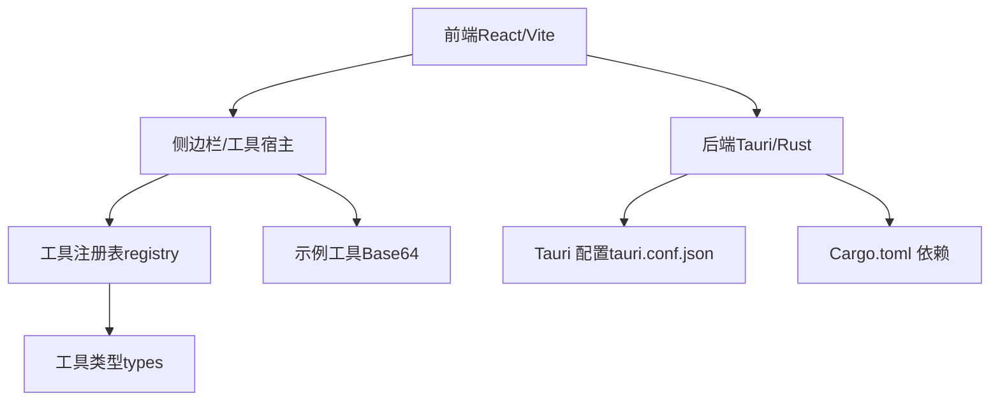
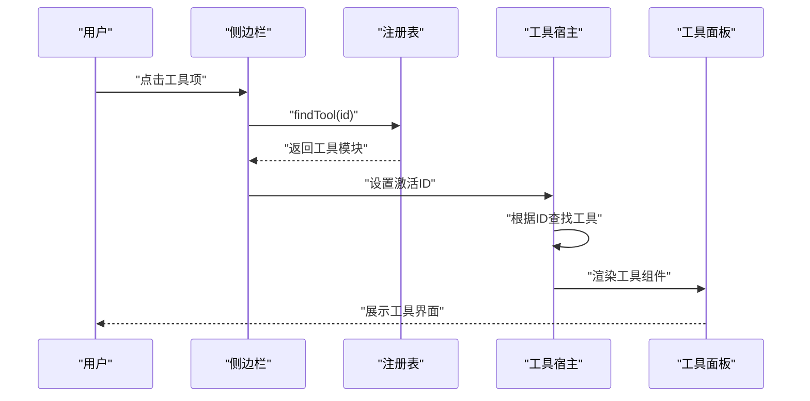
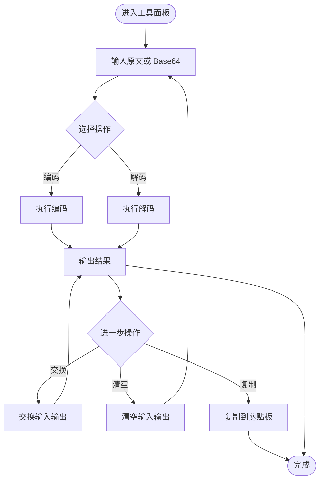
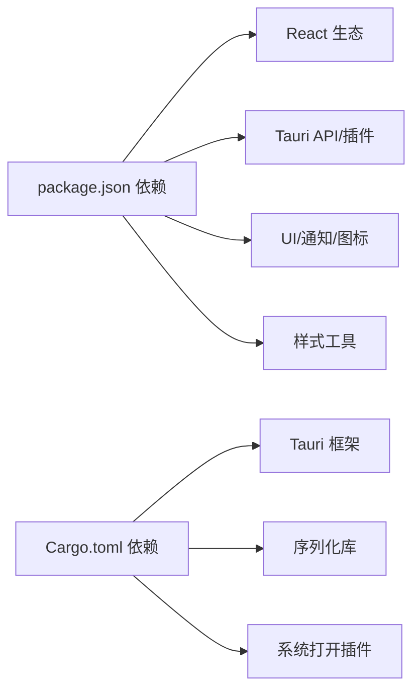

# 项目概述

<cite>
**本文引用的文件**
- [README.md](file://README.md)
- [package.json](file://package.json)
- [vite.config.ts](file://vite.config.ts)
- [tsconfig.json](file://tsconfig.json)
- [src/main.tsx](file://src/main.tsx)
- [src/App.tsx](file://src/App.tsx)
- [src/layout/Sidebar.tsx](file://src/layout/Sidebar.tsx)
- [src/layout/ToolHost.tsx](file://src/layout/ToolHost.tsx)
- [src/hooks/useActiveTool.ts](file://src/hooks/useActiveTool.ts)
- [src/tools/types.ts](file://src/tools/types.ts)
- [src/tools/registry.ts](file://src/tools/registry.ts)
- [src/tools/base64/Base64Panel.tsx](file://src/tools/base64/Base64Panel.tsx)
- [src/styles/index.css](file://src/styles/index.css)
- [src-tauri/tauri.conf.json](file://src-tauri/tauri.conf.json)
- [src-tauri/Cargo.toml](file://src-tauri/Cargo.toml)
- [src-tauri/src/lib.rs](file://src-tauri/src/lib.rs)
- [src-tauri/src/main.rs](file://src-tauri/src/main.rs)
</cite>

## 目录
1. [引言](#引言)
2. [项目结构](#项目结构)
3. [核心组件](#核心组件)
4. [架构总览](#架构总览)
5. [详细组件分析](#详细组件分析)
6. [依赖关系分析](#依赖关系分析)
7. [性能考量](#性能考量)
8. [故障排查指南](#故障排查指南)
9. [结论](#结论)
10. [附录](#附录)

## 引言
Toolbox 是一个基于 Tauri + React + TypeScript 的桌面应用工具箱，旨在以现代 Web 技术栈构建高性能、可扩展的本地化工具集合。项目采用混合架构设计：前端使用 React + TypeScript + Vite 构建用户界面与交互逻辑，后端使用 Rust 提供系统级能力与安全边界，通过 Tauri 框架桥接前后端，形成“浏览器内核 + 原生能力”的统一运行时。该架构相比传统桌面应用具有更小的体积、更低的资源占用、更强的安全隔离与更好的跨平台一致性。

项目强调模块化与插件化理念：通过工具注册表与统一的工具接口定义，新增工具仅需实现约定规范并注册即可被发现与加载，无需改动核心框架。工具的分类、搜索、路由与渲染均通过统一机制完成，便于持续扩展与维护。

发展历程方面，项目从模板起步，逐步沉淀出清晰的目录结构与开发约定，并在工具层实现了首个可用工具（Base64 编解码），为后续扩展打下基础。目标用户包括需要频繁使用多种轻量工具的开发者、运维人员与内容创作者，以及希望以模块化方式构建自定义工具集的团队。

## 项目结构
项目采用前后端分离但紧密集成的组织方式：
- 前端（src/）：React 应用、UI 组件库、布局容器、工具注册与类型定义、样式与主题。
- 后端（src-tauri/）：Rust 应用入口、Tauri 配置、能力声明与原生插件集成。
- 构建与开发（根目录）：Vite 配置、TypeScript 配置、包管理与脚本。

图表来源
- [src/main.tsx:1-11](file://src/main.tsx#L1-L11)
- [src/App.tsx:1-21](file://src/App.tsx#L1-L21)
- [src/layout/Sidebar.tsx:1-100](file://src/layout/Sidebar.tsx#L1-L100)
- [src/layout/ToolHost.tsx:1-50](file://src/layout/ToolHost.tsx#L1-L50)
- [src/hooks/useActiveTool.ts:1-34](file://src/hooks/useActiveTool.ts#L1-L34)
- [src/tools/types.ts:1-23](file://src/tools/types.ts#L1-L23)
- [src/tools/registry.ts:1-13](file://src/tools/registry.ts#L1-L13)
- [src/tools/base64/Base64Panel.tsx:1-125](file://src/tools/base64/Base64Panel.tsx#L1-L125)
- [src/styles/index.css:1-112](file://src/styles/index.css#L1-L112)
- [src-tauri/src/lib.rs:1-11](file://src-tauri/src/lib.rs#L1-L11)
- [src-tauri/src/main.rs:1-7](file://src-tauri/src/main.rs#L1-L7)
- [src-tauri/tauri.conf.json:1-39](file://src-tauri/tauri.conf.json#L1-L39)
- [src-tauri/Cargo.toml:1-26](file://src-tauri/Cargo.toml#L1-L26)

章节来源
- [README.md:1-8](file://README.md#L1-L8)
- [package.json:1-37](file://package.json#L1-L37)
- [vite.config.ts:1-39](file://vite.config.ts#L1-L39)
- [tsconfig.json:1-31](file://tsconfig.json#L1-L31)
- [src-tauri/tauri.conf.json:1-39](file://src-tauri/tauri.conf.json#L1-L39)
- [src-tauri/Cargo.toml:1-26](file://src-tauri/Cargo.toml#L1-L26)

## 核心组件
- 应用入口与根组件：负责挂载 React 应用与全局布局，承载侧边栏与工具宿主。
- 侧边栏：提供工具搜索、分组展示与选择交互，支持按名称、ID、描述与关键词匹配。
- 工具宿主：根据当前激活工具 ID 动态渲染对应工具组件，若无激活工具则展示引导页。
- 工具注册表：集中管理所有可用工具，提供查找与过滤能力，是插件化扩展的关键枢纽。
- 工具类型定义：统一约束工具的元数据（ID、名称、分类、关键词等）与实现接口（图标、组件等）。
- URL Hash 路由钩子：基于浏览器哈希路由管理当前激活工具，避免引入额外路由依赖。
- 示例工具（Base64）：演示工具的完整生命周期，包含输入输出处理、错误提示、复制与交换等交互。
- 主题与样式：基于 Tailwind CSS 与自定义变量的主题系统，支持明暗模式切换与组件样式复用。
- Tauri 后端：应用初始化、插件注册与命令处理的 Rust 入口，当前集成系统打开插件。

章节来源
- [src/App.tsx:1-21](file://src/App.tsx#L1-L21)
- [src/layout/Sidebar.tsx:1-100](file://src/layout/Sidebar.tsx#L1-L100)
- [src/layout/ToolHost.tsx:1-50](file://src/layout/ToolHost.tsx#L1-L50)
- [src/tools/registry.ts:1-13](file://src/tools/registry.ts#L1-L13)
- [src/tools/types.ts:1-23](file://src/tools/types.ts#L1-L23)
- [src/hooks/useActiveTool.ts:1-34](file://src/hooks/useActiveTool.ts#L1-L34)
- [src/tools/base64/Base64Panel.tsx:1-125](file://src/tools/base64/Base64Panel.tsx#L1-L125)
- [src/styles/index.css:1-112](file://src/styles/index.css#L1-L112)
- [src-tauri/src/lib.rs:1-11](file://src-tauri/src/lib.rs#L1-L11)

## 架构总览
Toolbox 的混合架构将前端与后端无缝衔接：
- 前端通过 Vite 开发服务器提供热更新与构建服务，Tauri 在开发与生产阶段分别指向不同入口。
- 后端通过 Tauri CLI 与 Rust 运行时提供原生能力（如系统打开），并通过 invoke 通道与前端通信。
- 工具注册表与类型系统确保工具实现遵循统一契约，便于扩展与维护。

图表来源
- [src/layout/Sidebar.tsx:1-100](file://src/layout/Sidebar.tsx#L1-L100)
- [src/layout/ToolHost.tsx:1-50](file://src/layout/ToolHost.tsx#L1-L50)
- [src/tools/registry.ts:1-13](file://src/tools/registry.ts#L1-L13)
- [src/tools/types.ts:1-23](file://src/tools/types.ts#L1-L23)
- [src/tools/base64/Base64Panel.tsx:1-125](file://src/tools/base64/Base64Panel.tsx#L1-L125)
- [src-tauri/tauri.conf.json:1-39](file://src-tauri/tauri.conf.json#L1-L39)
- [src-tauri/Cargo.toml:1-26](file://src-tauri/Cargo.toml#L1-L26)

## 详细组件分析

### 工具注册与路由机制
- 工具注册表集中声明所有可用工具，并提供按 ID 查找函数，作为工具发现与渲染的唯一入口。
- 工具类型定义统一了工具的元数据与实现接口，保证新增工具只需满足契约即可被识别。
- URL Hash 路由钩子读取与写入浏览器哈希，实现工具切换与深度链接能力，同时避免引入重型路由库。

图表来源
- [src/layout/Sidebar.tsx:67-90](file://src/layout/Sidebar.tsx#L67-L90)
- [src/layout/ToolHost.tsx:10-48](file://src/layout/ToolHost.tsx#L10-L48)
- [src/tools/registry.ts:9-12](file://src/tools/registry.ts#L9-L12)
- [src/hooks/useActiveTool.ts:28-30](file://src/hooks/useActiveTool.ts#L28-L30)

章节来源
- [src/tools/registry.ts:1-13](file://src/tools/registry.ts#L1-L13)
- [src/tools/types.ts:1-23](file://src/tools/types.ts#L1-L23)
- [src/hooks/useActiveTool.ts:1-34](file://src/hooks/useActiveTool.ts#L1-L34)
- [src/layout/Sidebar.tsx:1-100](file://src/layout/Sidebar.tsx#L1-L100)
- [src/layout/ToolHost.tsx:1-50](file://src/layout/ToolHost.tsx#L1-L50)

### 示例工具：Base64 编解码
- 输入输出区域：支持 UTF-8 文本与 Base64 字符串互转，提供一键交换、清空与复制结果等便捷操作。
- 错误处理：对编码/解码异常进行捕获并提示，提升用户体验。
- 交互流程：用户输入文本或 Base64，点击相应按钮执行转换，结果实时回显。

图表来源
- [src/tools/base64/Base64Panel.tsx:23-124](file://src/tools/base64/Base64Panel.tsx#L23-L124)

章节来源
- [src/tools/base64/Base64Panel.tsx:1-125](file://src/tools/base64/Base64Panel.tsx#L1-L125)

### 主题与样式系统
- 使用 Tailwind CSS 与自定义颜色变量，支持明暗模式切换与组件层级样式。
- 根节点与暗色类名统一管理色彩体系，确保全局一致的视觉体验。

章节来源
- [src/styles/index.css:1-112](file://src/styles/index.css#L1-L112)

### Tauri 后端与构建配置
- 应用初始化：默认启用系统打开插件，预留 invoke 处理器扩展点。
- 构建配置：前端开发服务器端口固定，避免冲突；忽略后端目录监听，减少不必要的重载。
- 应用配置：窗口尺寸、最小尺寸、图标与打包目标等参数集中管理。

章节来源
- [src-tauri/src/lib.rs:1-11](file://src-tauri/src/lib.rs#L1-L11)
- [src-tauri/src/main.rs:1-7](file://src-tauri/src/main.rs#L1-L7)
- [src-tauri/tauri.conf.json:1-39](file://src-tauri/tauri.conf.json#L1-L39)
- [src-tauri/Cargo.toml:1-26](file://src-tauri/Cargo.toml#L1-L26)
- [vite.config.ts:22-37](file://vite.config.ts#L22-L37)

## 依赖关系分析
- 前端依赖：React 生态、Tauri API、通知组件、图标库与样式工具，构成现代化 UI 基础设施。
- 开发依赖：Vite、React 插件、Tailwind Vite 插件、TypeScript 类型与 Tauri CLI，保障开发效率与构建质量。
- 后端依赖：Tauri 框架、序列化库与系统打开插件，提供原生能力与安全边界。

图表来源
- [package.json:12-35](file://package.json#L12-L35)
- [src-tauri/Cargo.toml:20-25](file://src-tauri/Cargo.toml#L20-L25)

章节来源
- [package.json:1-37](file://package.json#L1-L37)
- [src-tauri/Cargo.toml:1-26](file://src-tauri/Cargo.toml#L1-L26)

## 性能考量
- 构建与开发：固定前端端口与严格端口策略减少启动冲突；忽略后端目录监听降低开发时重载开销。
- 运行时：Tauri 将前端渲染置于受控的浏览器内核中，结合 Rust 后端提供更小体积与更低内存占用。
- UI 交互：工具面板采用卡片式布局与响应式间距，兼顾可用性与性能表现。
- 可扩展性：工具注册表与类型系统降低耦合度，便于按需加载与懒渲染，提升整体性能。

章节来源
- [vite.config.ts:22-37](file://vite.config.ts#L22-L37)
- [src/layout/ToolHost.tsx:10-48](file://src/layout/ToolHost.tsx#L10-L48)
- [src/tools/registry.ts:1-13](file://src/tools/registry.ts#L1-L13)

## 故障排查指南
- 开发环境无法访问：确认前端开发服务器端口与 HMR 配置是否正确，检查严格端口与主机绑定设置。
- 工具不显示或无法切换：检查工具注册表是否包含目标工具 ID，确认工具类型定义是否符合规范。
- 路由无效或刷新后丢失：验证 URL Hash 路由钩子是否正确读取与写入哈希值。
- 打开外部资源失败：检查系统打开插件初始化与权限配置，确保后端已正确注册插件。
- 样式异常：检查主题变量与 Tailwind 配置是否生效，确认暗色模式切换逻辑。

章节来源
- [vite.config.ts:22-37](file://vite.config.ts#L22-L37)
- [src/hooks/useActiveTool.ts:5-11](file://src/hooks/useActiveTool.ts#L5-L11)
- [src-tauri/src/lib.rs:6-9](file://src-tauri/src/lib.rs#L6-L9)

## 结论
Toolbox 以 Tauri + React + TypeScript 为核心技术栈，构建了一个模块化、可扩展且易于维护的桌面工具箱。其混合架构在保证开发体验的同时，提供了更优的性能与安全性；插件化设计让工具扩展变得简单直观。通过统一的工具类型与注册表，项目实现了清晰的职责分离与良好的可演进性。对于需要快速迭代与持续扩展的桌面工具场景，Toolbox 提供了可靠的技术基座与明确的实践路径。

## 附录
- 快速开始建议：先运行前端开发服务器，再通过 Tauri CLI 启动应用，确保前端与后端端口配置一致。
- 新增工具步骤：在工具目录创建新工具模块，实现类型定义与组件，导入注册表并添加到工具列表，即可被发现与使用。
- 主题定制：通过修改主题变量与 Tailwind 配置，快速适配品牌风格或暗色模式偏好。